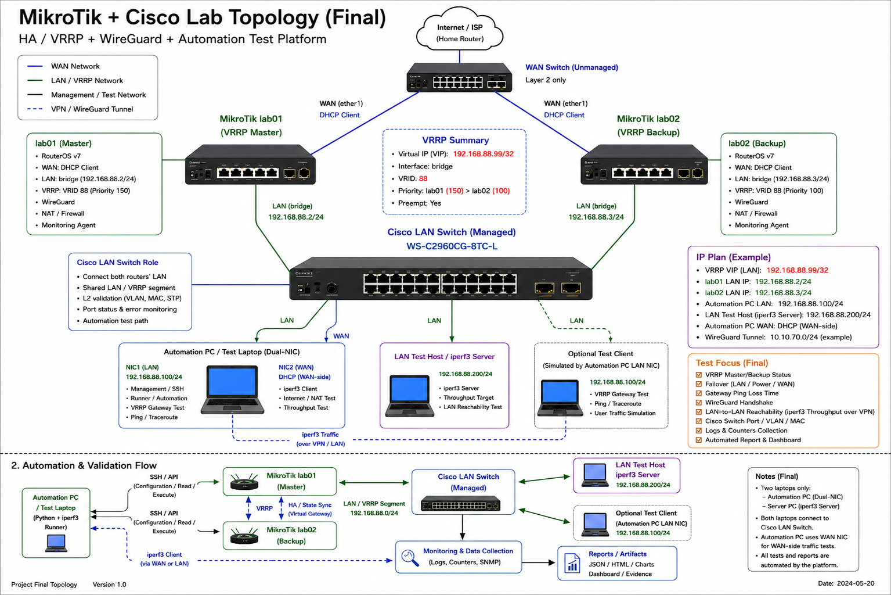
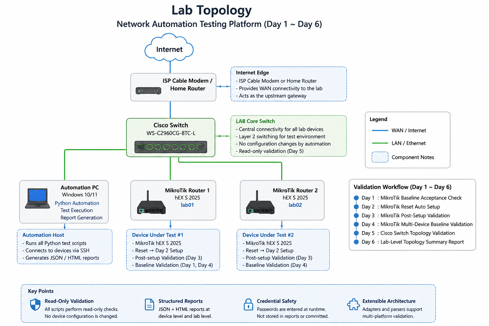
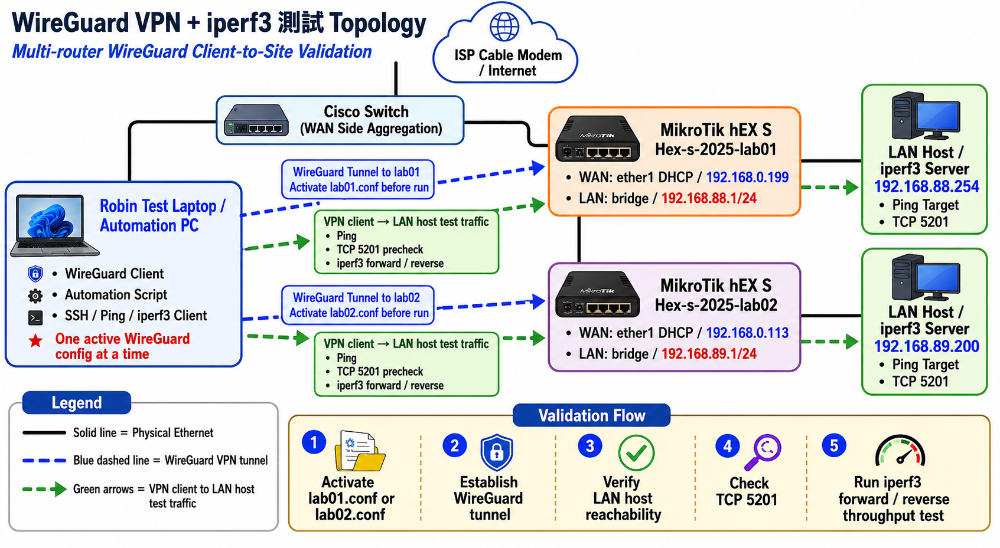

# Network Automation Lab

## Project Overview

Network Automation Lab is a Python-based lab automation project for validating network device configuration, connectivity, topology, and report output across a small multi-vendor lab.

A Python-based network automation and validation lab for MikroTik RouterOS, Cisco switch topology checks, iperf3 performance testing, regression checks, and local report visualization.

Current project status after Day160: `V05_AI_ASSISTANCE_PHASE_GATE_REVIEW_READY`, `V05_AI_ASSISTANCE_SAFETY_REGRESSION_MATRIX_REVIEW_READY`, `V05_AI_ASSISTANCE_REVIEWER_ONLY_FIXTURE_RENDERER_REVIEW_READY`, `V05_AI_ASSISTANCE_OUTPUT_TEMPLATE_CONTRACT_REVIEW_READY`, `V05_AI_ASSISTANCE_INPUT_BOUNDARY_CONTRACT_REVIEW_READY`, `V05_AI_ASSISTANCE_REOPEN_RATIONALE_REVIEW_READY`, `REVIEW_ONLY`, `REPORT_ONLY`, `NON_EXECUTABLE`, and `NEXT_PHASE_ALLOWED_FALSE`. Day160 reviews the Day155-Day159 v0.5 AI Assistance evidence chain as phase-gate-review ready only; it does not approve a phase gate, does not set `next_phase_allowed=true`, and does not allow AI execution, provider/API/model integration, executor action, live device access, direct command generation, secrets access, or voice/microphone runtime.

Current project status after Day155: `V05_AI_ASSISTANCE_REOPEN_RATIONALE_REVIEW_READY`, `DOCS_ONLY`, `RATIONALE_ONLY`, `REVIEW_ONLY`, `NON_EXECUTABLE`, and `NEXT_PHASE_ALLOWED_FALSE`. Day155 documents whether and how v0.5 AI Assistance may be reopened for reviewer assistance only; it does not allow AI execution, provider/API integration, executor action, live device access, direct command generation, secrets access, or phase gate approval.

Current project status after Day154: `README_STATUS_SYNC_ONLY`, `POST_CLOSURE_EVIDENCE_BASELINE_LOCK_REVIEW_READY`, `SDD_OPERATING_CONTRACT_DRAFT`, `POST_CLOSURE_FORBIDDEN_CAPABILITY_REFERENCE_SCAN_REVIEWED`, `POST_CLOSURE_REFERENCE_INTEGRITY_AUDITED`, `CLOSURE_EVIDENCE_INDEX_READY`, `PHASE_GATE_CLOSED_REVIEW_ONLY`, `NEXT_PHASE_ALLOWED_FALSE`, `NO_EXECUTION_PROVIDER_API`, `REVIEW_ONLY`, and `REPORT_ONLY`. AI Assistance v0.4 is closed as review-only / report-only; Day151 remains the closure evidence index authority; execution, provider, API, model calls, live network I/O, SSH, NETCONF, RESTCONF, secrets, and device access remain disabled; next_phase_allowed=false. Day154 records the post-closure baseline lock and SDD Operating Contract Draft only; it is not a Day153 supplement and is not next-day functionality. This README is a status summary only and does not replace formal safety planning documents, phase gate documents, deferred risk register, formal closure review evidence, the Day151 closure evidence index, the Day152 Post-Closure Reference Integrity Audit, the Day153 Post-Closure Forbidden Capability Reference Scan, or the Day154 Post-Closure Evidence Baseline Lock Review.

Current project status after Day152 remains preserved for Day152 reference-integrity evidence: `POST_CLOSURE_REFERENCE_INTEGRITY_AUDITED`, `CLOSURE_EVIDENCE_INDEX_READY`, `PHASE_GATE_CLOSED_REVIEW_ONLY`, and `NEXT_PHASE_ALLOWED_FALSE`.

Current project status after Day151 remains the historical closure baseline: `CLOSURE_EVIDENCE_INDEX_READY`, `PHASE_GATE_CLOSED_REVIEW_ONLY`, and `NEXT_PHASE_ALLOWED_FALSE`.

The v0.1 portfolio package covers Day 1 through Day 30 post-tag verification. The current project timeline also includes the v0.2 HA / VRRP planning foundation and the later AI Assistance review-only evidence chain through Day160:

- MikroTik baseline and post-reset validation
- MikroTik Day 2 setup workflow after reset
- MikroTik Day 3 post-setup validation
- MikroTik Day 4 multi-device baseline validation
- Cisco Catalyst switch topology validation
- Day 6 lab-level topology summary report
- Day 8 Router performance automation with iperf3
- Day 9 Router performance regression framework
- Day 10 Local dashboard for report visualization
- Day 11 Dashboard safe command execution and execution log viewer
- Day 12 WireGuard VPN client config export and throughput baseline automation
- Day 13 multi-router WireGuard Client-to-Site validation
- Day 14 unified lab runner and latest lab overview report
- Day 17 runner task catalog and local report visibility index
- Day 18 WireGuard runner safety layer
- Day 19 runner evidence index and portfolio finalization
- Day 20 runner report index and portfolio evidence cleanup
- Day 21 dashboard report viewer and evidence navigation
- Day 22 WireGuard runner documentation and safety review
- Day 23 runner safety metadata and RC readiness review
- Day 24 RC demo flow and portfolio walkthrough polish
- Day 25 v0.1 RC validation evidence
- Day 26 v0.1 release packaging and portfolio polish
- Day 28 portfolio evidence final review
- Day 29 v0.1 release tag preparation
- Day 30 v0.1 post-tag verification
- Day 31 HA / VRRP topology and safety planning
- Day 32 VRRP Read-only Precheck Runner
- Day 33 VRRP Topology Design + Dry-run Command Preview
- Day 34 VRRP Staged Apply Plan and Safety Gate
- Day 35 VRRP Failover Validation
- Day 36 VRRP Failover Evidence Review and Report Hardening
- Day 37 VRRP Report Regression and Evidence Snapshot Policy
- Day 38 Post-VRRP Milestone Review and v0.2 Scope Planning
- Day 39 VRRP Evidence Dashboard Integration
- Day 40 v0.2 Demo Readiness Review and Scope Lock
- Day 41 v0.2 Release Packaging
- Day 42 v0.2 Release Tag Preparation
- Day 43 v0.2 Release Verification and Portfolio Demo Baseline
- Day 44 Hermetic Test Fix for v0.2 Release Verification
- Day 45 Post-Day44 Fresh Checkout Verification
- Day 46 v0.2.1 Release Candidate Decision and Post-Fix Release Strategy
- Day 47 Portfolio Demo Baseline Final Check and Demo Operation Runbook
- Day 48 Demo Asset Packaging and Offline Portfolio Demo Kit
- Day 49 Offline Demo Verification and Portfolio Demo Dry Run
- Day 50 Dashboard Demo Polish and Portfolio Demo Landing Page
- Day 51 Portfolio Demo Visual QA and Screenshot Capture
- Day 52 Offline Demo Screenshot Capture and Demo Package Final Assembly
- Day 53 Portfolio Demo Final Rehearsal and Operation Checklist
- Day 54 Public-Facing Portfolio Demo Wording Audit
- Day 55 Public Repository Readiness Review and External Reviewer Walkthrough
- Day 56 v0.3 Scope Planning / Voice + AI Direction Review
- Day 57 AI-assisted Task Intent Mapping Prototype Plan
- Day 58 Intent Mapping Safety Review and Confirmation Gate Design
- Day 59 Intent Policy Matrix / Reviewer-Facing Safety Explanation
- Day 60 AI Intent Workflow Demo / Reviewer Walkthrough Flow
- Day 61 AI Intent Demo Dashboard Integration / Reviewer UI Entry Point
- Day 62 AI Intent Reviewer Scenario Pack / Sample Cases
- Day63 - AI Intent Reviewer Traceability Evidence Map
- Day64 - AI Intent Reviewer Acceptance Runbook
- Day65 - AI Intent Reviewer Acceptance Sign-off Package
- Day66 - Offline Mock Runtime Skeleton
- Day67 - Offline Mock Runtime Contract & Safety Invariant Validation
- Day68 - Offline Mock Runtime Reviewer Report Quality
- Day69 - Offline Mock Runtime Reviewer Dashboard Evidence Drilldown
- Day70 - Offline Mock Runtime Phase Exit Review and AI Runtime Readiness Gate
- Day71 - Controlled AI Runtime Prototype Entry Design
- Day72 - Controlled AI Runtime Input Contract Validator
- Day73 - Mock AI Decision Pipeline
- Day74 - Controlled Dry-run Plan Builder
- Day75 - Manual Review Approval Envelope
- Day76 - Controlled Runtime Audit Trail
- Day77 - Runtime Safety Gate
- Day78 - Controlled Runtime Safety Case
- Day79 - Controlled Read-only Task Contract & Allowlist
- Day80 - Read-only Execution Broker Skeleton
- Day81 - Read-only Broker Review Queue & Decision State Report
- Day82 - Reviewer Decision Audit Summary / Queue Evidence Export
- Day145 - v0.4 AI Assistance Evidence Freeze Package
- Day146 - v0.4 AI Assistance Non-Advancement Gate
- Day147 - AI Assistance Deferred Risk Register
- Day148 - AI Assistance Demo / Export / Draft Display Consistency Audit
- Day149 - AI Assistance Docs / Registry / Report Index Consistency Audit
- Day150 - v0.4 AI Assistance Phase Gate Closure Review
- Day151 - v0.4 AI Assistance Closure Evidence Index
- Day152 - Post-Closure Reference Integrity Audit
- Day153 - Post-Closure Forbidden Capability Reference Scan
- Day154 - Post-Closure Evidence Baseline Lock Review + SDD Operating Contract Draft
- Day155 - v0.5 AI Assistance Reopen Rationale
- Day156 - v0.5 AI Assistance Input Boundary Contract
- Day157 - v0.5 AI Assistance Output Template Contract
- Day158 - v0.5 AI Assistance Reviewer-Only Fixture Renderer
- Day159 - v0.5 AI Assistance Safety Regression Matrix
- Day160 - v0.5 AI Assistance Phase Gate Review

The project is designed as a practical QA Automation / SDET portfolio project for network infrastructure. It focuses on repeatable validation, structured test evidence, and readable JSON / HTML reports rather than one-off manual checks.

## Current Repo Structure Map

This is the current documentation map, not a new architecture or a file-move plan. Phase 2C-19 only clarifies how to read the existing repository layout. Phase 2D-07 records `CLOSE_PHASE_2D`; this map does not start a next phase.

Phase lanes and close status:

- `docs/phase_2c/` holds the completed Phase 2C navigation lane.
  - Phase 2C-01 through Phase 2C-10 cover local static job and artifact validation cycles.
  - Phase 2C-11 through Phase 2C-17 cover Interview MVP scope, candidate inventory, selected `local_result_envelope_contract`, implementation evidence, and acceptance review.
  - Phase 2C-18 is the planning-only structure review that recommended this clarification; Phase 2C-19 is documentation / polish only.
  - Phase 2C-20 is the next-slice decision gate.
  - Phase 2C-21 is the final candidate-inventory cycle for Phase 2C unless explicitly reauthorized by a later Phase 2C closure review; it lists candidates only and does not select a slice, authorize implementation, or start implementation.
  - Phase 2C-22 reviews safety deltas for those Phase 2C-21 candidates only; it does not reopen candidate inventory, create a second safety matrix, select a slice, authorize implementation, or start Phase 2C-23.
  - Phase 2C-23 is the planning-only final selection gate that selects `candidate-01` / `mock_demo_job_readability_polish` for later Phase 2C-24 authorization review only; it does not authorize implementation, start Phase 2C-24, or start Phase 2C-25.
  - Phase 2C-24 authorizes `candidate-01` / `mock_demo_job_readability_polish` for later Phase 2C-25 only within a report-only / dry-run / mock-only boundary; it does not implement the slice or start Phase 2C-25.
  - Phase 2C-25 applies that mock demo job readability polish to existing `local_static_job` reviewer evidence while preserving the same report-only / dry-run / mock-only boundary.
  - Phase 2C-26 is the post-implementation acceptance review for Phase 2C-25; it accepts or rejects existing evidence only and does not select the next slice, authorize new implementation, start Phase 2C-27, or add execution-capable behavior.
  - Phase 2C-27 records `CLOSE_PHASE_2C` using existing Phase 2C evidence only; it does not create a candidate inventory, select a slice, authorize implementation, start Phase 2D, or add execution-capable behavior.
- `docs/phase_2d/` holds the Phase 2D lane after Phase 2C closure.
  - Phase 2D-00 records `ALLOW_PHASE_2D_PLANNING`, allows only Phase 2D-01 as planning-only, and does not authorize implementation, select a Phase 2D slice, continue Phase 2C, create Phase 2C-28, or add execution-capable behavior.
  - Phase 2D-01 is the planning-only scope inventory at `docs/phase_2d/phase_2d_01_scope_inventory_planning_only.md`; it records `PHASE_2D_SCOPE_INVENTORY_COMPLETE`, allows only Phase 2D-02 as planning-only, and keeps implementation unauthorized.
  - Phase 2D-02 is the planning-only safety boundary review at `docs/phase_2d/phase_2d_02_safety_boundary_review_planning_only.md`; it records `PHASE_2D_SAFETY_BOUNDARY_REVIEW_COMPLETE`, allows only Phase 2D-03 as planning-only, and keeps implementation unauthorized.
  - Phase 2D-03 is the planning-only final selection gate at `docs/phase_2d/phase_2d_03_final_selection_gate_planning_only.md`; it records `PHASE_2D_FINAL_SELECTION_GATE_COMPLETE`, selects exactly one final Phase 2D direction for later Phase 2D-04 authorization-gate review, and keeps implementation unauthorized.
  - Phase 2D-04 is the authorization gate at `docs/phase_2d/phase_2d_04_implementation_kickoff_gate_authorization_gate.md`; it authorizes only the selected `README / demo flow convergence` direction for a later separately requested implementation review.
  - Phase 2D-05 is that documentation-only implementation slice at `docs/phase_2d/phase_2d_05_readme_demo_flow_convergence.md`; it clarifies the current reviewer demo path and Phase 2D active path without modifying code, runners, adapters, execution paths, live device access, SSH, NETCONF, RESTCONF, APIs, providers, models, secrets, config backup/change behavior, production execution paths, Day1-Day160 history, or the safety baseline.
  - Phase 2D-06 is the post-implementation acceptance review at `docs/phase_2d/phase_2d_06_post_implementation_acceptance_review_report_only.md`; it accepts Phase 2D-05 and does not select another slice or authorize new implementation.
  - Phase 2D-07 is the planning-only close-or-continue gate at `docs/phase_2d/phase_2d_07_close_or_continue_decision_gate_planning_only.md`; it records `CLOSE_PHASE_2D` using existing Phase 2D evidence only and does not create a candidate inventory, select a slice, authorize implementation, start a next phase, or add execution-capable behavior.
- `docs/phase_2e/` holds the Phase 2E controlled automation planning lane after Phase 2D closure.
  - Phase 2E-00 records `ALLOW_CONTROLLED_AUTOMATION_PLANNING_ONLY` at `docs/phase_2e/phase_2e_00_controlled_automation_entry_gate_planning_only.md`; it does not select a slice, authorize implementation, or add execution-capable behavior.
  - Phase 2E-01 reconciles read-only lab integration scope at `docs/phase_2e/phase_2e_01_read_only_lab_integration_scope_reconciliation_planning_only.md`; it is planning-only / documentation-only / report-only and does not select or authorize an implementation slice.
  - Phase 2E-02 inventories read-only lab integration candidate directions at `docs/phase_2e/phase_2e_02_read_only_lab_integration_candidate_inventory_planning_only.md`; it is planning-only / documentation-only / report-only, selects no unique slice, and does not authorize implementation.
  - Phase 2E-03 reviews Phase 2E-02 read-only lab integration candidate directions for safety deltas at `docs/phase_2e/phase_2e_03_readonly_lab_integration_safety_delta_review_planning_only.md`; it records `NO_NEW_SAFETY_DELTA_IDENTIFIED`, selects no unique slice, does not authorize implementation, and does not create a second safety matrix.
  - Phase 2E-04 records the read-only lab integration final selection gate at `docs/phase_2e/phase_2e_04_readonly_lab_final_selection_gate_planning_only.md`; it selects `Static lab artifact validation` for future authorization-gate review only, does not authorize implementation, and does not create a second safety matrix.
  - Phase 2E-05 records the static lab artifact validation kickoff authorization gate at `docs/phase_2e/phase_2e_05_static_lab_artifact_validation_kickoff_gate_authorization_gate.md`; it authorizes only a later separate `Static lab artifact validation` implementation slice, does not start implementation, and keeps runner, adapter, execution, live access, secrets, and second-safety-matrix scope closed.
  - Phase 2E-06 implements the static lab artifact validation slice at `docs/phase_2e/phase_2e_06_static_lab_artifact_validation_implementation.md`; it validates local static artifact envelopes only and keeps runner, adapter, execution, live access, provider/API/model, secrets, queue/scheduler/worker, config backup/change, production, Day1-Day160 rewrite, and second-safety-matrix scope closed.
  - Phase 2E-07 records the post-implementation acceptance review for Phase 2E-06 at `docs/phase_2e/phase_2e_07_static_lab_artifact_validation_acceptance_review_report_only.md`; it accepts the static lab artifact validation slice and does not authorize further implementation or start the next phase.
  - Phase 2E-08 records the close-or-continue decision gate at `docs/phase_2e/phase_2e_08_close_or_continue_decision_gate_planning_only.md`; it records `CLOSE` for Phase 2E and does not authorize further implementation or Phase 2F.
- `docs/phase_2f/` holds the Phase 2F read-only lab adapter re-entry planning lane after Phase 2E closure.
  - Phase 2F-00 records `ALLOW_PLANNING_DISCUSSION_ONLY` at `docs/phase_2f/phase_2f_00_readonly_lab_adapter_reentry_gate_planning_only.md`; it allows only future planning discussion and does not select a slice, authorize implementation, add adapter code, change runners or execution paths, use live access, or create a second safety matrix.
  - Phase 2F-01 reconciles adapter planning scope at `docs/phase_2f/phase_2f_01_adapter_scope_reconciliation_planning_only.md`; it records `SCOPE_RECONCILED` for planning discussion only and does not create candidate inventory, select a slice, authorize implementation, design adapter boundaries, add adapter code, change runners or execution paths, use live access, or create a second safety matrix.
  - Phase 2F-02 inventories adapter boundary discussion candidates at `docs/phase_2f/phase_2f_02_adapter_boundary_candidate_inventory_planning_only.md`; it selects no candidate, ranks no candidate, performs no safety delta review, creates no adapter boundary design, authorizes no implementation, and changes no code or execution behavior.
  - Phase 2F-03 reviews Phase 2F-02 adapter boundary candidates for safety deltas at `docs/phase_2f/phase_2f_03_adapter_safety_delta_review_planning_only.md`; it selects no candidate, ranks no candidate, creates no adapter boundary design, authorizes no implementation, and records that some candidates require narrowing, exclusion, or deferral before Phase 2F-04.
  - Phase 2F-04 creates the planning-only adapter boundary design at `docs/phase_2f/phase_2f_04_adapter_boundary_design_planning_only.md`; it defines conceptual reviewer boundaries, defers live-source details, selects no implementation slice, authorizes no implementation, adds no adapter code, changes no runners or execution paths, uses no live access, and creates no second safety matrix.
  - Phase 2F-05 records the authorization gate after Phase 2F-04 at `docs/phase_2f/phase_2f_05_authorization_gate_planning_only.md`; it keeps implementation authorization deferred because Phase 2F-03's `NEW_SAFETY_DELTA_FOUND: UNCLEAR` remains unresolved, recommends a safety clarification gate, and changes no source, tests, runners, adapters, execution paths, live access, secrets, or second safety matrix.
  - Phase 2F-05A clarifies the Phase 2F-03 safety delta result at `docs/phase_2f/phase_2f_05a_safety_delta_clarification_gate_planning_only.md`; it records `NO_NEW_SAFETY_DELTA_CONFIRMED` for the existing planning-only boundary/design, keeps implementation authorization closed, keeps Phase 2F-06 blocked until a separate authorization re-check gate, and changes no source, tests, runners, adapters, execution paths, live access, secrets, or second safety matrix.
  - Phase 2F-05B re-checks implementation authorization at `docs/phase_2f/phase_2f_05b_authorization_recheck_gate_planning_only.md`; it records `AUTHORIZATION_DECISION: DEFERRED` because a concrete Phase 2F-06 implementation slice is not yet defined, keeps implementation unauthorized, keeps Phase 2F-06 blocked, and changes no source, tests, runners, adapters, execution paths, live access, secrets, or second safety matrix.
  - Phase 2F-05C defines the first adapter implementation slice at `docs/phase_2f/phase_2f_05c_first_adapter_implementation_slice_definition_planning_only.md`; it authorizes future Phase 2F-06 only for `non_executing_local_adapter_contract_skeleton`, keeps Phase 2F-06 blocked for all other adapter work, and changes no source, tests, runners, adapters, execution paths, live access, secrets, config backup/change behavior, or second safety matrix.
  - Phase 2F-06 implements that first adapter slice at `docs/phase_2f/phase_2f_06_non_executing_local_adapter_contract_skeleton.md`; it adds only a local, deterministic, non-executing adapter contract skeleton with contract metadata, capability declarations, request/result validation helpers, and unit tests, while keeping runner integration, adapter execution wiring, live access, SSH, NETCONF, RESTCONF, provider/API/model/secrets, config backup/change behavior, production paths, Day1-Day160 rewrite, second safety matrix, next phase, and extra slices closed.
  - Phase 2F-07 records the post-first-adapter implementation acceptance review at `docs/phase_2f/phase_2f_07_post_first_adapter_implementation_acceptance_review_planning_only.md`; it accepts Phase 2F-06 as the first adapter implementation slice under the existing local-only, deterministic, non-executing safety boundary and does not authorize new implementation or start Phase 2F-08.
  - Phase 2F-08 records the next adapter slice decision gate at `docs/phase_2f/phase_2f_08_next_adapter_slice_decision_gate_planning_only.md`; it selects `non_executing_local_adapter_evidence_binding` for later authorization review only and does not authorize implementation, start Phase 2F-09, add source or tests, wire runners or adapters, use live access, touch secrets, rewrite Day1-Day160 artifacts, or create a second safety matrix.
  - Phase 2F-09 records the authorization review for the selected next adapter slice at `docs/phase_2f/phase_2f_09_next_adapter_slice_authorization_review_planning_only.md`; it authorizes only a later, separate `non_executing_local_adapter_evidence_binding` implementation slice under local deterministic no-execution conditions and does not itself add source or tests, wire runners or adapters, use live access, touch secrets, rewrite Day1-Day160 artifacts, or create a second safety matrix.
  - Phase 2F-10 implements that next adapter slice at `docs/phase_2f/phase_2f_10_non_executing_local_adapter_evidence_binding.md`; it adds only a local, deterministic, non-executing evidence binding primitive for already-existing or fixture-like local adapter evidence metadata, while keeping read-only lab adapter creation, runner connection, executable job registration, adapter instantiation, live access, SSH, NETCONF, RESTCONF, provider/API/model/secrets, config backup/change behavior, scheduler/queue/worker/agent loop, production paths, Day1-Day160 rewrite, second safety matrix, next phase, and extra slices closed.
  - Phase 2F-11 records the post-2F-10 acceptance review at `docs/phase_2f/phase_2f_11_post_non_executing_local_adapter_evidence_binding_acceptance_review_planning_only.md`; it confirms Phase 2F-11 was not already reserved, accepts Phase 2F-10 under the local-only, deterministic, non-executing evidence-binding boundary, and does not authorize implementation or start Phase 2F-12.
  - Phase 2F-12 records the close-or-continue decision gate at `docs/phase_2f/phase_2f_12_close_or_continue_decision_gate_planning_only.md`; it records `PHASE_2F_DECISION: CLOSE`, treats Phase 2F as closed from a planning standpoint, authorizes no further adapter slice, and requires any future adapter work to use a new separate authorization gate.
- `docs/phase_2g/` holds the Phase 2G project acceleration and demo-value planning lane after Phase 2F closure.
  - Phase 2G-00 records the project acceleration and demo-value entry review at `docs/phase_2g/phase_2g_00_project_acceleration_demo_value_entry_review.md`; it carries forward `Demo Flow`, `Project Health Dashboard`, `Evidence / Report Dashboard`, `Codex Workflow Accelerator`, and `Phase Scaffold` as planning candidates only, authorizes no implementation, selects no slice, changes no source behavior, and preserves the existing safety boundary.
  - Phase 2G-00A adds the future-plan addendum at `docs/phase_2g/phase_2g_00a_future_plan_addendum.md`; it defines the Phase 2G-01 through Phase 2G-08 planning path, keeps all five candidate tracks behind future gates, authorizes no implementation, changes no source behavior, and preserves the existing safety boundary.
  - Phase 2G-01 records the track prioritization planning result at `docs/phase_2g/phase_2g_01_track_prioritization.md`; it compares the five existing candidate tracks, recommends `Demo Flow` as the next planning focus, authorizes no implementation, defines no implementation slice, changes no source behavior, and preserves the existing safety boundary.
  - Phase 2G-02 records the Demo Flow authorization gate at `docs/phase_2g/phase_2g_02_demo_flow_authorization_gate.md`; it defines the demo-facing boundary using existing static evidence and report artifacts only, authorizes no implementation, recommends Phase 2G-03 as a planning-only slice-definition kickoff gate, changes no source behavior, and preserves the existing safety boundary.
  - Phase 2G-03 records the Demo Flow slice definition and implementation kickoff gate at `docs/phase_2g/phase_2g_03_demo_flow_slice_definition.md`; it selects one smallest static-documentation demo entry point for possible later Phase 2G-04 implementation, authorizes no implementation in this phase, changes no source behavior, and preserves the existing safety boundary.
  - Phase 2G-04 records the static Markdown walkthrough at `docs/phase_2g/phase_2g_04_demo_flow_walkthrough.md`; it documents the future demo path only, adds no runtime execution, no new report generation, no new dashboard behavior, and no runner or adapter changes.
  - Phase 2G-05 records the acceptance review for the Phase 2G-04 static Markdown walkthrough at `docs/phase_2g/phase_2g_05_demo_flow_walkthrough_acceptance_review.md`; it accepts the walkthrough as planning-only / documentation-only / report-only and does not authorize implementation, execution, adapter work, runner work, live network access, or demo-flow expansion.
  - Phase 2G-06 records the next-step decision gate for the accepted demo-flow walkthrough at `docs/phase_2g/phase_2g_06_demo_flow_next_step_decision_gate.md`; it closes or pauses the demo-flow track as sufficiently documented and does not authorize implementation, execution, adapter work, runner work, live network access, or demo-flow expansion.
- `docs/phase_2h/` holds project-state consolidation after Phase 2G demo-flow closure or pause.
  - Phase 2H-00 records the project-state consolidation at `docs/phase_2h/phase_2h_00_project_state_consolidation.md`; it summarizes current track status only, recommends Phase 2H-01 as planning-only candidate inventory, and does not select a track, authorize implementation, reopen Demo Flow, or add execution-capable behavior.
  - Phase 2H-01 records the next-track candidate inventory at `docs/phase_2h/phase_2h_01_next_track_candidate_inventory.md`; it inventories the remaining non-demo-flow candidate tracks, keeps Demo Flow closed or paused, selects and ranks no track, authorizes no implementation, and adds no runner, adapter, execution, live-device, provider/API/model, secret, queue, scheduler, worker, agent-loop, config-backup, or config-change behavior.
  - Phase 2H-02 records the next-track decision gate at `docs/phase_2h/phase_2h_02_next_track_decision_gate.md`; it recommends `Evidence / Report Dashboard` only for a future planning-only scope-definition step, keeps implementation unauthorized, does not start Phase 2H-03, does not reopen Demo Flow, and adds no runner, adapter, execution, live-device, provider/API/model, secret, queue, scheduler, worker, agent-loop, config-backup, or config-change behavior.
  - Phase 2H-03 records the Evidence / Report Dashboard scope definition at `docs/phase_2h/phase_2h_03_evidence_report_dashboard_scope_definition.md`; it defines a future passive evidence/report viewer boundary only, recommends Phase 2H-04 as a planning-only acceptance boundary review, authorizes no implementation, creates no dashboard code, changes no runner, adapter, execution, live-device, provider/API/model, secret, queue, scheduler, worker, agent-loop, config-backup, or config-change behavior, and does not repair or reinterpret optional WARN status.
  - Phase 2H-04 records the Evidence / Report Dashboard acceptance boundary review at `docs/phase_2h/phase_2h_04_evidence_report_dashboard_acceptance_boundary_review_planning_only.md`; it decides `ACCEPT_WITH_LIMITS` for continuing only through a future planning-only authorization gate, keeps implementation unauthorized, creates no dashboard code, changes no runner, adapter, execution, live-device, provider/API/model, secret, queue, scheduler, worker, agent-loop, config-backup, or config-change behavior, and does not repair or reinterpret optional WARN status.
  - Phase 2H-05 records the Evidence / Report Dashboard implementation kickoff gate at `docs/phase_2h/phase_2h_05_evidence_report_dashboard_implementation_kickoff_gate_planning_only.md`; it authorizes only a future separately requested narrow passive dashboard implementation slice, implements nothing in Phase 2H-05, creates no dashboard code in this task, changes no report generator, task registry, CLI dispatch, runner, adapter, execution, live-device, provider/API/model, secret, queue, scheduler, worker, agent-loop, config-backup, or config-change behavior, and does not repair or reinterpret optional WARN status.
  - Phase 2H-06 implements the first static Evidence / Report Dashboard shell at `docs/phase_2h/phase_2h_06_evidence_report_dashboard_static_shell.html`, with implementation notes at `docs/phase_2h/phase_2h_06_evidence_report_dashboard_static_shell.md`; it is static, local, deterministic, read-only, and non-executing, adds only placeholder evidence/report/artifact/empty-state sections, and connects no live data, runner, adapter, execution path, SSH, NETCONF, RESTCONF, provider/API/model, secret, queue, scheduler, worker, agent-loop, config-backup, or config-change behavior.
  - Phase 2H-07 records the Evidence / Report Dashboard static shell acceptance review at `docs/phase_2h/phase_2h_07_evidence_report_dashboard_static_shell_acceptance_review_planning_only.md`; it accepts Phase 2H-06 as a completed static dashboard shell slice, allows only a separately requested next static dashboard slice, implements no new dashboard behavior, changes no runtime, route, backend, API, runner, adapter, scheduler, queue, broker, worker, agent-loop, live-device, SSH, NETCONF, RESTCONF, provider/API/model, secret, config-backup, config-change, production execution, Day1-Day160 history, or second safety matrix behavior.
  - Phase 2H-08 adds a static artifact reference section to the existing dashboard shell at `docs/phase_2h/phase_2h_06_evidence_report_dashboard_static_shell.html`, with implementation notes at `docs/phase_2h/phase_2h_08_evidence_report_dashboard_static_artifact_reference.md`; it uses hard-coded repository-local references only, distinguishes static artifact, report, and optional/missing local artifact references, and adds no runtime scan, glob, walk, fetch, dynamic discovery, runtime existence check, backend route, API endpoint, runner, adapter, scheduler, queue, worker, agent-loop, live-device, SSH, NETCONF, RESTCONF, provider/API/model, secret, config-backup, config-change, Day1-Day160 rewrite, or second safety matrix behavior.
  - Phase 2H-09 records the Evidence / Report Dashboard static artifact reference acceptance review at `docs/phase_2h/phase_2h_09_dashboard_static_artifact_reference_acceptance_review.md`; it accepts Phase 2H-08 with notes as a static/local/deterministic/read-only/report-only, non-executing dashboard artifact reference slice, authorizes no implementation in Phase 2H-09, and confirms no runtime scan, live data, runner, adapter, backend/API, provider/model, secret, queue/scheduler/worker, agent-loop, SSH, NETCONF, RESTCONF, config-backup, config-change, production execution, Day1-Day160 rewrite, or second safety matrix behavior was introduced.
  - Phase 2H-10 records the Evidence / Report Dashboard next static slice gate at `docs/phase_2h/phase_2h_10_dashboard_next_static_slice_gate.md`; it recommends exactly one future static slice, `Phase 2H-11 - Evidence / Report Dashboard Static Empty-State And Missing-Artifact Messaging Slice`, implements nothing, authorizes no implementation, and confirms no dashboard runtime behavior, runtime scan, live data, runner, adapter, backend/API, provider/model, secret, queue/scheduler/worker, agent-loop, SSH, NETCONF, RESTCONF, config-backup, config-change, production execution, Day1-Day160 rewrite, or second safety matrix behavior is introduced.
  - Phase 2H-11 records the Evidence / Report Dashboard static empty-state and missing-artifact messaging kickoff gate at `docs/phase_2h/phase_2h_11_dashboard_empty_state_missing_artifact_messaging_kickoff_gate.md`; it authorizes only a future separately requested Phase 2H-12 static messaging implementation slice, implements nothing, changes no dashboard behavior, and confirms no runtime artifact discovery, runtime scan, live data, runner, adapter, backend/API, provider/model, secret, queue/scheduler/worker, agent-loop, SSH, NETCONF, RESTCONF, config-backup, config-change, production execution, Day1-Day160 rewrite, or second safety matrix behavior is introduced.
  - Phase 2H-12 adds static empty-state and missing-artifact messaging to the existing Evidence / Report Dashboard shell at `docs/phase_2h/phase_2h_06_evidence_report_dashboard_static_shell.html`, with implementation notes at `docs/phase_2h/phase_2h_12_dashboard_empty_state_missing_artifact_messaging.md`; it uses deterministic committed dashboard copy only, explains optional or absent static artifact references without checking the filesystem, and adds no runtime artifact discovery, live scan, filesystem scanning, existence check, fallback discovery, auto-recovery, runner, adapter, API, provider/model, secret, live-device, SSH, NETCONF, RESTCONF, config-backup, config-change, Day1-Day160 rewrite, or second safety matrix behavior.
  - Phase 2H-13 records the Evidence / Report Dashboard static empty-state and missing-artifact messaging acceptance review and next gate at `docs/phase_2h/phase_2h_13_dashboard_empty_state_missing_artifact_messaging_acceptance_review.md`; it accepts Phase 2H-12 as static/local/deterministic/read-only/report-only, recommends only a future planning-only Phase 2H-14 next static slice decision gate, implements no dashboard behavior, starts no Phase 2H-14 work, and confirms no runtime artifact discovery, live scan, filesystem scanning, existence check, fallback discovery, auto-recovery, runner, adapter, API, provider/model, secret, live-device, SSH, NETCONF, RESTCONF, config-backup, config-change, Day1-Day160 rewrite, or second safety matrix behavior is introduced.
  - Phase 2H-14 records the Evidence / Report Dashboard next static slice decision gate at `docs/phase_2h/phase_2h_14_dashboard_next_static_slice_decision_gate.md`; it reviews the completed Phase 2H-06, Phase 2H-08, and Phase 2H-12 static dashboard slices, recommends only a future planning-only Phase 2H-15 static terminology consistency kickoff gate, implements no dashboard behavior, starts no Phase 2H-15 work, and confirms no runtime artifact discovery, live scan, filesystem scanning, existence check, fallback discovery, auto-recovery, runner, adapter, API, provider/model, secret, live-device, SSH, NETCONF, RESTCONF, config-backup, config-change, Day1-Day160 rewrite, or second safety matrix behavior is introduced.
  - Phase 2H-15 records the Evidence / Report Dashboard static terminology consistency kickoff gate at `docs/phase_2h/phase_2h_15_dashboard_static_terminology_consistency_kickoff_gate.md`; it defines a planning-only terminology inventory target for a possible later static-only slice, implements no terminology changes, changes no dashboard behavior, source, HTML, CSS, JavaScript, tests, generated artifacts, or report-index behavior, preserves the existing optional WARN as out of scope, and authorizes no implementation.
  - Phase 2H-16 records the Evidence / Report Dashboard static terminology consistency implementation authorization gate at `docs/phase_2h/phase_2h_16_dashboard_terminology_consistency_implementation_authorization_gate.md`; it authorizes only a later narrow static terminology implementation slice, implements no terminology changes in Phase 2H-16, changes no dashboard behavior, HTML, tests, runner, adapter, execution, live access, provider/API/model, secrets, config behavior, Day1-Day160 artifacts, Demo Flow, Project Health Dashboard, Codex Workflow Accelerator, Phase Scaffold, or second safety matrix.
  - Phase 2H-17 implements the Evidence / Report Dashboard static terminology consistency slice at `docs/phase_2h/phase_2h_17_dashboard_static_terminology_consistency_implementation_slice.md`; it normalizes the optional local artifact reference label in committed static dashboard/report-facing copy while preserving separate missing-artifact messaging, dashboard behavior, dashboard logic, report-generation semantics, runner/adapter/execution boundaries, live access, provider/API/model/secrets boundaries, Day1-Day160 artifacts, Demo Flow, Project Health Dashboard, Codex Workflow Accelerator, Phase Scaffold, and second safety matrix scope.
  - Phase 2H-18 records the Evidence / Report Dashboard static terminology consistency acceptance review at `docs/phase_2h/phase_2h_18_dashboard_static_terminology_consistency_acceptance_review.md`; it accepts Phase 2H-17 as a static terminology-only slice, confirms the dashboard static-surface boundary and forbidden scope remained closed, requires no follow-up before a future separately requested next static dashboard slice decision gate, and does not authorize or start implementation.
  - Phase 2H-19 records the Evidence / Report Dashboard next static slice decision gate at `docs/phase_2h/phase_2h_19_dashboard_next_static_slice_decision_gate.md`; it compares safe local/static/report-only dashboard slice candidates, recommends only a future planning-only static section ordering / grouping refinement kickoff gate, implements no selected slice, changes no dashboard rendering behavior or Python execution logic, and does not authorize implementation now.
  - Phase 2H-20 records the Static Dashboard Section Ordering / Grouping Refinement implementation authorization gate at `docs/phase_2h/phase_2h_20_dashboard_section_ordering_grouping_refinement_authorization_gate.md`; it reviews the Phase 2H-19 selected static slice, authorizes only one future static section ordering / grouping refinement implementation phase, implements no selected slice in Phase 2H-20, changes no dashboard rendering behavior or Python execution logic, and starts no Phase 2H-21 work.
  - Phase 2H-21 implements the Static Dashboard Section Ordering / Grouping Refinement slice at `docs/phase_2h/phase_2h_21_dashboard_section_ordering_grouping_refinement_implementation_slice.md`; it reorders and groups existing static dashboard sections for clearer reviewer reading flow, preserves the same local/deterministic/read-only/report-only boundary, adds no live or execution-capable behavior, selects no extra slice, and starts no Phase 2H-22 work.
  - Phase 2H-22 records the Static Dashboard Section Ordering / Grouping Refinement acceptance review at `docs/phase_2h/phase_2h_22_dashboard_section_ordering_grouping_refinement_acceptance_review.md`; it accepts Phase 2H-21 as the authorized static ordering/grouping refinement slice, performs no implementation, modifies no dashboard source or static output, and recommends only a future planning-only Phase 2H-23 next static dashboard slice decision gate.
  - Phase 2H-23 records the Static Dashboard Next Static Slice Decision Gate at `docs/phase_2h/phase_2h_23_dashboard_next_static_slice_decision_gate.md`; it compares safe local/static/report-only dashboard slice candidates, recommends only a future planning-only static status and availability label clarity kickoff gate, implements no selected slice, changes no dashboard source, static HTML, tests, rendering behavior, or Python execution logic, and does not authorize implementation now.
  - Phase 2H-24 records the Static Status and Availability Label Clarity Implementation Authorization Gate at `docs/phase_2h/phase_2h_24_static_status_availability_label_clarity_implementation_authorization_gate.md`; it authorizes only one future static label-clarity implementation slice, performs no implementation in Phase 2H-24, changes no dashboard source, static HTML, rendering behavior, runtime discovery, filesystem probing, runner/adapter behavior, or Python execution logic, and keeps the future scope limited to reviewer-facing static status and availability label clarification.
  - Phase 2H-25 implements the Static Status and Availability Label Clarity slice at `docs/phase_2h/phase_2h_25_static_status_availability_label_clarity_implementation_slice.md`; it adds static reviewer-facing explanations for existing labels only, updates the committed static dashboard HTML and targeted tests, preserves the accepted dashboard section order and grouping, and adds no runtime discovery, filesystem probing, or execution behavior.

Existing report-only evidence surfaces:

- `phase_2c_*.py` files at the repository root preserve the matching Phase 2C evidence-generation tasks where they already exist. Phase 2C-19 and Phase 2C-20 do not add or change task execution behavior.
- `tests/test_phase_2c_*.py` files preserve targeted regression coverage for existing Phase 2C behavior. This map does not add a new runtime behavior surface.
- `fixtures/` and `fixtures/phase_2a/` hold committed sample data used by safe, deterministic reviewer evidence paths.

Root-level entry and visibility files:

- `network_lab.py` is the unified local CLI entry point for existing lab tasks and report-index generation.
- `network_lab_task_registry.py` and `network_lab_cli_dispatch.py` expose existing task metadata and dispatch wiring. They are visibility and routing surfaces, not authorization to open new live execution scope.
- `dashboard_app.py`, `dashboard_command_runner.py`, `templates/`, `app/`, `components/`, and `lib/` contain existing local dashboard / Next.js reviewer and MVP surfaces. Phase 2C-19 does not change these surfaces.
- Historical Day and intent modules at the repository root remain in place for traceability. Their presence does not mean a current Phase 2C task rewrites, replaces, or reactivates Day1-Day160 work.

Documentation areas:

- `docs/phase_2a/`, `docs/phase_2b/`, `docs/phase_2c/`, and `docs/phase_2d/` hold staged planning, authorization, implementation, and acceptance evidence.
- `docs/ai/` and `docs/ai-intent/` hold AI Assistance and AI Intent reviewer evidence. The v0.4/v0.5 AI Assistance chain remains reviewer-only / report-only unless a future safety gate separately changes that boundary.
- `docs/automation_readiness/` holds future actual-automation readiness planning. It does not authorize live automation by itself.
- `docs/portfolio/`, `docs/reviewer/`, `docs/demo/`, `docs/roadmap/`, and `docs/portfolio_evidence/` are reviewer-facing navigation, demo, roadmap, and portfolio evidence areas.
- `docs/assets/` contains committed visual assets used by documentation and demo material.

Test, configuration, and evidence areas:

- `tests/` contains the Python regression suite for existing safety, report, parser, runner, dashboard, and phase evidence behavior.
- `config/`, `config.example.json`, `.env.example`, `runner_profiles/`, and `topology_profiles/` provide committed examples and profiles. Real secrets, private credentials, and local runtime environment files must stay out of Git.
- `summary/` contains committed summary snapshots that are intentionally safe to share.
- Generated local reports are expected under `reports/` when tasks are run locally. The report index is a reviewer evidence index, not a complete repository map and not an authorization surface.

Parked, historical, or future-only tracks:

- Day1-Day160 artifacts remain historical project evidence and are not rewritten or replaced by Phase 2C-19.
- Older live-lab workflows remain guarded and outside the active Phase 2C documentation / mock / report-only path.
- Actual automation integration, live device access, SSH, NETCONF, RESTCONF, new network-automation provider/API/model execution, queues, schedulers, workers, AI agent loops, backup execution, configuration changes, and production execution remain inactive unless a future task explicitly authorizes a separate safety gate.

## Network Automation AI Node

The current AI workbench is now connected to the Day1-Day160 Router/Switch automation platform as a Network Automation AI Node. It is not a general chatbot. It reads existing reviewer-facing evidence such as `reports/`, `summary/`, inventory-shaped JSON pasted by the user, topology context, and raw report text, then returns structured JSON for downstream platform steps.

The AI Node can:

- Import Day result evidence from JSON and TXT reports.
- Analyze report text into summary, findings, warnings, possible causes, recommended actions, risk level, and approval flags.
- Parse natural-language network requests into an intent, target device, vendor, interface, VLAN, allowlisted action ID, missing fields, and safety flags.
- Create a platform job record through the Job Runner Adapter.

The AI Node cannot:

- SSH to routers or switches.
- Call device APIs.
- Execute generated CLI.
- Run reset, reboot, remove, disable, enable, or configuration-changing operations.
- Bypass manual approval for config-change intent.

### Network AI Setup

Create `.env.local` locally:

```env
OPENAI_API_KEY=your_api_key_here
OPENAI_MODEL=gpt-5-mini
```

`OPENAI_API_KEY` and `OPENAI_MODEL` are read only from `process.env` in server-side API routes. The front end never receives the API key. `.env.example` stays committed as a blank template:

```env
OPENAI_API_KEY=
OPENAI_MODEL=gpt-5-mini
```

### Import Day1-Day160 Reports

Place or keep existing report evidence under:

```text
reports/
summary/
```

The Day Result Importer scans JSON and TXT files and normalizes each report into:

```json
{
  "id": "string",
  "sourceDay": "Day160",
  "deviceName": "string or null",
  "vendor": "mikrotik | cisco | unknown",
  "checkType": "string",
  "status": "PASS | WARN | FAIL | UNKNOWN",
  "rawOutput": "string",
  "parsedResult": {},
  "createdAt": "ISO timestamp"
}
```

Open the workbench:

```text
http://localhost:3000/network/day-results
http://localhost:3000/network/ai-actions
http://localhost:3000/network/reports
http://localhost:3000/network/jobs
```

### Network AI APIs

```text
POST /api/network/ai/analyze-report
POST /api/network/ai/parse-request
POST /api/network/jobs/create
GET  /api/network/actions
GET  /api/network/day-results
GET  /api/network/reports
GET  /api/network/jobs
```

`/api/network/ai/analyze-report` accepts:

```json
{
  "reportText": "string",
  "deviceContext": {}
}
```

`/api/network/ai/parse-request` accepts:

```json
{
  "userRequest": "string",
  "deviceInventory": {},
  "availableActions": {}
}
```

AI output is validated against JSON Schema-shaped runtime contracts before it is returned to the UI. Unknown action IDs are removed. Config-change intent always sets `requiresApproval=true`.

### AI Analyze Persistence

AI Analyze results are saved as server-side analysis records in:

```text
data/network-ai/analyses.json
```

The UI does not rely only on front-end React state. When `/network/day-results` loads or when a user selects a report, it calls:

```text
GET /api/network/reports/{reportId}/analysis/latest
```

If a latest analysis exists, the page displays the persisted analysis record with the analysis ID, creation time, model, job-creation safety flag, safety reason, and validated AI JSON. This keeps the analysis visible after navigating to AI Actions, Reports, or Jobs and returning to Day Results.

Each analysis record stores the report ID, source day, result kind, target device, check type, model, prompt version, input hash, validated output, safety metadata, and creation time. The runtime store is ignored by Git so local analysis history is not accidentally committed.

Non-device reports such as `phase_gate_report`, `summary_report`, and `test_report` are reviewer evidence only. Their `recommendedExistingActionIds` are removed during server-side sanitize, `jobCreationAllowed=false`, and job creation is not allowed because there is no concrete target device for the platform Job Runner.

### Available Action Bridge

The AI Node can recommend only these existing platform action IDs:

- `baseline_check`
- `wan_lan_check`
- `interface_status_check`
- `backup_config`
- `environment_check`

If no action matches, the parser returns `recommendedActionId: null`, includes `recommendedActionId` in `missingFields`, and marks the request blocked instead of inventing an action.

### Job Runner Adapter Flow

Current safe flow:

```text
parse -> recommend -> validate -> create job -> approve -> execute
```

The first Job Runner Adapter implementation only creates job records:

- Low-risk read-only checks become `ready`.
- Medium/high-risk or future config-change actions become `pending_approval`.
- No device command is executed by the AI route or UI.

Future execution must be added behind a separate safety gate and routed through the platform Job Runner. Configuration changes must remain manually approved before any live-capable execution path is introduced.

### Wrapping Existing Scripts As Actions

To wrap old Day1-Day160 scripts safely:

1. Add a stable action ID to the allowlist in `lib/network-ai/actions.ts`.
2. Map it to an existing script only inside a future Job Runner layer, not inside the AI parser.
3. Mark whether the action is read-only or config-changing.
4. Add negative tests proving rejected or unknown intents do not reach adapters, brokers, runners, SSH, or execution paths.
5. Keep script output as JSON/TXT reviewer evidence so it can be imported by the Day Result Importer.

## AI Project Assistant MVP

This repository also includes a separate Next.js App Router MVP at `/ai` for internal project drafting:

- AI meeting summaries
- AI requirement analysis
- AI knowledge-base Q&A from pasted SOP or document text

This MVP is intentionally separate from the Network Automation Lab runner and the `/ai-intent-reviewer` evidence chain. It does not execute network tasks, does not call SSH, does not access routers or switches, does not read device config files, and does not unlock the historical AI Assistance provider/API phase gates for network automation. It only sends user-pasted text from server-side API routes to OpenAI after the user configures an API key.

### Install

```bash
npm install
```

Python validation remains available separately:

```bash
python -m pytest
python network_lab.py --task report-index
```

### Configure API Key

Create `.env.local` locally:

```env
OPENAI_API_KEY=your_api_key_here
OPENAI_MODEL=gpt-5-mini
```

The app reads `OPENAI_API_KEY` and `OPENAI_MODEL` from `process.env` on the server. `.env.local` is ignored by Git; do not commit real API keys, tokens, credentials, or secrets. `.env.example` is committed only as a blank template.

### Start

```bash
npm run dev
```

Open:

```text
http://localhost:3000/ai
```

### Use The Three MVP Tools

1. Meeting summary: paste meeting notes or a transcript, then click `產生摘要`. Output includes meeting highlights, decisions, owners, due dates, risks, blockers, and next-meeting suggestions.
2. Requirement analysis: paste raw requirements, then click `整理需求`. Output includes a requirement summary, modules, user stories, acceptance criteria, missing information, priority guidance, and risk notes.
3. Knowledge-base Q&A: paste SOP or document content, enter a question, then click `回答問題`. The assistant is prompted to answer only from the pasted document and to say when the provided content is insufficient.

All generated output is labeled `AI 草稿，需人工確認`; project members should review before copying results to Jira, Notion, GitHub Issues, Confluence, or any internal system.

## Automation AI Nodes MVP

The Next.js app also includes workflow-ready AI Action Node demos at `/automation/ai-nodes`. These nodes are designed for automation pipelines rather than open-ended chat. Each node returns JSON that can be passed to a future workflow engine step such as a trigger handler, task creation, notification, or approval flow.

Server-side endpoints:

```text
POST /api/automation/ai/meeting-summary
POST /api/automation/ai/requirement-analysis
POST /api/automation/ai/kb-qa
```

### Node Inputs And Outputs

Meeting Summary Node input:

```json
{
  "meetingText": "meeting transcript or notes"
}
```

Output fields:

```json
{
  "summary": "string",
  "decisions": ["string"],
  "tasks": [
    {
      "title": "string",
      "owner": "string",
      "dueDate": "string",
      "status": "string"
    }
  ],
  "risks": ["string"],
  "followUpQuestions": ["string"],
  "needsHumanReview": true
}
```

Requirement Analysis Node input:

```json
{
  "requirementText": "raw requirement"
}
```

Output fields:

```json
{
  "summary": "string",
  "modules": ["string"],
  "userStories": ["string"],
  "acceptanceCriteria": ["string"],
  "missingInfo": ["string"],
  "priority": "High | Medium | Low",
  "risks": ["string"],
  "needsHumanReview": true
}
```

Knowledge QA Node input:

```json
{
  "documentText": "SOP or document content",
  "question": "question"
}
```

Output fields:

```json
{
  "answer": "string",
  "evidence": ["string"],
  "insufficientInfo": true,
  "suggestedNextStep": "string",
  "needsHumanReview": true
}
```

Each endpoint returns a wrapper with `nodeType`, `draftNotice`, `model`, `output`, and `rawJson`. The `rawJson` field is intentionally preserved so a later workflow engine can pass the AI node result into downstream automation without scraping UI text.

### Automation Node Setup

Use the same installation and environment setup:

```bash
npm install
```

Create `.env.local` locally:

```env
OPENAI_API_KEY=your_api_key_here
OPENAI_MODEL=gpt-5-mini
```

Start the app:

```bash
npm run dev
```

Open:

```text
http://localhost:3000/automation/ai-nodes
```

API keys are supplied by the user and must not be committed to Git. The front end never receives `OPENAI_API_KEY`; all OpenAI calls run inside server-side API routes. The nodes remain draft generators for human review and do not execute network automation tasks, SSH, device commands, or configuration changes.

## Public Reviewer Start Here

If you are reviewing this repository from GitHub or from a fresh local checkout, start with:

```text
docs/portfolio/public_reviewer_walkthrough.md
```

That walkthrough explains what the project does, how to read the dashboard and reports, why `python network_lab.py --task report-index` may return WARN when optional generated local reports are missing, and how to review the project without router, switch, VPN, VRRP, WireGuard, SSH, iperf3, or live lab access.

Current converged reviewer demo path:

1. Read `docs/portfolio/public_reviewer_walkthrough.md`.
2. Open the offline demo kit at `docs/demo/offline_interview_demo_kit/README.md`.
3. Use `docs/demo/offline_interview_demo_kit/demo_checklist.md` and `docs/demo/offline_interview_demo_kit/demo_commands.md` for the safe local command order: repository state, Python, local tests if available, `python network_lab.py --task report-index`, `python network_lab.py --task demo-flow`, and optional dashboard startup.
4. Review committed dashboard screenshots in `docs/demo/day52_offline_demo_package/screenshots/`.
5. If running locally, start the dashboard with `python dashboard_app.py` and open `/`, `/reports`, `/commands`, and `/ai-checklist`.
6. Use `docs/phase_2d/phase_2d_05_readme_demo_flow_convergence.md` and `docs/phase_2d/phase_2d_07_close_or_continue_decision_gate_planning_only.md` to confirm that Phase 2D converges README/demo-flow documentation, closes with existing evidence only, and introduces no execution behavior.
7. Use `docs/roadmap/day55_public_repository_readiness_review.md` for the Day55 readiness result and validation notes.
8. Use `docs/roadmap/day56_v0_3_scope_planning_voice_ai_direction_review.md` for the conservative v0.3 planning start, including Voice/AI safety boundaries.
9. Use `docs/roadmap/day57_ai_assisted_task_intent_mapping_prototype_plan.md` for the dry-run-only intent mapping prototype plan.
10. Use `docs/roadmap/day58_intent_mapping_safety_review_confirmation_gate.md` for the dry-run intent safety review and blocked-by-default confirmation gate design.
11. Use `docs/ai/day59_intent_policy_matrix_reviewer_safety_explanation.md` for the reviewer-facing intent policy matrix.
12. If running the dashboard locally, open `/ai-intent-reviewer` for the Day57-Day160 AI Assistance reviewer evidence chain. The page remains a reviewer UI entry point only: `REVIEW_ONLY`, `REPORT_ONLY`, `POST_CLOSURE_EVIDENCE_BASELINE_LOCK_REVIEW_READY`, `V05_AI_ASSISTANCE_PHASE_GATE_REVIEW_READY`, `V05_AI_ASSISTANCE_REOPEN_RATIONALE_REVIEW_READY`, `SDD_OPERATING_CONTRACT_DRAFT`, `POST_CLOSURE_FORBIDDEN_CAPABILITY_REFERENCE_SCAN_REVIEWED`, `POST_CLOSURE_REFERENCE_INTEGRITY_AUDITED`, `CLOSURE_EVIDENCE_INDEX_READY`, `PHASE_GATE_CLOSED_REVIEW_ONLY`, and `NEXT_PHASE_ALLOWED_FALSE` remain active, with no execution, provider, API, model call, SSH, NETCONF, RESTCONF, live network I/O, device access, secrets, POST route, adapter, broker, runner, mapped task execution, voice input, or microphone runtime enabled.

## Why This Project Exists

Network device setup is often validated manually with SSH sessions, screenshots, and copied command output. That works for a single check, but it is difficult to repeat, compare, or present as test evidence.

This project exists to turn a home lab network into an automated testing target:

- Replace manual CLI inspection with repeatable validation scripts.
- Convert device state into structured PASS / FAIL / WARNING evidence.
- Keep MikroTik and Cisco workflows separated but reportable at the lab level.
- Demonstrate automation engineering practices in a network infrastructure context.
- Produce portfolio-ready reports that show test scope, result status, and topology health.

## Key Features

- SSH-based validation for MikroTik RouterOS and Cisco IOS.
- Read-only validation workflows for baseline, post-setup, topology, and lab summary checks.
- MikroTik reset setup workflow with dry-run and conservative apply behavior.
- Multi-device MikroTik baseline validation using device profiles from `config.json`.
- Cisco switch topology validation using a separate Cisco config file.
- Lab-level topology summary based on existing JSON reports.
- WireGuard client config export and VPN throughput baseline evidence.
- JSON and HTML report output for device-level and lab-level evidence.
- Adapter-oriented structure for cross-platform baseline validation experiments.
- Password-safe workflow: runtime password prompts are used, and passwords are not written to reports.

## Supported Devices

| Device | Platform | Current Scope |
| --- | --- | --- |
| MikroTik hEX S 2025 | RouterOS | Reset setup, acceptance check, post-setup validation, multi-device baseline validation |
| Cisco WS-C2960CG-8TC-L | Cisco IOS | Read-only switch topology validation |

Cisco validation is read-only. It runs show commands for topology evidence and does not enter configuration mode, change VLANs, change ports, update IP settings, or save configuration.

## Current Progress Summary

| Day | Scope | Status |
| --- | --- | --- |
| Day 1 | MikroTik baseline acceptance checks | Complete |
| Day 2 | MikroTik reset auto setup workflow with dry-run/apply modes | Complete |
| Day 3 | MikroTik post-setup validation and per-device reports | Complete |
| Day 4 | MikroTik multi-device baseline validation and summary reports | Complete |
| Day 5 | Cisco switch topology validation | Complete |
| Day 6 | Lab-level topology summary generated from existing device reports | Complete |
| Day 7 | Documentation cleanup, user guide, topology notes, and portfolio packaging | Complete |
| Day 8 | RouterOS precheck and iperf3 router performance automation | Complete |
| Day 9 | Repeatable iperf3 router performance regression with JSON / HTML / TXT reports | Complete |
| Day 10 | Local dashboard for viewing reports and safe command examples | Complete |
| Day 11 | Dashboard safe command execution and execution log viewer | Complete |
| Day 12 | WireGuard VPN client config export and throughput baseline automation | Complete |
| Day 13 | Multi-router WireGuard Client-to-Site validation | Complete |
| Day 14 | Unified lab runner and latest lab overview report | Complete |
| Day 17 | Runner task catalog and report visibility index | Complete |
| Day 18 | WireGuard runner safety layer | Complete |
| Day 19 | Runner evidence index and portfolio finalization | Complete |
| Day 20 | Runner report index and portfolio evidence cleanup | Complete |
| Day 21 | Dashboard report viewer and evidence navigation | Complete |
| Day 22 | WireGuard runner documentation and safety review | Complete |
| Day 23 | Runner safety metadata and RC readiness review | Complete |
| Day 24 | RC demo flow and portfolio walkthrough polish | Complete |
| Day 25 | v0.1 RC validation evidence | Complete |
| Day 26 | v0.1 release packaging and portfolio polish | Complete |
| Day 28 | Portfolio evidence final review | Complete |
| Day 29 | v0.1 release tag preparation | Complete |
| Day 30 | v0.1 post-tag verification | Complete |
| Day 31 | HA / VRRP topology and safety planning | Complete |
| Day 32 | VRRP Read-only Precheck Runner | Complete |
| Day 33 | VRRP Topology Design + Dry-run Command Preview | Complete |
| Day 34 | VRRP Staged Apply Plan and Safety Gate | Complete |
| Day 35 | VRRP Failover Validation | Complete |
| Day 36 | VRRP Failover Evidence Review and Report Hardening | Complete |
| Day 37 | VRRP report regression guards and evidence snapshot policy | Complete |
| Day 38 | Post-VRRP milestone review and v0.2 scope planning; documentation/report-planning only with no new live test | Complete |
| Day 39 | VRRP evidence dashboard/report-index integration; report-only with no live test, SSH, or configuration change | Complete |
| Day 40 | v0.2 demo readiness review and scope lock; report-only with no live test, SSH, or configuration change | Complete |
| Day 41 | v0.2 release packaging; documentation/report-only with no live test, SSH, configuration change, voice/AI implementation, or tag creation | Complete |
| Day 42 | v0.2 release tag preparation and annotated tag creation; release validation only with no live test, SSH, or device configuration change | Complete |
| Day 43 | v0.2 release verification and portfolio demo baseline; tag checkout and offline smoke verification only with no live test, SSH, or device configuration change | Complete with notes |
| Day 44 | Hermetic Day12 test fix for the v0.2 release verification issue; removes hidden dependency on ignored local config.json; non-live test-only fix | Complete |
| Day 45 | Post-Day44 fresh checkout verification of remote main; confirms Day12 hermetic fix and full pytest pass without ignored local config.json; non-live verification only | Complete |
| Day 46 | v0.2.1 release candidate decision and post-fix release strategy; recommends deferring patch tag creation while using main as the portfolio demo baseline | Complete |
| Day 47 | Portfolio demo baseline final check and operation runbook; documentation/report-only/local validation with no v0.2.1 tag creation and no v0.3 feature work | Complete |
| Day 48 | Demo asset packaging and offline portfolio demo kit; can be shown without GitHub, internet, live devices, SSH, VPN, WireGuard, or lab access | Complete |
| Day 49 | Offline demo verification and portfolio demo dry run; verifies the Day48 kit, dashboard/report paths, safe commands, talk track, and fallbacks with no live device dependency | Ready with notes |
| Day 50 | Dashboard portfolio demo landing page polish; improves `/` with demo status, proof points, quick links, safety boundary, and 3-5 minute flow without live test or runner behavior changes | Ready with notes |
| Day 51 | Portfolio demo visual QA and screenshot capture planning; checks `/`, `/reports`, `/commands`, and `/ai-checklist`, documents screenshot guidance and demo sequence, and confirms safety boundaries without live device access | Ready with notes |
| Day 52 | Offline demo screenshot capture and demo package final assembly; captures local dashboard screenshots and packages portfolio review usage guidance with no live device dependency | Ready with notes |
| Day 53 | Portfolio demo final rehearsal and operation checklist; documentation-only and rehearsal-only with no new features, no live tests, and no `v0.3` work | Ready with notes |
| Day 54 | Public-facing portfolio demo wording audit; updates README, docs, and templates so public review language leads with portfolio/offline/project demo framing while preserving historical paths | Ready with notes |
| Day 55 | Public repository readiness review and external reviewer walkthrough; adds a reviewer-first entry point, report-index WARN explanation, dashboard page map, offline demo package pointers, and no-live-device review statement without runtime changes | Ready with notes |
| Day 56 | v0.3 scope planning and Voice + AI direction review; defines conservative intent mapping, future interface boundaries, safety gates, and demo flow without implementing Voice Control, AI Agent behavior, runner changes, dashboard routes, or live tests | Ready with notes |
| Day 57 | AI-assisted task intent mapping prototype plan; maps static text to allowlisted runner task proposals with safety level and confirmation policy while remaining dry-run-only with no OpenAI API, voice control, live runner execution, SSH, or device access | Ready with notes |
| Day 58 | Intent mapping safety review and confirmation gate design; adds a dry-run/report-only safety decision report, blocks live-capable actions by default, and does not connect OpenAI API, voice, SSH, or devices | Ready with notes |
| Day 59 | Intent policy matrix and reviewer-facing safety explanation; adds an optional report-only JSON/HTML matrix for Day57/Day58 intent decisions without OpenAI API, voice, SSH, device access, config.json, or mapped task execution | Ready with notes |
| Day 60 | AI intent workflow demo and reviewer walkthrough flow; adds `intent-workflow-demo` to connect Day57/Day58/Day59 into a local report-only walkthrough with no API, voice, SSH, device access, config.json, live execution, or mapped task execution | Ready with notes |
| Day 61 | AI intent demo dashboard integration and reviewer UI entry point; adds `/ai-intent-reviewer` so Day57-Day60 can be reviewed from the dashboard without API, voice, SSH, device access, config.json, live execution, or mapped task execution | Ready with notes |
| Day 62 | AI Intent Reviewer Scenario Pack / Sample Cases; adds reviewer-readable static cases for report-only, dry-run, blocked, and clarification-required intents with no API, voice, SSH, live execution, device access, config.json dependency, release tag, or automatic mapped task execution | Ready with notes |
| Day 63 | AI Intent Reviewer Traceability Evidence Map; a reviewer-facing evidence map that connects Day57-Day62 AI intent review artifacts into a traceable, report-only audit path without adding runtime AI behavior | Ready with notes |
| Day 64 | AI Intent Reviewer Acceptance Runbook; provides reviewer acceptance steps for the dashboard entry, scenario pack, traceability map, validation commands, and safety boundary confirmation while remaining documentation/static dashboard/report-only | Ready with notes |
| Day 65 | AI Intent Reviewer Acceptance Sign-off Package; summarizes Day57-Day64 reviewer evidence, defines accepted/deferred/rejected scope, and prepares for a future offline mock runtime skeleton without implementing runtime AI execution | Ready with notes |
| Day 66 | Offline Mock Runtime Skeleton; adds a deterministic offline mock / dry-run-only runtime shape for AI Intent Reviewer evidence without OpenAI API, voice, SSH, device access, live execution, config.json dependency, or network configuration changes | Ready with notes |
| Day 67 | Offline Mock Runtime Contract & Safety Invariant Validation; validates Day66 mock runtime output without enabling OpenAI API, voice, SSH, device access, live execution, mapped task execution, or network configuration changes | Ready with notes |
| Day 68 | Offline Mock Runtime Reviewer Report Quality; checks Day66-Day67 report readability, scenario evidence traceability, contract validation proof, and no-execution evidence without adding AI runtime, voice, SSH, device access, or live execution | Ready with notes |
| Day 69 | Offline Mock Runtime Reviewer Dashboard Evidence Drilldown; improves `/ai-intent-reviewer` with a static Day66-Day69 evidence chain, scenario drilldown, contract status, and review quality status without AI runtime, OpenAI API, voice, SSH, device access, POST routes, or live execution | Ready with notes |
| Day 70 | Offline Mock Runtime Phase Exit Review and AI Runtime Readiness Gate; reviews Day66-Day69 evidence and adds a static readiness gate while remaining static/read-only/report-only with no AI runtime, OpenAI API, voice, SSH, device access, forms, POST routes, or live execution | Ready with notes |
| Day 71 | Controlled AI Runtime Prototype Entry Design; defines the future AI runtime entry contract, input/output fields, safety gate order, and reviewer evidence map while remaining design-only with no OpenAI API, model invocation, voice, SSH, device access, live execution, mapped task execution, forms, POST routes, action endpoints, or configuration changes | Ready with notes |
| Day 72 | Controlled AI Runtime Input Contract Validator; validates structured future AI runtime intent payloads deterministically while remaining validation-only with no OpenAI API, voice, SSH/device access, live execution, mapped task execution, config changes, forms, POST routes, action endpoints, or dashboard action surface | Ready with notes |
| Day 73 | Mock AI Decision Pipeline; runs deterministic mock-only decisions after the Day72 validator with no OpenAI API, AI SDK, real AI runtime, SSH/device access, live execution, mapped task execution, dashboard action endpoint, or network configuration change | Ready with notes |
| Day 74 | Controlled Dry-run Plan Builder; converts Day73 mock decisions into deterministic dry-run plan previews with no OpenAI API, AI SDK, device access, mapped task execution, approval unlock, dashboard action endpoint, or network configuration change | Ready with notes |
| Day 75 | Manual Review Approval Envelope; wraps Day74 dry-run plans in deterministic record-only reviewer sign-off envelopes with no OpenAI API, AI SDK, device access, mapped task execution, dashboard form, POST route, execution control, approval unlock, or network configuration change | Ready with notes |
| Day 76 | Controlled Runtime Audit Trail; links Day73 decisions, Day74 plans, and Day75 approval envelopes into deterministic reviewer evidence packages with no OpenAI API, AI SDK, device access, mapped task execution, dashboard action endpoint, execution unlock, or network configuration change | Ready with notes |
| Day 77 | Runtime Safety Gate; links Day73 decisions, Day74 plans, Day75 approval envelopes, and Day76 audit records into deterministic LOCKED gate records with no OpenAI API, AI SDK, device access, mapped task execution, dashboard action endpoint, execution unlock, or network configuration change | Ready with notes |
| Day 78 | Controlled Runtime Safety Case; links Day72-Day77 evidence into deterministic REVIEW_ONLY safety case records with no OpenAI API, AI SDK, device access, mapped task execution, dashboard action endpoint, execution unlock, or network configuration change | Ready with notes |
| Day 79 | Controlled Read-only Task Contract & Allowlist; defines future read-only candidates and blocked task categories while keeping allowed_to_execute false, dry_run_only true, and execution_unlock_supported false | Ready with notes |
| Day 80 | Read-only Execution Broker Skeleton; receives fixed mock read-only requests, validates them against Day79, rejects unsafe requests, queues review-only requests, and prepares mock execution request data while remaining mock-only and dry-run-only | Ready with notes |
| Day 81 | Read-only Broker Review Queue & Decision State Report; transforms Day80 broker records into reviewer queue and decision state evidence while preserving no execution unlock, no SSH/device access, no mapped task execution, and no dashboard action endpoint | Ready with notes |
| Day 82 | Reviewer Decision Audit Summary / Queue Evidence Export; summarizes Day81 queue decisions into deterministic reviewer audit evidence while preserving no live execution, no AI runtime, no SSH/device access, no config dependency, and no dashboard action endpoint | Ready with notes |
| Day 93 | Guarded Fake Adapter Contract; proves guard-first ordering before a fake adapter boundary, with allowed scenarios invoking only the fake adapter and rejected scenarios never entering any adapter boundary | Ready with notes |
| Day 145 | v0.4 AI Assistance Evidence Freeze Package; freezes the AI Assistance evidence package as REVIEW_ONLY / REPORT_ONLY and keeps execution, provider, API, model, SSH, live-device, and next-phase paths disabled | Ready with notes |
| Day 146 | v0.4 AI Assistance Non-Advancement Gate; keeps the Day127-Day145 AI Assistance chain frozen and confirms provider/API/model/runtime/mapped task/SSH/live-device paths remain blocked | Ready with notes |
| Day 147 | AI Assistance Deferred Risk Register; records deferred risks and blocked items only while preserving Day145 freeze, Day146 non-advancement, and NEXT_PHASE_ALLOWED_FALSE | Ready with notes |
| Day 148 | AI Assistance Demo / Export / Draft Display Consistency Audit; audits existing display/export/draft/diff artifacts without enabling execution/provider/API/model/device/adapter/broker/runner paths | Ready with notes |
| Day 149 | AI Assistance Docs / Registry / Report Index Consistency Audit; verifies Day145-Day149 docs, task registry, CLI task names, report-index visibility, report paths, day labels, and disabled execution/provider/API flags | Ready with notes |
| Day 150 | v0.4 AI Assistance Phase Gate Closure Review; closes the v0.4 AI Assistance phase gate as review-only, preserves Day145-Day149 conclusions, confirms README status-summary-only boundaries, and keeps next phase blocked pending a future explicit safety gate | Ready with notes |
| Day 151 | v0.4 AI Assistance Closure Evidence Index; indexes Day145-Day150 closure evidence for reviewer navigation without rerunning source tasks while preserving CLOSURE_EVIDENCE_INDEX_READY, PHASE_GATE_CLOSED_REVIEW_ONLY, and NEXT_PHASE_ALLOWED_FALSE | Ready with notes |
| Day 152 | Post-Closure Reference Integrity Audit; verifies post-Day151 README, docs, registry, CLI, task catalog, and report-index references stay aligned without redoing Day145-Day151 safety judgments or rerunning source tasks | Ready with notes |
| Day 153 | Post-Closure Forbidden Capability Reference Scan; statically scans post-closure review/report artifacts for risky enablement wording while keeping review_only=true, report_only=true, and all execution/provider/API/model/live paths disabled | Ready with notes |
| Day 154 | Post-Closure Evidence Baseline Lock Review + SDD Operating Contract Draft; records the post-closure evidence baseline lock after Day145-Day153 while preserving review-only/report-only status, no execution/provider/API/model/live-device capability, and next_phase_allowed=false | Ready with notes |
| Day 155 | v0.5 AI Assistance Reopen Rationale; documents reviewer-assistance-only reopen rationale after the Day154 closure baseline lock while keeping execution, provider/API/model, live-device, direct command, executor unlock, secrets, phase gate, and next-phase paths disabled | Ready with notes |
| Day 156 | v0.5 AI Assistance Input Boundary Contract; defines static reviewer evidence inputs and forbids secrets, config.json, live-device configs, provider/API/model activation, voice input, command execution, and next-phase advancement | Ready with notes |
| Day 157 | v0.5 AI Assistance Output Template Contract; fixes reviewer-only output fields and forbids live command, executor action, provider activation, secret/credential, approval unlock, and next-phase fields | Ready with notes |
| Day 158 | v0.5 AI Assistance Reviewer-Only Fixture Renderer; renders deterministic reviewer-only fixtures for safe report summaries, optional missing evidence, and blocked live-action requests without provider/API/model/runtime behavior | Ready with notes |
| Day 159 | v0.5 AI Assistance Safety Regression Matrix; maps provider/API/model, live-device/command, secret/private input, and reviewer-authority invariants while keeping all unsafe paths blocked | Ready with notes |
| Day 160 | v0.5 AI Assistance Phase Gate Review; reviews Day155-Day159 evidence as phase-gate-review ready only without approving phase gate, execution, executor unlock, provider/API/model paths, live-device access, or next phase | Ready with notes |

## Lab Topology





This lab uses a Windows Automation PC, a Cisco WS-C2960CG-8TC-L switch, two MikroTik hEX S 2025 routers, and an upstream ISP cable modem or home router. The v0.2 topology adds the HA / VRRP lab plan with VRID 88, VIP `192.168.88.99/32`, lab01 as the higher-priority master candidate, and lab02 as the backup candidate. The Automation PC runs the Python validation workflows, connects to devices over SSH only for explicitly read-only or guarded workflows, and generates JSON / HTML reports at both device and lab level.

More details:

- [User Guide](docs/user_guide.md)
- [Topology Notes](docs/topology.md)

## Project Architecture

The project is organized around small validation workflows that can be run independently and then summarized at the lab level.

```text
Runtime configs
  config.json
  config.cisco.json
  topology_profiles/day6_lab_topology.json

Device workflows
  MikroTik setup and validation scripts
  Cisco topology validation script

Shared parsing and adapter code
  parsers/
  adapters/
  core/

Reports
  reports/<device_name>/
  reports/day4_summary_report.*
  reports/day6_lab_topology_summary.*
```

The MikroTik path remains the stable primary workflow. The cross-platform structure under `core/` and `adapters/` supports the experimental baseline direction without replacing the existing scripts.

## Folder Structure

```text
.
├── adapters/
│   ├── cisco_ios.py
│   └── mikrotik_routeros.py
├── core/
│   ├── device_base.py
│   └── device_factory.py
├── docs/
│   ├── assets/
│   ├── cisco_topology_validation.md
│   ├── topology.md
│   └── user_guide.md
├── parsers/
│   ├── cisco_parser.py
│   └── mikrotik_parser.py
├── tests/
├── topology_profiles/
│   └── day6_lab_topology.json
├── cisco_topology_validation.py
├── day6_lab_topology_summary.py
├── experimental_cross_platform_baseline.py
├── mikrotik_day2_auto_setup.py
├── mikrotik_post_validation.py
├── mikrotik_day4_multi_device_baseline.py
├── topology_summary.py
├── config.example.json
├── config.cisco.example.json
├── requirements.txt
└── README.md
```

Generated runtime files such as `config.json`, `config.cisco.json`, `.venv/`, and `reports/` are local working files and should not be committed.

## Setup Guide

Create and activate a Python virtual environment:

```powershell
python -m venv .venv
.\.venv\Scripts\Activate.ps1
pip install -r requirements.txt
```

Create runtime config files from the public examples:

```powershell
Copy-Item config.example.json config.json
Copy-Item config.cisco.example.json config.cisco.json
```

Review local config files before running against lab devices:

- Keep MikroTik settings in `config.json`.
- Keep Cisco switch settings in `config.cisco.json`.
- Keep lab summary device mapping in `topology_profiles/day6_lab_topology.json`.
- Leave passwords empty when possible and enter them at runtime.
- Do not commit local config files that contain lab-specific values.

## How to Run

Run MikroTik Day 2 setup workflow:

```powershell
python mikrotik_day2_auto_setup.py --dry-run --device-name Hex-s-2025-lab01
python mikrotik_day2_auto_setup.py --device-name Hex-s-2025-lab01
```

Run MikroTik acceptance and post-setup validation:

```powershell
python mikrotik_acceptance_check.py --device-name Hex-s-2025-lab01
python mikrotik_post_validation.py --device-name Hex-s-2025-lab01
```

Run MikroTik Day 4 multi-device baseline validation:

```powershell
python mikrotik_day4_multi_device_baseline.py
```

Run Cisco switch topology validation:

```powershell
python cisco_topology_validation.py
```

Run Day 6 lab topology summary:

```powershell
python day6_lab_topology_summary.py
```

Run Day 8 iperf3 router performance automation:

```powershell
python performance_test.py
```

Run Day 9 router performance regression:

```powershell
python performance_regression.py --device-name Hex-s-2025-lab01 --direction LAN_TO_WAN_DNAT_REPLY --router-wan-ip 192.168.0.199 --lan-server-ip 192.168.88.254 --duration 40 --parallel 4 --omit 10 --runs 3 --threshold-mbps 800 --baseline-mbps 948 --regression-ratio 0.90
```

Compatibility aliases are also available:

```powershell
python mikrotik_setup.py
python mikrotik_auto_setup.py
python cisco_day5_topology_validation.py
python topology_summary.py
```

## Day 8 iperf3 Router Performance Automation

Day 8 validates router performance with iperf3 and records structured JSON / HTML evidence. The WAN-side PC runs `performance_test.py` and the iperf3 client. The LAN-side PC runs the iperf3 server.

Test topology:

```text
WAN PC 192.168.0.114
-> MikroTik Router WAN IP 192.168.0.199
-> DNAT TCP/5201
-> LAN PC 192.168.88.254
```

Start the LAN-side server:

```powershell
iperf3 -s
```

Example RouterOS DNAT rule:

```text
/ip firewall nat add chain=dstnat in-interface=ether1 protocol=tcp dst-port=5201 action=dst-nat to-addresses=192.168.88.254 to-ports=5201 comment="day8 iperf3 WAN to LAN dst-nat"
```

Example RouterOS firewall allow rule:

```text
/ip firewall filter add chain=forward in-interface=ether1 protocol=tcp dst-address=192.168.88.254 dst-port=5201 action=accept comment="day8 allow iperf3 WAN to LAN"
```

Confirm Router WAN IP on RouterOS:

```text
/ip address print
```

Interactive mode:

```powershell
python performance_test.py
```

WAN_TO_LAN_DNAT:

```powershell
python performance_test.py --device-name Hex-s-2025-lab01 --router-wan-ip 192.168.0.199 --lan-server-ip 192.168.88.254 --direction WAN_TO_LAN_DNAT --router-host 192.168.0.199 --router-username admin
```

LAN_TO_WAN_DNAT_REPLY:

```powershell
python performance_test.py --device-name Hex-s-2025-lab01 --router-wan-ip 192.168.0.199 --lan-server-ip 192.168.88.254 --direction LAN_TO_WAN_DNAT_REPLY --router-host 192.168.0.199 --router-username admin
```

Skip RouterOS precheck:

```powershell
python performance_test.py --device-name Hex-s-2025-lab01 --router-wan-ip 192.168.0.199 --lan-server-ip 192.168.88.254 --direction WAN_TO_LAN_DNAT --skip-router-precheck
```

Important Day 8 notes:

- `router_wan_ip` is the IP that the iperf3 client actually connects to.
- `lan_server_ip` is the LAN PC that runs `iperf3 -s`.
- `WAN_TO_LAN_DNAT` measures DNAT forward throughput from the WAN-side client to the LAN iperf3 server.
- `LAN_TO_WAN_DNAT_REPLY` uses iperf3 `-R` reverse mode over the same DNAT connection. It is reply-direction throughput, not a standard outbound LAN-to-WAN SRCNAT test.
- `-O 10` excludes the first 10 seconds as warm-up.
- The default test duration is 40 seconds, with the first 10 seconds omitted from throughput calculation.
- Throughput Mbps is the primary Day 8 performance evidence.
- The default threshold is 800 Mbps.
- The default warning threshold is 700 Mbps. Results between 700 and 800 Mbps are WARN, not DUT FAIL.
- If required parameters are missing, the script asks for them in PowerShell.
- Day 8 uses SSH for RouterOS precheck by default.
- The first RouterOS precheck version is read-only and does not modify RouterOS.
- If DNAT or firewall filter allow rules are missing, the script provides suggested MikroTik commands.

A true `LAN_TO_WAN_SRCNAT` test requires the iperf3 client to be on the LAN side and the iperf3 server to be on the WAN side. Example topology: LAN PC `192.168.88.x` -> Router -> WAN PC `192.168.0.114` running `iperf3 -s`. The command from the LAN side would be `iperf3 -c 192.168.0.114 -t 40 -P 4 -O 10 -J`, and RouterOS connection tracking should show `s = SRCNAT`. This should be implemented separately and not mixed with DNAT reverse mode.

Day 8 final evidence:

- The original router throughput failure was isolated to endpoint baseline instability, not the MikroTik DNAT path.
- Root cause: `192.168.0.11` used a Realtek RTL8156 USB 2.5GbE adapter with driver `11.19.602.2025`, which caused unstable PC-to-PC reverse baseline throughput of about 772 to 785 Mbps.
- After updating the Realtek RTL8156 driver to `1156.22.20.113`, repeated 180-second PC-to-PC reverse baseline tests recovered to 948 Mbps.
- After the endpoint fix, `LAN_TO_WAN_DNAT_REPLY` passed with 946.35 Mbps against the 800 Mbps threshold.
- Final status: host baseline `PASS`, endpoint issue `FIXED`, DNAT reply-direction `PASS`, router issue `NOT REPRODUCED`.

Day 8 report output:

```text
reports/Hex-s-2025-lab01/day8_iperf3_WAN_TO_LAN_DNAT_report.json
reports/Hex-s-2025-lab01/day8_iperf3_WAN_TO_LAN_DNAT_report.html
reports/Hex-s-2025-lab01/day8_iperf3_LAN_TO_WAN_DNAT_REPLY_report.json
reports/Hex-s-2025-lab01/day8_iperf3_LAN_TO_WAN_DNAT_REPLY_report.html
```

Day 8 HTML report uses a dashboard-style layout for portfolio presentation.

## Day 9 Router Performance Regression Framework

Day 9 upgrades the Day 8 single-run iperf3 validation into a repeatable router performance regression framework. It runs the same iperf3 scenario multiple times, compares each run against a required threshold and an optional baseline, calculates aggregate statistics, and writes stable JSON / HTML / TXT reports for later review.

Day 9 keeps Day 8 behavior intact. Day 8 remains the router performance automation and RouterOS precheck workflow; Day 9 focuses on repeatable regression detection and report generation.

Supported directions:

- `WAN_TO_LAN_DNAT`
- `LAN_TO_WAN_DNAT_REPLY`
- `LAN_TO_WAN_ROUTING`

Example command:

```powershell
python performance_regression.py --device-name Hex-s-2025-lab01 --direction LAN_TO_WAN_DNAT_REPLY --router-wan-ip 192.168.0.199 --lan-server-ip 192.168.88.254 --duration 40 --parallel 4 --omit 10 --runs 3 --threshold-mbps 800 --baseline-mbps 948 --regression-ratio 0.90
```

Generated Day 9 report paths:

```text
reports/Hex-s-2025-lab01/day9_performance_regression_report.json
reports/Hex-s-2025-lab01/day9_performance_regression_report.html
reports/Hex-s-2025-lab01/day9_performance_regression_report.txt
```

Result criteria with `--baseline-mbps`:

- `PASS`: throughput is greater than or equal to `threshold_mbps` and greater than or equal to `baseline_mbps * regression_ratio`.
- `WARNING`: throughput is greater than or equal to `threshold_mbps` but below `baseline_mbps * regression_ratio`.
- `FAIL`: throughput is below `threshold_mbps`.

Result criteria without `--baseline-mbps`:

- `PASS`: throughput is greater than or equal to `threshold_mbps`.
- `FAIL`: throughput is below `threshold_mbps`.
- `WARNING` is not used unless baseline comparison is available.

Overall result:

- `FAIL` if any run fails.
- `WARNING` if no run fails but at least one run warns.
- `PASS` if all runs pass.

`reports/` remains ignored and generated Day 9 JSON / HTML / TXT reports should not be committed. The fixed Day 9 JSON schema keeps the top-level keys `metadata`, `config`, `aggregate`, and `runs` for future dashboard aggregation.

## Day 10 Local Dashboard

Day 10 adds a local Web GUI prototype for viewing automation reports. It converts CLI-based automation outputs into a user-readable dashboard, improves demo usability, and keeps execution safe by separating report viewing from command execution.

Purpose:

- Local dashboard for viewing automation reports.
- Show report summary cards for MikroTik baseline, Cisco topology, lab topology summary, iperf3 performance, and performance regression.
- Show PASS / FAIL / WARNING / UNKNOWN status when the JSON report exposes a supported result field.
- Link to existing HTML reports under `reports/`.
- Show safe PowerShell-friendly commands that can be copied and run manually.

Install the dashboard dependency:

```powershell
pip install flask
```

Or install all project dependencies:

```powershell
pip install -r requirements.txt
```

Start the dashboard:

```powershell
python dashboard_app.py
```

Open the local dashboard:

```text
http://127.0.0.1:5000
```

Dashboard pages:

- `/` shows the report summary cards, including Day 9 performance regression visibility.
- `/reports` scans `reports/` recursively for JSON and HTML reports and works even when `reports/` is missing.
- `/commands` shows safe command execution controls, recent execution logs, and copyable command examples.

Current limitation:

- Day 10 dashboard is read/report-oriented.
- It does not execute router configuration commands.
- It does not run performance regression from the web UI.
- It does not run pytest from the web UI.
- Safe command execution is introduced separately in Day 11 with a strict allowlist.

## Day 11 Dashboard Safe Command Execution

Day 11 extends the local Flask dashboard with a safe command runner and execution log viewer. It keeps the Day10 report dashboard intact while adding a limited way to trigger approved local repository commands from the browser.

Safety model:

- The dashboard uses a strict allowlist registry in `dashboard_command_runner.py`.
- The UI never accepts arbitrary shell commands.
- Commands run with `subprocess.run()` argument lists and `shell=False`.
- Unknown command IDs are rejected.
- Missing scripts are marked unavailable instead of replaced with unrelated behavior.
- Commands have timeouts and failures are logged instead of crashing Flask.

Enabled dashboard commands:

- `python -m pytest`
- `python -m pytest tests`
- `python -m pytest tests/test_performance_regression.py`
- `python topology_summary.py`

`topology_summary.py` rebuilds `reports/day6_lab_topology_summary.json` and `.html` from existing report files. It does not rerun Day8 iperf3 or Day9 performance regression tests.

Listed but disabled by default:

- `python performance_regression.py`

The Day9 performance regression script needs explicit lab parameters such as device name, direction, router WAN IP, LAN iperf3 server IP, thresholds, and baseline values. Run it manually with those arguments instead of using a one-click dashboard action.

Forbidden from the dashboard:

- Router or switch SSH command execution.
- Password entry or credential collection.
- MikroTik or Cisco configuration apply workflows.
- Firewall, NAT, reboot, reset, or destructive device actions.
- Arbitrary command text boxes.

Start the dashboard:

```powershell
python dashboard_app.py
```

Open:

```text
http://127.0.0.1:5000/
```

Day 11 routes:

- `/commands` lists safe commands, run buttons, and recent logs.
- `POST /commands/<command_id>/run` executes only registered command IDs.
- `/commands/logs` lists previous command executions.
- `/commands/logs/<log_id>` shows stdout, stderr, status, exit code, and duration.
- `/ai-checklist` lists Day11 review items for confirming safe command execution behavior.

Execution logs are saved as JSON under:

```text
reports/execution_logs/
```

`reports/` is ignored by git, so generated execution logs should remain local.

New Day11 execution logs use the local system time for `started_at`, `finished_at`, and the timestamp prefix in `log_id`.

Run Day11 tests:

```powershell
python -m pytest tests/test_dashboard_command_runner.py tests/test_dashboard_app.py
```

## Day12 WireGuard VPN Automation

Day 12 automates WireGuard client config export and VPN throughput baseline validation for the MikroTik lab. It keeps the real WireGuard client `.conf` local, validates router-side state, checks tunnel connectivity after the client is active, and records forward/reverse iperf3 evidence in JSON and HTML reports.

Purpose:

- Export a Windows WireGuard client config from an existing MikroTik peer.
- Validate `wg0`, peer state, firewall rules, handshake, rx/tx, LAN reachability, TCP 5201, and iperf3 throughput.
- Keep secrets out of Git, reports, README, PRs, and dashboard pages.

Topology:

```text
WAN PC WireGuard Client 10.10.10.2
MikroTik hEX S wg0 10.10.10.1
LAN PC iperf3 Server 192.168.88.254
```

Manual baseline summary:

- WireGuard interface: `wg0`
- MikroTik wg0 IP: `10.10.10.1/24`
- Client IP: `10.10.10.2/32`
- Endpoint host: `192.168.0.199`
- LAN gateway: `192.168.88.1`
- LAN host / iperf3 server: `192.168.88.254`
- Forward iperf manual baseline: `201 Mbps`
- Reverse iperf manual baseline: `272 Mbps`

Run examples:

```powershell
python mikrotik_day12_wireguard_vpn_automation.py --device-name Hex-s-2025-lab01
```

```powershell
python mikrotik_day12_wireguard_vpn_automation.py --device-name Hex-s-2025-lab01 --expect-connected
```

```powershell
python mikrotik_day12_wireguard_vpn_automation.py --device-name Hex-s-2025-lab01 --run-iperf
```

```powershell
python mikrotik_day12_wireguard_vpn_automation.py --device-name Hex-s-2025-lab01 --conf-filename robin-laptop-day12.conf
```

For repeated runs, save a local non-secret Day12 config:

```powershell
python mikrotik_day12_wireguard_vpn_automation.py --device-name Hex-s-2025-lab01 --router-host 192.168.0.199 --conf-filename robin-laptop-day12.conf --save-config
```

Then run:

```powershell
python mikrotik_day12_wireguard_vpn_automation.py --config Set_WireguardVPN_config.json --run-iperf
```

Expected export path:

```text
exports/wireguard/<filename>.conf
```

Report paths:

```text
reports/<device_name>/day12_wireguard_vpn_automation_report.json
reports/<device_name>/day12_wireguard_vpn_automation_report.html
```

iperf3 examples:

```powershell
iperf3 -c 192.168.88.254 -t 40 -O 10 -P 4
```

```powershell
iperf3 -c 192.168.88.254 -t 40 -O 10 -P 4 -R
```

Safety notes:

- Do not upload `.conf` files to GitHub.
- Do not upload QR codes.
- Do not paste `PrivateKey` into README, reports, issues, PRs, or chat.
- `.conf` files contain the client `PrivateKey` and must stay local.
- Reports must show `PrivateKey` as `REDACTED`.
- Dashboard must not display full `.conf` content.
- `reports/`, `exports/`, `.conf`, and local secret config files must stay ignored.

Troubleshooting notes:

- If Windows WireGuard shows connected but MikroTik rx/tx is `0`, check the UDP `13231` input firewall rule before the final input drop rule.
- If `192.168.88.1` is reachable but `192.168.88.254` is not, check the LAN PC firewall and default gateway.
- If iperf3 TCP `5201` fails, check the LAN PC iperf3 server and Windows firewall.
- If `Endpoint` has a duplicated port, make sure `client-endpoint` is host only, not `host:port`, when building the MikroTik peer config.
- If `--run-iperf` fails, first verify:

```powershell
Test-NetConnection 192.168.88.254 -Port 5201
```

## Day13 Multi-router WireGuard Client-to-Site Validation

Day 13 validates that the Day 12 WireGuard client-to-site workflow can be reused across multiple MikroTik routers with independent LAN and WireGuard subnets. It is not site-to-site VPN, router-to-router VPN, or hub-and-spoke VPN.

Initial targets:

- `Hex-s-2025-lab01`: LAN `192.168.88.0/24`, WireGuard `10.10.10.0/24`, client `10.10.10.2/32`.
- `Hex-s-2025-lab02`: LAN `192.168.89.0/24`, WireGuard `10.10.20.0/24`, client `10.10.20.2/32`.



Profile and wrapper:

```text
topology_profiles/day13_wireguard_client_to_site_profiles.json
mikrotik_day13_multi_router_wireguard_validation.py
```

Run static profile validation and aggregate reporting:

```powershell
python mikrotik_day13_multi_router_wireguard_validation.py --profile topology_profiles/day13_wireguard_client_to_site_profiles.json
```

Run live WireGuard validation:

```powershell
python mikrotik_day13_multi_router_wireguard_validation.py --profile topology_profiles/day13_wireguard_client_to_site_profiles.json --run-live-validation
```

Run live WireGuard validation with iperf3:

```powershell
python mikrotik_day13_multi_router_wireguard_validation.py --profile topology_profiles/day13_wireguard_client_to_site_profiles.json --run-live-validation --run-iperf
```

Run single-device live validation with iperf3:

```powershell
python mikrotik_day13_multi_router_wireguard_validation.py --profile topology_profiles/day13_wireguard_client_to_site_profiles.json --devices Hex-s-2025-lab01 --run-live-validation --run-iperf
```

`--run-day12` remains available as a backward-compatible alias for `--run-live-validation`.
When multiple devices are selected for live validation, Day 13 reminds you before each next router to move the physical router cable and activate that router's WireGuard client config.

Future lab03/lab04/lab05 profiles should follow the same subnet rule: labNN uses `10.10.(NN*10).0/24`, router WireGuard IP `.1/24`, and Windows client WireGuard IP `.2/32`.

Safety notes:

- Do not commit exported `.conf` files.
- Do not commit generated reports under `reports/`.
- Day 13 timestamped summary snapshots that are intentionally safe to share belong under `summary/`, not `reports/`, when committed as documentation artifacts.
- Do not commit local config files.
- Day 13 reports show exported config paths only; they do not read or render WireGuard `.conf` content.

## Day14 Unified Lab Runner and Report Index

Day14 adds a unified entry point for lab-level tasks and a report index that builds a latest overview from existing JSON reports. It is designed as a portfolio-friendly summary layer and as a foundation for future dashboard integration.

Purpose:

- List implemented and planned lab automation tasks from one command.
- Dry-run the report index so you can see which files will be checked.
- Generate a latest lab overview JSON and HTML page from existing reports.
- Keep live device validation in the existing day-specific scripts.

What it does:

- Reads report paths from `topology_profiles/day14_lab_runner_profile.json`.
- Normalizes common report result fields such as `overall_result`, `result`, `status`, `passed`, and nested summary result fields.
- Handles missing or malformed report JSON without crashing.
- Creates a human-readable HTML overview with links to existing HTML reports.

What it does not do:

- Day14 report-index does not connect to routers.
- It does not run WireGuard validation.
- It does not run iperf3.
- It does not replace Day2 through Day13 scripts.
- Use Day13 `--run-live-validation --run-iperf` first if fresh WireGuard performance data is needed.

Commands:

Interactive safe menu:

```powershell
python network_lab.py
```

```powershell
python network_lab.py --interactive
```

The interactive menu can run `report-index` directly because it only reads local reports and writes the overview. Day4 and Day8 are guarded live tasks that ask for confirmation before delegation. The WireGuard runner uses stable feature-based CLI names and is dry-run by default.

```powershell
python network_lab.py --list-tasks
```

```powershell
python network_lab.py --task report-index --dry-run
```

```powershell
python network_lab.py --task report-index
```

```powershell
python network_lab.py --task report-index --profile topology_profiles/day14_lab_runner_profile.json
```

WireGuard runner dry-run:

```powershell
python network_lab.py --task wireguard-runner --dry-run
```

Blocked WireGuard live example:

```powershell
python network_lab.py --task wireguard-runner
```

Guarded WireGuard live flag:

```powershell
python network_lab.py --task wireguard-runner --allow-live-wireguard
```

Console output uses colored status labels in supported terminals. Set `NO_COLOR=1` if you need plain text output for logs or copy/paste.

Open the generated HTML overview:

```powershell
start reports\lab-summary\latest_lab_overview.html
```

Output files:

```text
reports/lab-summary/latest_lab_overview.json
reports/lab-summary/latest_lab_overview.html
```

`reports/` is ignored by git, so generated Day14 overview output should remain local and should not be committed.

## Day17 Runner Task Catalog and Report Visibility

Day17 cleans up the unified runner as a safer platform entry point. It improves task catalog visibility, adds safety classification, and generates a local report visibility index without adding WireGuard live execution.

List unified runner tasks:

```powershell
python network_lab.py --list-tasks
```

Generate the Day17 report visibility index:

```powershell
python network_lab.py --report-index
```

Open the generated HTML index:

```powershell
start reports\report_index.html
```

Safety levels:

| Safety level | Meaning |
| --- | --- |
| report-only | Local report viewing, summary generation, dry-run output, or existing report indexing. |
| read-only | Live device checks that read state without changing configuration. |
| guarded-live | Live validation delegated only after explicit runner action, confirmation, or guard flag. |
| dry-run | Planned-action preview that does not connect to devices or start live checks. |
| disabled | Placeholder or blocked workflow that is intentionally not available from the runner. |

Day17 report visibility behavior:

- `--list-tasks` prints task ID, day, display name, category, safety level, enabled state, execution mode, live-device requirement, related script, and report paths.
- `--report-index` scans local report paths and writes `reports/report_index.html`.
- Missing expected reports are shown as `MISSING` instead of crashing.
- Existing HTML reports are linked with relative paths when possible.
- Report visibility does not connect to devices, ask for SSH passwords, read `config.json`, or print secrets.
- WireGuard runner integration appears under a stable feature-based task name, while Day18 remains metadata and historical context.

Available guarded runner tasks still include:

```powershell
python network_lab.py --task day4-baseline
python network_lab.py --task iperf3-performance
```

## Day18 WireGuard Runner Safety Layer

Day18 adds the WireGuard Runner Safety Layer to the unified runner. The feature was added in Day18, but the CLI uses stable feature-based names so future users do not need to remember day numbers.

Primary dry-run command:

```powershell
python network_lab.py --task wireguard-runner --dry-run
```

Dry-run with an explicit lab02 WireGuard config:

```powershell
python network_lab.py --task wireguard-runner `
  --wireguard-config Set_WireguardVPN_lab02_config.json `
  --dry-run
```

Blocked live example with an explicit config:

```powershell
python network_lab.py --task wireguard-runner `
  --wireguard-config Set_WireguardVPN_lab02_config.json
```

Guarded live command with an explicit config:

```powershell
python network_lab.py --task wireguard-runner `
  --wireguard-config Set_WireguardVPN_lab02_config.json `
  --allow-live-wireguard
```

Guarded live validation with iperf3:

```powershell
python network_lab.py --task wireguard-runner `
  --wireguard-config Set_WireguardVPN_lab02_config.json `
  --allow-live-wireguard `
  --wireguard-run-iperf
```

Safety behavior:

- Dry-run does not connect to devices.
- Dry-run does not start WireGuard.
- Dry-run does not run ping or iperf.
- Dry-run does not enable VPN tunnels, modify firewall rules, reset routers, reboot routers, or apply config.
- `--wireguard-config` selects the Day12 WireGuard validation config file.
- If `--wireguard-config` is omitted, the runner uses the compatibility default `Set_WireguardVPN_config.json`.
- The selected config path is printed during dry-run, blocked live attempts, and guarded live execution.
- Live WireGuard execution requires explicit `--allow-live-wireguard`.
- Reports and console output must not disclose secrets.
- The runner omits unsafe Day12 flags such as `--recreate-peer` and `--apply-firewall-fixes`.
- The runner does not run iperf by default; use `--wireguard-run-iperf` with `--allow-live-wireguard` when throughput checks are intentionally requested.

Feature report paths:

```text
reports/lab-summary/wireguard_runner_safety_layer.json
reports/lab-summary/wireguard_runner_safety_layer.html
```

Day18 is a runner safety and summary layer. It does not replace `mikrotik_day12_wireguard_vpn_automation.py`; Day12 remains the detailed source of truth for WireGuard validation, exported config handling, tunnel checks, TCP 5201 checks, and iperf3 evidence.

When guarded live execution delegates to Day12, the Day18 runner report stays concise and links back to the Day12 source of truth. It includes the delegated Day12 JSON/HTML report paths, delegated result, final VPN connectivity status, handshake timing status, and iperf forward/reverse Mbps when those fields are available. It does not duplicate the full Day12 report or WireGuard config content.

The runner intentionally delegates only the safe Day12 validation path. Unsafe Day12 write flags such as `--recreate-peer` and `--apply-firewall-fixes` are not included in the runner command.

## Day19 Runner Evidence Index and Portfolio Finalization

Day19 closes the runner portfolio story with a local-only evidence index. It reads the task catalog and report visibility metadata, then writes a portfolio-ready JSON and HTML summary for final review, screenshots, and sharing.

Run the Day19 finalization:

```powershell
python network_lab.py --portfolio-finalize
```

Output files:

```text
reports/portfolio/day19_runner_evidence_index.json
reports/portfolio/day19_runner_evidence_index.html
```

Safety behavior:

- Does not connect to routers, switches, WireGuard clients, or iperf3 endpoints.
- Does not execute live workflow subprocesses.
- Does not read `config.json`, exported WireGuard `.conf` files, or secrets.
- Reuses report visibility metadata and links existing JSON / HTML evidence when present.
- Marks evidence quality as `READY`, `PARTIAL`, `GUARDED`, or `MISSING`.
- Keeps generated portfolio output under ignored `reports/` paths.

## Day20 Runner Report Index and Portfolio Evidence Cleanup

Day20 improves portfolio review clarity without adding new live actions. The report index now shows each evidence row with day, task name, report type, availability, safety label, report paths, and a short description. Missing files remain visible as unavailable evidence instead of causing failures.

See the concise portfolio review guide:

```text
docs/portfolio_evidence.md
```

## Day21 Dashboard Report Viewer and Evidence Navigation

Day21 extends the local Flask dashboard with a portfolio-friendly report viewer. The `/reports` page reuses the unified runner report visibility metadata, groups evidence by day, and shows report title, device or scope, report type, PASS / FAIL / WARN / UNKNOWN / MISSING status, JSON / HTML paths, and a short description.

Run the dashboard:

```powershell
python dashboard_app.py
```

Open the report viewer:

```text
http://127.0.0.1:5000/reports
```

Viewer behavior:

- HTML report links open only files under expected local evidence folders such as `reports/` and `summary/`.
- JSON report links show a readable, redacted preview without assuming every report uses the same schema.
- Missing reports show a clear not-generated-yet state instead of crashing.
- The viewer is read-only. It does not run live VPN validation, router resets, reboots, config changes, SSH commands, or iperf3 tests.

## Day22 WireGuard Runner Documentation and Safety Review

Day22 realigns the WireGuard runner story with the validation-first plan. The runner is a safety and evidence layer around the existing Day12 script, not a new VPN activation engine.

What the WireGuard runner can do:

- Produce a dry-run safety report showing the selected Day12 config, planned validation command, guardrail status, and report paths.
- Block accidental live execution unless `--allow-live-wireguard` is provided from the CLI or a separate interactive confirmation is accepted from the menu.
- When manually authorized, delegate to the existing Day12 validation script with fixed argv execution and without unsafe Day12 write flags.
- Summarize related Day12 evidence when the delegated Day12 JSON/HTML reports already exist.

What it intentionally cannot do:

- It does not automatically enable live VPN tunnels.
- It does not modify router firewall rules.
- It does not reset or reboot routers.
- It does not apply destructive configuration.
- It does not expose WireGuard private keys, `.conf` contents, SSH passwords, or local config secrets.

Evidence relationship:

- Day12 remains the detailed source of truth for WireGuard client config export, tunnel checks, TCP 5201 checks, and iperf3 evidence.
- Day13 summarizes multi-router WireGuard client-to-site validation and links Day12 report paths when available.
- Day18 records runner guardrails and delegated Day12 evidence without duplicating the Day12 report or reading exported `.conf` files.
- Day22 documents the safety boundary so Day25 v0.1 RC review can separate validation evidence from intentionally blocked live automation.

Review WireGuard evidence from the Day21 dashboard at `/reports`. Use grouped evidence cards, redacted JSON preview, and safe HTML report links for already-generated `reports/` or `summary/` evidence. Dashboard evidence browsing is read-only; it must not start live validation, activate VPN clients, apply config, reset routers, reboot routers, or reveal secrets.

## Day23 Runner Safety Metadata and RC Readiness Review

Day23 tightens runner metadata before the Day25 v0.1 RC. The task catalog in `network_lab.py` is the source of truth for user-facing task names, descriptions, safety level, execution mode, report outputs, and notes about dry-run, guarded-live, report-only, or disabled behavior.

Safety metadata is used by `--list-tasks`, report visibility, portfolio evidence, and reviewer documentation. `report-only` tasks read existing evidence, `read-only` tasks inspect live device state without config changes, `guarded-live` tasks require explicit action before delegation, `dry-run` tasks preview planned work, and `disabled` tasks are intentionally blocked from runner execution.

WireGuard runner metadata stays conservative: dry-run is the default posture, guarded live validation requires explicit authorization, and the runner does not add VPN activation, firewall apply logic, reset, reboot, or destructive behavior.

Day25 RC readiness checklist:

- Runner task metadata is complete.
- Safety labels and execution modes are consistent.
- Report outputs are traceable to Day8, Day12, Day13, Day18, Day21, and Day22 evidence or documentation.
- `/reports` viewer remains functional and read-only.
- WireGuard tasks remain dry-run or guarded-live only.
- No new destructive live behavior was introduced.
- Full `python -m pytest` suite passes.

Day25 v0.1 RC validation evidence is recorded in `docs/portfolio_evidence/day25_v0.1_rc_validation.md`.

## Day24 RC Demo Flow and Portfolio Walkthrough Polish

Day24 adds a report-only walkthrough artifact for RC review and portfolio demos. It turns the existing runner metadata, report visibility, dashboard viewer, WireGuard safety boundary, and portfolio evidence index into a clear reviewer path.

Generate the Day24 demo flow:

```powershell
python network_lab.py --task demo-flow
```

Output files:

```text
reports/portfolio/day24_rc_demo_flow.json
reports/portfolio/day24_rc_demo_flow.html
```

Recommended walkthrough order:

1. Open `README.md` to introduce the lab goal, supported devices, and Day1-Day24 scope.
2. Run `python network_lab.py --list-tasks --verbose` to show task safety metadata.
3. Run `python network_lab.py --report-index` and review `reports/report_index.html`.
4. Run `python dashboard_app.py` and open `http://127.0.0.1:5000/reports`.
5. Show `python network_lab.py --task wireguard-runner --dry-run` for the WireGuard guardrail boundary.
6. Open `reports/portfolio/day19_runner_evidence_index.html` and `reports/portfolio/day24_rc_demo_flow.html` for the closeout.

Safety behavior:

- Does not connect to routers, switches, WireGuard clients, or iperf3 endpoints.
- Does not execute live workflow subprocesses.
- Does not read `config.json`, exported WireGuard `.conf` files, or secrets.
- Leaves live validation behind the existing read-only, dry-run, guarded-live, or disabled runner controls.

## Day25 v0.1 RC Validation

Day25 records release-candidate validation for v0.1. It is documentation-only evidence that confirms the runner metadata, safety posture, demo-flow output, dashboard/report paths, ignored artifact posture, and full regression suite were ready for v0.1 review.

Evidence document:

```text
docs/portfolio_evidence/day25_v0.1_rc_validation.md
```

Recorded validation command:

```powershell
python -m pytest --basetemp=.pytest-tmp-day25-rc
```

Recorded result:

```text
401 passed in 1.94s
```

Day25 did not add product behavior, runner behavior, dashboard behavior, live VPN behavior, SSH execution behavior, generated reports, exports, real configs, caches, or secrets.

## Day26 v0.1 Release Packaging and Portfolio Polish

Day26 turns the Day25 RC into a v0.1 portfolio release package through documentation-only polish. It adds committed release notes and a concise portfolio checklist so reviewers can follow the existing README, runner metadata, report index, dashboard viewer, RC demo flow, and RC validation evidence without adding runner behavior.

Committed release docs:

```text
docs/portfolio_evidence/v0.1_release_notes.md
docs/portfolio_evidence/v0.1_portfolio_checklist.md
```

Safety behavior:

- Does not connect to routers, switches, WireGuard clients, or iperf3 endpoints.
- Does not add runner tasks, product features, or report generators.
- Does not read `config.json`, exported WireGuard `.conf` files, SSH passwords, private keys, or local secrets.
- Does not commit generated reports, exports, real configs, caches, or secrets.

## Day28 Portfolio Evidence Final Review

Day28 performs a documentation-only final review of the v0.1 portfolio evidence package. It aligns README scope, demo scripts, portfolio evidence notes, release notes, and safety wording so reviewers see one consistent v0.1 story.

Review focus:

- Clarify implemented v0.1 features versus future roadmap items.
- Keep demo flow centered on project goal, safe runner/task catalog, report visibility, portfolio evidence, and safety boundaries.
- Treat `reports/` and `exports/` as local generated artifacts that are ignored by Git.
- Keep real configs, credentials, passwords, private keys, WireGuard `.conf` files, and environment-specific files out of committed evidence.
- Preserve the existing safe-runner behavior and avoid adding live VPN, HA, VRRP, failover, or new device-control logic.

## Day29 v0.1 Release Tag Preparation

Day29 prepares the v0.1 repository state for release tagging. It records the final tag checklist, validation command, safety posture, and release-tag handoff notes without creating generated reports or changing runner/dashboard behavior.

Evidence document:

```text
docs/portfolio_evidence/day29_v0.1_release_tag_preparation.md
```

Recommended final validation before creating the tag:

```powershell
python -m pytest --basetemp=.pytest-tmp-day29-tag
```

Day29 does not create the Git tag by itself. Create `v0.1` only after the Day29 documentation commit is complete and validation passes.

## Day30 v0.1 Post-tag Verification

Day30 records the observed local `v0.1` tag state after the Day29 release preparation handoff. It confirms the tag exists and points at the Day29 release preparation merge commit without creating, moving, deleting, or pushing tags.

Evidence document:

```text
docs/portfolio_evidence/day30_v0.1_post_tag_verification.md
```

Recorded verification command:

```powershell
git show --no-patch --format=fuller v0.1
```

Observed tag target:

```text
bc3dd01d27aab2ef34506d407a6d9a27da9b03f2
```

Day30 is documentation-only. It does not create generated reports, add runner or dashboard behavior, execute live workflows, read secrets, or change the `v0.1` tag.

## Day31 HA / VRRP Topology and Safety Planning

Day31 creates the v0.2 HA / VRRP planning foundation without adding VRRP automation, runner behavior, dashboard behavior, live configuration changes, generated reports, or secrets.

Review the planning docs:

```text
docs/roadmap/ha_vrrp_topology_plan.md
docs/roadmap/ha_vrrp_safety_model.md
```

## Day32 - VRRP Read-only Precheck Runner

Purpose: collect current HA/VRRP-related state without changing devices.

Safety: read-only only; blocks `add`, `set`, `remove`, `disable`, `enable`, `reboot`, and `reset-configuration` before any MikroTik command is sent.

Run the Day32 runner:

```powershell
python mikrotik_day32_vrrp_readonly_precheck.py
python network_lab.py --task day32-vrrp-precheck
```

Reports:

```text
reports/lab-summary/day32_vrrp_readonly_precheck.json
reports/lab-summary/day32_vrrp_readonly_precheck.html
reports/lab-summary/day32_vrrp_readonly_precheck.txt
```

Safety behavior:

- Day31 is classified as `documentation_only`.
- Day32 is classified as `read_only_with_report`.
- The Day32 runner sends only read-only MikroTik commands such as `/system identity print`, `/interface vrrp print detail`, `/ip address print detail`, `/ip route print detail`, bridge print commands, and `/export terse`.
- The runner does not deploy VRRP, change interfaces, change IP addresses, edit routes, edit firewall rules, disable services, reboot, or reset devices.
- If VRRP is not configured, the report records `VRRP not configured or command returned no entries` and keeps the run as readiness evidence rather than a deployment failure.

## Day33 - VRRP Topology Design + Dry-run Command Preview

Purpose: render the intended HA/VRRP topology and the RouterOS commands that a future guarded workflow would review, without connecting to devices.

Safety: safe dry-run only; no SSH, no credentials, no RouterOS command execution, no failover trigger, no reboot, no reset, and no interface state changes.

Run the Day33 dry-run:

```powershell
python mikrotik_day33_vrrp_topology_dry_run.py
python network_lab.py --task day33-vrrp-dry-run
```

Profile:

```text
topology_profiles/day33_vrrp_topology_dry_run.json
```

Reports:

```text
reports/lab-summary/day33_vrrp_topology_dry_run.json
reports/lab-summary/day33_vrrp_topology_dry_run.html
reports/lab-summary/day33_vrrp_topology_dry_run.txt
```

Safety behavior:

- Day33 is classified as `safe_dry_run`.
- The Day33 runner validates the MikroTik + Cisco Lab Topology v0.2 values before rendering commands.
- Required VRRP values are VRID `88`, interface `vrrp-lan`, parent interface `bridge`, lab01 priority `150`, lab02 priority `100`, and VIP `192.168.88.99/32`.
- Physical LAN bridge IPs are lab01 `192.168.88.2/24` and lab02 `192.168.88.3/24`; the VIP must not equal either physical address.
- Required command preview for lab01 is `DRY-RUN: /interface vrrp add name=vrrp-lan interface=bridge vrid=88 priority=150 preemption-mode=yes` and `DRY-RUN: /ip address add address=192.168.88.99/32 interface=vrrp-lan`.
- Required command preview for lab02 is `DRY-RUN: /interface vrrp add name=vrrp-lan interface=bridge vrid=88 priority=100 preemption-mode=yes` and `DRY-RUN: /ip address add address=192.168.88.99/32 interface=vrrp-lan`.
- Previewed RouterOS commands are configuration-changing by nature, but they are text output only.
- The runner blocks destructive preview keywords such as `remove`, `disable`, `enable`, `reboot`, and `reset-configuration`.
- The runner does not read `config.json`, open SSH, send commands, deploy VRRP, or modify live lab state.

## Day34 - VRRP Staged Apply Plan and Safety Gate

Purpose: convert the Day33 dry-run preview into a staged backup-then-primary apply plan with a safety gate, while still blocking live execution.

Safety: blocked plan-only gate; no SSH, no credentials, no RouterOS command execution, no failover trigger, no reboot, no reset, and no interface state changes.

Run the Day34 staged plan:

```powershell
python mikrotik_day34_vrrp_staged_apply_plan.py
python network_lab.py --task day34-vrrp-staged-plan
```

Profile:

```text
topology_profiles/day34_vrrp_staged_apply_plan.json
```

Reports:

```text
reports/lab-summary/day34_vrrp_staged_apply_plan.json
reports/lab-summary/day34_vrrp_staged_apply_plan.html
reports/lab-summary/day34_vrrp_staged_apply_plan.txt
```

Safety behavior:

- Day34 is classified as `blocked_guarded_live_plan` in the report and `dry-run` in the runner task catalog.
- The Day34 safety gate checks for Day32 read-only precheck evidence and Day33 dry-run evidence.
- Missing Day32 or Day33 evidence keeps the overall Day34 result as `BLOCKED`.
- The staged plan previews backup router VRRP commands before primary router VRRP commands.
- Rollback commands are rendered as scoped preview text only and are not executed.
- Manual operator confirmation and live execution remain blocked in the Day34 report.
- The runner does not read `config.json`, open SSH, send commands, deploy VRRP, or modify live lab state.

## Day35 - VRRP Failover Validation

Purpose: safely prove that lab02 takes over the VRRP VIP when lab01 has a manual LAN-side failure.

Safety: controlled failover observation; automation collects evidence and reports, while the operator manually disconnects/reconnects the lab01 LAN cable from the LAN switch.

Run Day35:

```powershell
python mikrotik_day35_vrrp_failover_validation.py
python network_lab.py --task day35-vrrp-failover-validation
```

Profile:

```text
topology_profiles/day35_vrrp_failover_validation.json
```

Reports:

```text
reports/lab-summary/day35_vrrp_failover_validation.json
reports/lab-summary/day35_vrrp_failover_validation.html
reports/lab-summary/day35_vrrp_failover_validation.txt
```

Safety behavior:

- Day35 is classified as `controlled_failover_observation`.
- Day35 is not a configuration day and does not modify RouterOS configuration.
- The failover trigger is manual and external: disconnect lab01 LAN from the switch, then reconnect it when prompted.
- Automation uses `ping -S 192.168.88.100 <target>` for LAN reachability checks.
- RouterOS evidence collection is limited to read-only `print` commands.
- Interface enable/disable, firewall/NAT modification, IP address changes, VRRP changes, reboot, reset, and automatic failure injection are blocked.
- The LAN server firewall must allow ICMPv4 Echo from `192.168.88.0/24`.

Completion summary:

- Day35 live VRRP failover validation result: `PASS`.
- Manual lab01 LAN disconnect/reconnect was the only failover trigger.
- Automation remained read-only, and RouterOS configuration modification commands stayed blocked.
- lab01 started as `MASTER`; lab02 started as `BACKUP`.
- VRRP VIP remained reachable through failover.
- Operator guidance includes Step 1/2, Step 2/2, countdown, and progress messages.
- Latest validated commit: `6513bba`.

## Day36 - VRRP Failover Evidence Review and Report Hardening

Purpose: review the existing Day35 VRRP live validation evidence and make the generated reports, report index visibility, and portfolio traceability easier to review.

Safety: documentation and report hardening only. Day36 did not run new VRRP failover testing, did not inject a new fault, did not connect to MikroTik routers for live validation, and did not change router configuration.

Reviewed Day35 evidence:

```text
reports/lab-summary/day35_vrrp_failover_validation.json
reports/lab-summary/day35_vrrp_failover_validation.html
reports/lab-summary/day35_vrrp_failover_validation.txt
```

Day36 hardening:

- Day35 report generation now includes a concise evidence summary for initial master, backup router, failover trigger, observed failover result, recovery result, overall result, and limitations.
- The report explicitly states that convergence was validated by observed VRRP role transition and connectivity recovery, but exact convergence timing was not measured in Day35.
- The report index can infer PASS from Day35 `overall_status` metadata.
- Portfolio evidence documentation links Day35 validation evidence with the Day36 hardening note.
- No raw generated reports are required for source control; reports remain local generated evidence.

Roadmap note:

```text
docs/roadmap/day36_vrrp_failover_evidence_review_report_hardening.md
```

## Day37 - VRRP Report Regression and Evidence Snapshot Policy

Purpose: protect the Day35 and Day36 VRRP evidence chain with offline regression tests and a clear evidence snapshot policy.

Safety: regression and documentation only. Day37 did not perform new VRRP failover testing, did not unplug cables, did not connect to MikroTik routers for new validation, did not modify RouterOS configuration, and did not commit full runtime reports.

Day35-Day37 chain:

- Day35: VRRP live failover validation completed with a manual external failure trigger and read-only evidence collection.
- Day36: VRRP evidence summary and report hardening completed.
- Day37: Regression guards and evidence snapshot policy added.

Day37 regression coverage:

- Protects the Day35 report summary contract with fixture/sample JSON.
- Confirms report-index result detection handles `overall_status`, `status`, and missing or unknown status fields without crashing.
- Keeps runtime evidence under `reports/` local unless a small sanitized snapshot is intentionally selected for a milestone.

Roadmap note:

```text
docs/roadmap/day37_vrrp_report_regression_evidence_policy.md
```

## Day38 - Post-VRRP Milestone Review and v0.2 Scope Planning

Purpose: consolidate the Day31-Day37 HA / VRRP milestone before choosing the next v0.2 direction.

Safety: documentation and report-planning only. Day38 adds no new live test, no RouterOS configuration change, no SSH write command, no interface disable/enable automation, no reboot/reset automation, and no new iperf3 live run requirement.

Day38 review focus:

- Summarizes completed Day31-Day37 VRRP planning, precheck, dry-run, failover validation, report hardening, and regression evidence policy.
- Inventories committed planning evidence and marks local generated report paths as items to verify.
- Identifies remaining gaps such as manual physical failover trigger, limited topology variants, and need for a clearer v0.2 feature boundary.
- Compares candidate v0.2 directions including VRRP dashboard integration, multi-device read-only state collection, portfolio demo packaging, and AI-assisted summaries from existing reports only.
- Recommends a conservative v0.2 scope centered on read-only collection, report visibility, dashboard integration, and portfolio-ready HA / VRRP demo material.

Roadmap note:

```text
docs/roadmap/day38_post_vrrp_milestone_review_and_v0_2_scope_planning.md
```

## Day39 - VRRP Evidence Dashboard Integration

Purpose: integrate Day31-Day38 HA / VRRP docs, diagrams, profiles, generated reports, evidence policy, and milestone planning into the local dashboard and report index.

Safety: report-only and documentation/dashboard integration only. Day39 does not run live tests, open SSH sessions, require router credentials, start iperf3, trigger failover, or change MikroTik, Cisco, firewall/NAT, IP, VRRP, interface, reboot, reset, or topology settings.

Run Day39:

```powershell
python network_lab.py --task day39-vrrp-evidence-dashboard-integration
python network_lab.py --task report-index
```

Reports:

```text
reports/lab-summary/day39_vrrp_evidence_dashboard_integration.json
reports/lab-summary/day39_vrrp_evidence_dashboard_integration.html
```

v0.2 relevance: Day39 improves demo readiness and evidence traceability by making the HA / VRRP evidence chain visible from the dashboard `/reports` page, the generated report index, and the latest lab overview.

## Day40 - v0.2 Demo Readiness Review and Scope Lock

Purpose: lock the v0.2 demo scope, summarize the Day31-Day39 HA / VRRP milestone, and generate a portfolio-ready demo checklist and readiness report.

Safety: report-only and documentation-focused. Day40 does not run live tests, open SSH sessions, require credentials, start iperf3, trigger failover, or change MikroTik, Cisco, firewall/NAT, IP, VRRP, interface, reboot, reset, or topology settings.

Demo navigation command:

```powershell
python network_lab.py --task day40-v0.2-demo-readiness-review
```

Reports:

```text
reports/portfolio/day40_v0.2_demo_readiness_review.json
reports/portfolio/day40_v0.2_demo_readiness_review.html
```

Checklist:

```text
docs/portfolio_v0.2_demo_checklist.md
```

## Day41 - v0.2 Release Packaging

Purpose: prepare the v0.2 release package for Day31-Day40 HA / VRRP evidence, safety model, dashboard/report integration, and demo readiness. Day41 is report-only and documentation-only.

Safety: Day41 does not run live tests, open SSH sessions, require credentials, implement voice or AI features, change MikroTik, Cisco, firewall/NAT, IP, VRRP, interface, reboot, reset, or topology settings, or create a `v0.2` tag. The `v0.2` tag is reserved for Day42.

Release package:

```text
docs/releases/v0.2_release_package.md
docs/releases/v0.2_artifact_checklist.md
docs/portfolio/v0.2_demo_handoff_guide.md
```

Optional report-only packaging command:

```powershell
python network_lab.py --task day41-v0.2-release-packaging
```

Reports:

```text
reports/portfolio/day41_v0.2_release_packaging.json
reports/portfolio/day41_v0.2_release_packaging.html
```

## Day42 - v0.2 Release Tag Preparation

Purpose: prepare and create the v0.2 annotated release tag after the Day41 v0.2 release package is merged into `main`.

Scope: Day42 is release validation and tag creation only. It verifies `main`, confirms the Day41 release package materials, runs the local regression suite, records the tag command, and pushes the `v0.2` tag after the Day42 documentation commit is on `main`.

Safety: Day42 does not run live network tests, open SSH sessions, connect to routers, switches, or firewalls, change MikroTik, Cisco, firewall/NAT, IP, VRRP, interface, reboot, reset, or topology settings, run WireGuard live execution, or run iperf3 live performance testing.

Release tag preparation note:

```text
docs/roadmap/day42_v0.2_release_tag_preparation.md
```

v0.2 represents the demo-ready Network Automation Platform package for the HA / VRRP milestone.

## Day43 - v0.2 Release Verification and Portfolio Demo Baseline

Purpose: verify that the `v0.2` tag can be checked out and used as a repository-only portfolio demo baseline without adding new features or touching devices.

Scope: Day43 is release verification and documentation only. It uses a temporary Git worktree, local Python tests, report-index generation, demo-flow generation, and Flask test-client route checks for `/` and `/reports`.

Safety: Day43 does not run live network tests, open SSH sessions, connect to routers, switches, firewalls, VPN devices, WireGuard peers, or iperf3 endpoints, or change MikroTik, Cisco, firewall/NAT, IP, VRRP, WireGuard, interface, route, reboot, reset, or topology settings.

Verification note:

```text
docs/roadmap/day43_v0.2_release_verification_interview_demo_baseline.md
```

Day43 result: the `v0.2` checkout and local dashboard/demo-flow paths are usable for a portfolio demo with notes, but the fresh tag checkout is not a fully green release verification because one Day12 non-interactive config test fails and the ignored `reports/` evidence is absent.

## Day44 - Hermetic Test Fix for v0.2 Release Verification

Purpose: fix the Day12 hermetic test issue found during Day43 v0.2 release verification.

Scope: Day44 is a non-live test-only fix. It removes the hidden dependency on ignored local `config.json` by supplying explicit fake non-live values in the Day12 regression test and guarding the existing-peer default-mode test path against unexpected write commands.

Safety: Day44 does not run live tests, open SSH sessions, connect to routers, switches, firewalls, VPN devices, WireGuard peers, or iperf3 endpoints, or change MikroTik, Cisco, firewall/NAT, IP, VRRP, WireGuard, interface, route, reboot, reset, or topology settings.

Roadmap note:

```text
docs/roadmap/day44_hermetic_test_fix_v02_release_verification.md
```

## Day45 - Post-Day44 Fresh Checkout Verification

Purpose: verify that remote `main` passes from a fresh detached checkout after the Day44 hermetic Day12 test fix.

Scope: Day45 is non-live verification and documentation only. It confirms that the Day12 WireGuard tests pass without ignored local `config.json`, then confirms the full Python regression suite from the same fresh checkout.

Safety: Day45 does not run live network tests, use SSH, connect to routers, switches, firewalls, VPN devices, WireGuard peers, or iperf3 endpoints, or change MikroTik, Cisco, firewall/NAT, IP, VRRP, WireGuard, interface, route, reboot, reset, or topology settings.

Result: the fresh `origin/main` checkout at `cd1ce2bb30cc51b3a9ed2de9c2f5c71d6e8cf5f6` contained no `config.json`; Day12 passed with `50 passed`, and the full suite passed with `487 passed, 1 warning`.

Roadmap note:

```text
docs/roadmap/day45_post_day44_fresh_checkout_verification.md
```

## Day46 - v0.2.1 Release Candidate Decision and Post-Fix Release Strategy

Purpose: decide whether to create a `v0.2.1` tag after the Day44 hermetic test fix and Day45 fresh checkout verification.

Scope: Day46 is documentation-only release strategy work. It creates no tag, no GitHub release, no live test, no SSH session, no `config.json`, and no router, switch, firewall, NAT, IP, VRRP, WireGuard, interface, or route configuration change.

Decision: defer `v0.2.1` tag creation. Current `main` is suitable as the portfolio demo baseline, and `v0.2.1` should be created later only if a formal corrected patch release is required. Moving directly to `v0.3` is not recommended because Day44 and Day45 were patch-level fixes and verification work, not feature-level scope.

Roadmap note:

```text
docs/roadmap/day46_v021_release_candidate_decision_post_fix_release_strategy.md
```

## Portfolio Demo

v0.1 includes reviewer/portfolio demo scripts for presenting the current platform safely without adding features, changing runner/dashboard behavior, or running live device-changing workflows:

```text
docs/portfolio_demo_script.md
docs/portfolio_demo_script_zh-TW.md
```

## How to Read Reports

Reports are written as structured evidence for each workflow.

Common result meanings:

| Status | Meaning |
| --- | --- |
| PASS | The check matched the expected state. |
| FAIL | A required condition failed or a required report was missing. |
| WARNING | The device or lab is usable, but drift, missing optional evidence, or a non-blocking risk was found. |
| SKIP | The check was not applicable or lacked enough input to judge. |
| UNKNOWN | A source report did not expose a supported result field. |

JSON reports are useful for automation, regression comparison, and future RAG ingestion. HTML reports are intended for human review, screenshots, and portfolio demos.

When reading reports, start with:

1. Overall result or lab result.
2. Failed items and warning items.
3. Per-check expected and actual values.
4. Raw command output only when deeper troubleshooting is needed.

Passwords are not written to console output or report files.

## Sample Report Paths

MikroTik Day 2:

```text
reports/Hex-s-2025-lab01/day2_auto_setup_report.json
reports/Hex-s-2025-lab01/day2_auto_setup_report.txt
```

MikroTik Day 3:

```text
reports/Hex-s-2025-lab01/day3_test_report.json
reports/Hex-s-2025-lab01/day3_test_report.txt
```

MikroTik Day 4:

```text
reports/Hex-s-2025-lab01/day4_baseline_validation.json
reports/Hex-s-2025-lab01/day4_baseline_validation.html
reports/Hex-s-2025-lab02/day4_baseline_validation.json
reports/Hex-s-2025-lab02/day4_baseline_validation.html
reports/day4_summary_report.json
reports/day4_summary_report.html
```

Cisco Day 5:

```text
reports/cisco-switch/switch_topology_report.json
reports/cisco-switch/switch_topology_report.html
```

Day 6 lab summary:

```text
reports/day6_lab_topology_summary.json
reports/day6_lab_topology_summary.html
```

Day 8 iperf3 router performance:

```text
reports/Hex-s-2025-lab01/day8_iperf3_WAN_TO_LAN_DNAT_report.json
reports/Hex-s-2025-lab01/day8_iperf3_WAN_TO_LAN_DNAT_report.html
reports/Hex-s-2025-lab01/day8_iperf3_LAN_TO_WAN_DNAT_REPLY_report.json
reports/Hex-s-2025-lab01/day8_iperf3_LAN_TO_WAN_DNAT_REPLY_report.html
```

Day 9 router performance regression:

```text
reports/Hex-s-2025-lab01/day9_performance_regression_report.json
reports/Hex-s-2025-lab01/day9_performance_regression_report.html
reports/Hex-s-2025-lab01/day9_performance_regression_report.txt
```

Day 12 WireGuard VPN automation:

```text
reports/Hex-s-2025-lab01/day12_wireguard_vpn_automation_report.json
reports/Hex-s-2025-lab01/day12_wireguard_vpn_automation_report.html
```

Day 13 multi-router WireGuard Client-to-Site summary:

```text
reports/lab-summary/day13_multi_router_wireguard_client_to_site_summary.json
reports/lab-summary/day13_multi_router_wireguard_client_to_site_summary.html
reports/lab-summary/day13_multi_router_wireguard_client_to_site_summary_YYYYMMDD_HHMMSS.json
reports/lab-summary/day13_multi_router_wireguard_client_to_site_summary_YYYYMMDD_HHMMSS.html
```

Day 19 portfolio evidence index:

```text
reports/portfolio/day19_runner_evidence_index.json
reports/portfolio/day19_runner_evidence_index.html
```

Day 24 RC demo flow:

```text
reports/portfolio/day24_rc_demo_flow.json
reports/portfolio/day24_rc_demo_flow.html
```

Day 25 v0.1 RC validation:

```text
docs/portfolio_evidence/day25_v0.1_rc_validation.md
```

Day 26 v0.1 release package:

```text
docs/portfolio_evidence/v0.1_release_notes.md
docs/portfolio_evidence/v0.1_portfolio_checklist.md
```

Day 29 v0.1 release tag preparation:

```text
docs/portfolio_evidence/day29_v0.1_release_tag_preparation.md
```

Day 30 v0.1 post-tag verification:

```text
docs/portfolio_evidence/day30_v0.1_post_tag_verification.md
```

Day31 HA / VRRP planning:

```text
docs/roadmap/ha_vrrp_topology_plan.md
docs/roadmap/ha_vrrp_safety_model.md
```

Day32 VRRP read-only precheck:

```text
reports/lab-summary/day32_vrrp_readonly_precheck.json
reports/lab-summary/day32_vrrp_readonly_precheck.html
reports/lab-summary/day32_vrrp_readonly_precheck.txt
```

Day33 VRRP topology dry-run:

```text
reports/lab-summary/day33_vrrp_topology_dry_run.json
reports/lab-summary/day33_vrrp_topology_dry_run.html
reports/lab-summary/day33_vrrp_topology_dry_run.txt
```

Day34 VRRP staged apply plan:

```text
reports/lab-summary/day34_vrrp_staged_apply_plan.json
reports/lab-summary/day34_vrrp_staged_apply_plan.html
reports/lab-summary/day34_vrrp_staged_apply_plan.txt
```

Day35 VRRP failover validation:

```text
reports/lab-summary/day35_vrrp_failover_validation.json
reports/lab-summary/day35_vrrp_failover_validation.html
reports/lab-summary/day35_vrrp_failover_validation.txt
```

Day37 VRRP evidence policy:

```text
docs/roadmap/day37_vrrp_report_regression_evidence_policy.md
```

Day38 post-VRRP milestone review and v0.2 scope planning:

```text
docs/roadmap/day38_post_vrrp_milestone_review_and_v0_2_scope_planning.md
```

Day39 VRRP evidence dashboard integration:

```text
reports/lab-summary/day39_vrrp_evidence_dashboard_integration.json
reports/lab-summary/day39_vrrp_evidence_dashboard_integration.html
```

Day40 v0.2 demo readiness review:

```text
docs/roadmap/day40_v0.2_demo_readiness_review.md
docs/portfolio_v0.2_demo_checklist.md
reports/portfolio/day40_v0.2_demo_readiness_review.json
reports/portfolio/day40_v0.2_demo_readiness_review.html
```

Day41 v0.2 release packaging:

```text
docs/releases/v0.2_release_package.md
docs/releases/v0.2_artifact_checklist.md
docs/portfolio/v0.2_demo_handoff_guide.md
reports/portfolio/day41_v0.2_release_packaging.json
reports/portfolio/day41_v0.2_release_packaging.html
```

Day42 v0.2 release tag preparation:

```text
docs/roadmap/day42_v0.2_release_tag_preparation.md
```

Day43 v0.2 release verification and portfolio demo baseline:

```text
docs/roadmap/day43_v0.2_release_verification_interview_demo_baseline.md
```

Day44 hermetic test fix for v0.2 release verification:

```text
docs/roadmap/day44_hermetic_test_fix_v02_release_verification.md
```

Day45 post-Day44 fresh checkout verification:

```text
docs/roadmap/day45_post_day44_fresh_checkout_verification.md
```

Day46 v0.2.1 release candidate decision and post-fix release strategy:

```text
docs/roadmap/day46_v021_release_candidate_decision_post_fix_release_strategy.md
```

Day47 portfolio demo baseline final check and operation runbook:

```text
docs/roadmap/day47_interview_demo_baseline_final_check_runbook.md
```

Day47 result: current `main` remains the portfolio demo baseline. No `v0.2.1` tag was created, no `v0.3` feature work was started, and Day47 stayed documentation/report-only/local-validation only. Validation result: `python -m pytest` completed with `487 passed, 1 warning`.

Day48 offline portfolio demo kit:

```text
docs/demo/offline_interview_demo_kit/
docs/roadmap/day48_demo_asset_packaging_offline_interview_demo_kit.md
```

Day48 created a portable offline portfolio demo kit that can be shown without GitHub, internet access, live routers, switches, VPN, WireGuard peers, SSH, or lab devices. It includes a README, checklist, PowerShell-friendly safe commands, troubleshooting guide, Traditional Chinese talk track, no-live-dependency statement, and optional screenshot backup plan.

Day49 offline demo verification and portfolio demo dry run:

```text
docs/roadmap/day49_offline_demo_verification_interview_dry_run.md
```

Day49 verified the Day48 offline portfolio demo kit as usable for a 3-5 minute portfolio walkthrough. It confirms the dashboard/report explanation path, safe offline commands, Traditional Chinese talk track, and fallback explanations without requiring live routers, switches, SSH, VPN, WireGuard, VRRP, iperf3, internet access, or `config.json`.

Day50 dashboard demo polish and portfolio demo landing page:

```text
docs/roadmap/day50_dashboard_demo_polish_interview_landing_page.md
```

Day50 updates the dashboard `/` route into a portfolio-review-friendly landing page for `Network Automation Lab - Portfolio Demo`. It presents `READY WITH NOTES`, core proof points, a 3-5 minute demo flow, quick links to Reports, Commands, AI Checklist, and the offline demo kit, plus a clear safety boundary: the demo does not require live router access and live tests are separated from report-only and read-only tasks. Day50 does not change runner behavior, create `v0.2.1`, start `v0.3`, run live network tests, use SSH, or depend on `config.json`.

Day51 portfolio demo visual QA and screenshot capture planning:

```text
docs/roadmap/day51_interview_demo_visual_qa_screenshot_capture.md
docs/demo/day51_visual_qa_screenshots/README.md
```

Day51 checks the dashboard pages `/`, `/reports`, `/commands`, and `/ai-checklist` from a portfolio-demo UX perspective. It records a page-by-page visual QA checklist, screenshot capture checklist, suggested file names, portfolio demo sequence, and page-level talk track. Validation result: `python -m pytest` completed with `488 passed, 1 warning`; `report-index` returned WARN with `fail=0` because optional local generated reports were missing; localhost route smoke checks passed for `/`, `/reports`, `/commands`, and `/ai-checklist`. Safety result: no live tests, no SSH, no device connections, no `config.json` changes, no NAT/IP/VRRP/WireGuard/firewall/interface/route/device configuration changes, no `v0.2.1` tag, and no `v0.3` work.

Day52 offline demo screenshot package:

```text
docs/roadmap/day52_offline_demo_screenshot_capture_demo_package_final_assembly.md
docs/demo/day52_offline_demo_package/README.md
docs/demo/day52_offline_demo_package/interview_demo_folder_usage_guide.md
docs/demo/day52_offline_demo_package/screenshots/
```

Day52 captures real local dashboard screenshots for `/`, `/reports`, `/commands`, and `/ai-checklist`, then packages them with a portfolio demo folder usage guide. It remains offline-demo only: no live tests, no SSH, no device access, no `config.json` dependency or modification, no NAT/IP/VRRP/WireGuard/firewall/interface/route/device configuration changes, no `v0.3` work, and no release tag.

Day53 portfolio demo final rehearsal and operation checklist:

```text
docs/roadmap/day53_interview_demo_final_rehearsal_operation_checklist.md
docs/demo/day53_interview_demo_rehearsal/
```

Day53 prepares a public-facing portfolio demo workflow for Network Automation Lab with a Traditional Chinese opening script, 3-5 minute operation sequence, reviewer Q&A, and final checklist. It is documentation-only and rehearsal-only: no new features, no live tests, no SSH, no device access, no `config.json` dependency or modification, no NAT/IP/VRRP/WireGuard/firewall/interface/route/device configuration changes, no release tag, and no `v0.3` work.

Day54 public-facing portfolio demo wording audit:

```text
docs/roadmap/day54_public_facing_portfolio_demo_wording_audit.md
```

Day54 audits `README.md`, `docs/`, and `templates/` for older private interview-oriented wording and updates public-facing prose toward portfolio demo, offline demo, project demo, public project review, demo reviewer, evaluator, demo-ready, and portfolio-ready language. It preserves historical file paths and folder names, performs documentation/template wording cleanup only, and does not change runtime behavior, runner behavior, Flask route logic, network scripts, `config.json`, release tags, or device configuration.

Day55 public repository readiness review:

```text
docs/portfolio/public_reviewer_walkthrough.md
docs/roadmap/day55_public_repository_readiness_review.md
```

Day55 adds a reviewer-first walkthrough for public GitHub review and a readiness note that maps the dashboard pages, offline demo package, screenshot package, report-index WARN interpretation, and no-live-device safety boundary. It preserves historical paths and does not change runtime behavior, runner behavior, dashboard route logic, live network workflows, `config.json`, release tags, or `v0.3` scope.

Day56 v0.3 scope planning and Voice + AI direction review:

```text
docs/roadmap/day56_v0_3_scope_planning_voice_ai_direction_review.md
```

Day56 starts the v0.3 planning line conservatively. Voice is kept as a future interface layer, AI is limited to planned intent mapping and evidence explanation, the runner/runtime remains unchanged, and AI is explicitly prohibited from directly executing shell commands or modifying routers, switches, firewalls, VPN, WireGuard, VRRP, NAT, IP, interface, route, or device configuration. Day56 defines a future demo flow only; it does not implement Voice Control, an AI Agent, API integration, dashboard routes, live tests, SSH, or device changes.

Day57 AI-assisted task intent mapping prototype plan:

```text
docs/roadmap/day57_ai_assisted_task_intent_mapping_prototype_plan.md
docs/ai/day57_intent_mapping_prototype.md
```

Day57 adds a dry-run-only intent mapping prototype for the future v0.3 Voice + AI assistant direction. Static user text is normalized, classified into a reviewed intent, mapped to an allowlisted runner task proposal, labeled with a safety level, and paired with a human confirmation policy. The prototype does not call OpenAI APIs, does not implement voice control, does not execute mapped runner tasks, does not use SSH, does not connect to devices, does not read or modify `config.json`, and does not change NAT, IP, VRRP, WireGuard, firewall, route, interface, or device configuration.

Day58 intent mapping safety review and confirmation gate design:

```text
docs/roadmap/day58_intent_mapping_safety_review_confirmation_gate.md
docs/ai/day58_intent_mapping_safety_review_confirmation_gate.md
reports/portfolio/day58_intent_mapping_safety_review.json
reports/portfolio/day58_intent_mapping_safety_review.html
```

Day58 adds `intent-safety-review`, a dry-run/report-only safety decision layer for mapped intent proposals. It classifies report-only, read-only, dry-run, live-capable, blocked, and unknown intents; defines the future confirmation gate requirements; blocks live-capable actions by default; and writes local JSON / HTML reports. It does not connect OpenAI API, implement voice, execute mapped tasks, use SSH, connect to devices, read or modify `config.json`, or change NAT, IP, VRRP, WireGuard, firewall, interface, route, or device configuration.

Day59 intent policy matrix and reviewer safety explanation:

```text
docs/roadmap/day59_intent_policy_matrix_reviewer_safety_explanation.md
docs/ai/day59_intent_policy_matrix_reviewer_safety_explanation.md
reports/portfolio/day59_intent_policy_matrix.json
reports/portfolio/day59_intent_policy_matrix.html
```

Day59 adds `intent-policy-matrix`, an optional report-only runner task that writes a reviewer-facing JSON / HTML safety matrix for Day57 / Day58 intent decisions. The matrix separates understanding intent from executing a task, shows allowed report-only and dry-run examples, and shows blocked-by-default examples for VRRP failover, WireGuard live validation, SSH, router/switch configuration changes, and unknown requests. It does not connect OpenAI API, implement voice, execute mapped tasks, use SSH, connect to devices, read or modify `config.json`, or change NAT, IP, VRRP, WireGuard, firewall, interface, route, or device configuration.

Day60 AI intent workflow demo and reviewer walkthrough flow:

```text
docs/roadmap/day60_ai_intent_workflow_demo_reviewer_walkthrough.md
docs/ai/day60_ai_intent_workflow_demo_reviewer_walkthrough.md
reports/portfolio/day60_intent_workflow_demo.json
reports/portfolio/day60_intent_workflow_demo.html
```

Day60 adds `intent-workflow-demo`, an optional report-only runner task that connects Day57 dry-run intent mapping, Day58 safety review, and Day59 policy explanation into a reviewer-facing walkthrough. It demonstrates allowed report-only/documentation examples and blocked live-capable or configuration-changing examples, then explicitly states: `No mapped task was executed. This is a dry-run reviewer walkthrough only.` It does not connect OpenAI API, implement voice, execute mapped tasks, run live tests, use SSH, connect to devices, read or require `config.json`, create release tags, start real `v0.3` runtime work, or change NAT, IP, VRRP, WireGuard, firewall, interface, route, or device configuration.

Day61 AI intent demo dashboard integration and reviewer UI entry point:

```text
docs/roadmap/day61_ai_intent_dashboard_reviewer_entry.md
```

Day61 adds `/ai-intent-reviewer`, a reviewer-facing dashboard entry point for the Day57-Day60 AI intent workflow. The page explains what the workflow is, what Day57-Day60 added, how to review the committed docs and optional generated report paths, and why this remains report-only. It does not connect OpenAI API, add voice input, execute mapped tasks, run live tests, use SSH, connect to devices, read or require `config.json`, create release tags, implement real `v0.3` runtime execution, or change NAT, IP, VRRP, WireGuard, firewall, interface, route, or device configuration.

Day62 AI intent reviewer scenario pack and sample cases:

```text
docs/roadmap/day62_ai_intent_reviewer_scenario_pack.md
docs/ai/intent_reviewer_scenario_pack.md
```

Day62 adds a reviewer-readable scenario pack for the AI Intent Reviewer flow. The pack gives sample natural-language intents and expected human reviewer decisions for report-only requests, dashboard navigation, dry-run requests, unsafe direct execution, SSH, VRRP failover, ambiguous automation, voice-driven requests, OpenAI/API delegation, and existing report-index review. It is documentation/report-only and does not connect OpenAI API, add voice, perform live execution, use SSH, access devices, change router/switch/firewall/VPN/VRRP/NAT/interface/route/IP/WireGuard settings, require `config.json`, create a release tag, implement real v0.3 runtime execution, modify Day9-Day15 behavior, or add automatic mapped task execution.

Day63 - AI Intent Reviewer Traceability Evidence Map:

```text
docs/roadmap/day63_ai_intent_reviewer_traceability_evidence_map.md
docs/ai/intent_reviewer_traceability_evidence_map.md
```

Day63 adds a reviewer-facing evidence map that connects Day57-Day62 AI intent review artifacts into a traceable, report-only audit path. It indexes the Day57 mapping prototype, Day58 safety gate, Day59 policy matrix, Day60 walkthrough, Day61 static dashboard entry, and Day62 scenario pack without adding runtime AI behavior, OpenAI API integration, voice integration, SSH, device access, live execution, form submission, action endpoints, task runners, release tags, or router/switch/firewall/VPN/VRRP configuration changes.

Day64 - AI Intent Reviewer Acceptance Runbook:

```text
docs/roadmap/day64_ai_intent_reviewer_acceptance_runbook.md
docs/ai/intent_reviewer_acceptance_runbook.md
```

Day64 adds a reviewer acceptance runbook for the AI Intent Reviewer chain. It gives reviewers clear steps for checking the dashboard entry, scenario pack, traceability evidence map, validation commands, and safety boundary before recording acceptance. It remains documentation/static dashboard/report-only and does not add OpenAI API integration, voice input, live execution, SSH, device access, forms, POST actions, action endpoints, task runners, release tags, or router/switch/firewall/VPN/VRRP configuration changes.

Day65 - AI Intent Reviewer Acceptance Sign-off Package:

```text
docs/roadmap/day65_ai_intent_reviewer_acceptance_signoff_package.md
docs/ai/intent_reviewer_acceptance_signoff_package.md
```

Day65 adds the formal reviewer sign-off package for the AI Intent Reviewer chain. It summarizes Day57-Day64 acceptance evidence, defines accepted, accepted-with-notes, deferred, and rejected outcomes, and confirms that the current system is not a runtime AI executor. It is still documentation/report-only/static dashboard work. Day65 prepares the project for a future offline mock runtime skeleton, but does not implement that skeleton, connect OpenAI API, add voice integration, execute mapped tasks, use SSH, access devices, add forms, add POST actions, add action endpoints, add task runners, create a release tag, require `config.json`, add credentials, or change router/switch/firewall/VPN/VRRP settings.

Day66 - Offline Mock Runtime Skeleton:

```text
docs/roadmap/day66_offline_mock_runtime_skeleton.md
docs/ai/intent_offline_mock_runtime_skeleton.md
intent_offline_mock_runtime.py
reports/portfolio/day66_offline_mock_runtime_skeleton.json
reports/portfolio/day66_offline_mock_runtime_skeleton.html
```

Day66 adds a deterministic offline mock / dry-run-only runtime skeleton for the AI Intent Reviewer flow. It models the future runtime shape with fixed mock scenarios, safety categories, mock plans, mock execution records, reviewer evidence references, and an optional fixed report task. It does not add OpenAI API integration, voice integration, SSH, device access, live execution, mapped task execution, `config.json` dependency, credentials, secrets, POST forms, action endpoints, arbitrary command execution, or router/switch/firewall/VPN/VRRP/network configuration changes. Reviewer-facing purpose: show the future runtime shape without enabling real execution.

Day67 - Offline Mock Runtime Contract & Safety Invariant Validation:

```text
docs/roadmap/day67_offline_mock_runtime_contract_safety_invariants.md
docs/ai/intent_offline_mock_runtime_contract.md
intent_runtime_contract.py
reports/portfolio/day67_offline_mock_runtime_contract.json
reports/portfolio/day67_offline_mock_runtime_contract.html
```

Day67 added an offline mock runtime contract and safety invariant validation layer. It validates Day66 mock runtime output without enabling OpenAI API, voice, SSH, device access, live execution, mapped task execution, or network configuration changes.

Day68 - Offline Mock Runtime Reviewer Report Quality:

```text
docs/roadmap/day68_offline_mock_runtime_reviewer_report_quality.md
docs/ai/intent_offline_mock_runtime_reviewer_report_quality.md
intent_reviewer_report_quality.py
reports/lab-summary/day68_offline_mock_runtime_reviewer_report_quality.json
reports/lab-summary/day68_offline_mock_runtime_reviewer_report_quality.html
```

Day68 added a reviewer report quality and evidence trace layer for the Day66-Day67 offline mock runtime chain. It checks scenario readability, evidence references, contract validation proof, and no-live/no-mapped-task evidence without starting AI runtime behavior, calling OpenAI APIs, adding voice, using SSH, accessing devices, executing mapped tasks, or changing network configuration.

Day69 - Offline Mock Runtime Reviewer Dashboard Evidence Drilldown:

```text
docs/roadmap/day69_offline_mock_runtime_reviewer_dashboard_evidence_drilldown.md
docs/ai/intent_offline_mock_runtime_reviewer_dashboard_evidence_drilldown.md
/ai-intent-reviewer
```

Day69 improves `/ai-intent-reviewer` with a static reviewer evidence drilldown for the Day66-Day68 offline mock runtime chain. The dashboard now shows Day66 Offline Mock Runtime -> Day67 Contract Validation / Safety Invariants -> Day68 Reviewer Report Quality -> Day69 Dashboard Evidence Drilldown, plus scenario-level cards with expected decision/status, evidence source, contract status, review quality status, safety note, and related document/report paths. It does not add AI runtime, OpenAI API, voice, SSH, device access, live execution, mapped task execution, forms, POST routes, command surfaces, `config.json` dependency, release tags, or network/device configuration changes.

Day70 - Offline Mock Runtime Phase Exit Review and AI Runtime Readiness Gate:

```text
docs/roadmap/day70_offline_mock_runtime_phase_exit_ai_readiness_gate.md
docs/ai/intent_offline_mock_runtime_phase_exit_review.md
/ai-intent-reviewer
```

Day70 adds a reviewer-facing phase exit review for the Day66-Day69 offline mock runtime chain and a static AI runtime readiness gate on `/ai-intent-reviewer`. It confirms PASS for the offline mock runtime, contract validation, reviewer quality review, dashboard evidence drilldown, live execution boundary documentation, and human review requirement documentation. It also confirms AI runtime implementation and voice integration are NOT STARTED, and device access and OpenAI API are NOT ENABLED. Day70 does not start AI runtime; it remains static/read-only/report-only with no OpenAI API, voice, SSH, device access, live execution, mapped task execution, dashboard forms, POST routes, action endpoints, `config.json` dependency, release tag, or network/device configuration changes.

Day71 - Controlled AI Runtime Prototype Entry Design:

```text
docs/roadmap/day71_controlled_ai_runtime_prototype_entry_design.md
docs/ai/intent_controlled_ai_runtime_entry_design.md
intent_controlled_ai_runtime_entry.py
/ai-intent-reviewer
```

Day71 defines the controlled entry design for a future AI runtime without implementing runtime execution. It documents the proposed future entry point, input contract, output contract, safety gate sequence, reviewer evidence mapping from Day57-Day70, and the blocked-at-Day71 surfaces. The static contract keeps `execution_allowed`, `api_integration_allowed`, `voice_allowed`, `device_access_allowed`, `dashboard_action_surface_allowed`, `mapped_task_execution_allowed`, and `live_execution_allowed` set to `False`. Day71 does not add OpenAI API integration, model invocation, voice, SSH, device access, live execution, mapped task execution, arbitrary command execution, `config.json` dependency, dashboard forms, POST routes, action endpoints, release tags, or router/switch/firewall/VPN/VRRP configuration changes.

Day72 - Controlled AI Runtime Input Contract Validator:

```text
docs/roadmap/day72_controlled_ai_runtime_input_contract_validator.md
docs/ai/intent_controlled_ai_runtime_input_validator.md
intent_controlled_ai_runtime_validator.py
/ai-intent-reviewer
```

Day72 adds a deterministic input contract validator for future controlled AI runtime intent payloads. It validates required fields, field types, allowed operation values, non-empty intent text, unsafe intent patterns, and the invariant that `execution_allowed` remains `False`. Safe report-only inputs may validate, but they remain validation-only and reviewer/report-only. Unsafe requests such as OpenAI/API connection, voice command mode, SSH, device access, subprocess/socket/requests usage, mapped task execution, router/switch/firewall/VPN/VRRP changes, `config.json` usage, API keys, or secrets are blocked before any runtime decision path. Day72 does not add OpenAI API, model invocation, voice, SSH, device access, live execution, mapped task execution, configuration changes, dashboard forms, POST routes, action endpoints, dashboard action surfaces, release tags, or router/switch/firewall/VPN/VRRP configuration changes.

Day73 - Mock AI Decision Pipeline:

```text
docs/roadmap/day73_mock_ai_decision_pipeline.md
docs/ai/intent_mock_ai_decision_pipeline.md
intent_mock_ai_decision_pipeline.py
reports/lab-summary/day73_mock_ai_decision_pipeline.json
reports/lab-summary/day73_mock_ai_decision_pipeline.html
/ai-intent-reviewer
```

Day73 adds `mock-ai-decision-pipeline`, a deterministic mock-only decision stage after the Day72 validator. It produces reviewer-facing decisions for documentation-only, report-only, ambiguous, live-action, and invalid-input scenarios with labels such as `DOCUMENTATION_ONLY`, `REPORT_ONLY`, `REVIEW_REQUIRED`, `BLOCKED_LIVE_ACTION`, and `INVALID_INPUT_BLOCKED`. Every decision record keeps `allowed_to_execute` set to `False`; no OpenAI API, AI SDK, real AI runtime, SSH, device access, live execution, mapped task execution, `config.json` dependency, dashboard POST/action endpoint, release tag, or router/switch/firewall/VPN/VRRP/network configuration change is added.

Day74 - Controlled Dry-run Plan Builder:

```text
docs/roadmap/day74_dry_run_plan_builder.md
docs/ai/intent_dry_run_plan_builder.md
intent_dry_run_plan_builder.py
reports/lab-summary/day74_dry_run_plan_builder.json
reports/lab-summary/day74_dry_run_plan_builder.html
/ai-intent-reviewer
```

Day74 adds `dry-run-plan-builder`, a deterministic dry-run-only plan stage after the Day73 decision pipeline. It converts documentation-only, report-only, review-required, blocked live-action, and invalid-input Day73 records into reviewer-facing plan statuses: `DRY_RUN_READY`, `REVIEW_REQUIRED`, `BLOCKED`, and `INVALID_INPUT_BLOCKED`. Every plan keeps `allowed_to_execute` set to `False` and `dry_run_only` set to `True`; no OpenAI API, AI SDK, real AI runtime, SSH, device access, live execution, mapped task execution, `config.json` dependency, dashboard form, POST route, action endpoint, approval unlock, release tag, or router/switch/firewall/VPN/VRRP/network configuration change is added.

Day75 - Manual Review Approval Envelope:

```text
docs/roadmap/day75_manual_review_approval_envelope.md
docs/ai/intent_manual_review_approval_envelope.md
reports/lab-summary/day75_manual_review_approval_envelope.json
reports/lab-summary/day75_manual_review_approval_envelope.html
/ai-intent-reviewer
```

Day75 adds `manual-review-approval-envelope`, a deterministic mock-only and dry-run-only reviewer sign-off simulation after the Day74 plan builder. It wraps Day74 plans into record-only approval envelopes with reviewer decisions such as `approved_for_record_only`, `rejected_for_review_gap`, `requires_manual_follow_up`, and `blocked_live_action`. Every envelope keeps `allowed_to_execute` set to `False`, `dry_run_only` set to `True`, and `execution_unlock_supported` set to `False`; no reviewer decision, approval state, OpenAI API, AI SDK, real AI runtime, SSH, device access, live execution, mapped task execution, `config.json` dependency, dashboard form, POST route, action endpoint, approval unlock, release tag, or router/switch/firewall/VPN/VRRP/network configuration change is added.

Day76 - Controlled Runtime Audit Trail:

```text
docs/roadmap/day76_runtime_audit_trail.md
docs/ai/intent_runtime_audit_trail.md
intent_runtime_audit_trail.py
reports/lab-summary/day76_runtime_audit_trail.json
reports/lab-summary/day76_runtime_audit_trail.html
/ai-intent-reviewer
```

Day76 adds `runtime-audit-trail`, a deterministic mock-only and dry-run-only reviewer evidence package after the Day75 approval envelope. It links Day73 mock AI decision records, Day74 dry-run plans, and Day75 approval envelopes into audit records with `decision_id`, `dry_run_plan_id`, `approval_envelope_id`, `evidence_chain`, `reviewer_trace`, safety invariants, and final runtime policy. Every audit record keeps `allowed_to_execute` set to `False`, `dry_run_only` set to `True`, and `execution_unlock_supported` set to `False`; no audit result, reviewer decision, approval state, OpenAI API, AI SDK, real AI runtime, SSH, device access, live execution, mapped task execution, `config.json` dependency, dashboard form, POST route, approve button, execute button, action endpoint, approval unlock, release tag, or router/switch/firewall/VPN/VRRP/network configuration change is added.

Day77 - Runtime Safety Gate:

```text
docs/roadmap/day77_runtime_safety_gate.md
docs/ai/intent_runtime_safety_gate.md
intent_runtime_safety_gate.py
reports/lab-summary/day77_runtime_safety_gate.json
reports/lab-summary/day77_runtime_safety_gate.html
/ai-intent-reviewer
```

Day77 adds `runtime-safety-gate`, a deterministic mock-only and dry-run-only no-execution enforcement report after the Day76 audit trail. It links Day73 mock AI decision records, Day74 dry-run plans, Day75 approval envelopes, and Day76 audit records into final gate records with `gate_id`, `decision_id`, `dry_run_plan_id`, `approval_envelope_id`, `audit_id`, `evidence_chain_complete`, `runtime_gate_state`, `execution_policy`, blocked conditions, and safety invariants. Every gate record keeps `runtime_gate_state` set to `LOCKED`, `allowed_to_execute` set to `False`, `dry_run_only` set to `True`, and `execution_unlock_supported` set to `False`; no gate result, audit result, reviewer decision, approval state, OpenAI API, AI SDK, real AI runtime, SSH, device access, live execution, mapped task execution, arbitrary command execution, `config.json` dependency, dashboard form, POST route, approve button, execute button, action endpoint, approval unlock, execution control, release tag, or router/switch/firewall/VPN/VRRP/network configuration change is added.

Day78 - Controlled Runtime Safety Case:

```text
docs/roadmap/day78_runtime_safety_case.md
docs/ai/intent_runtime_safety_case.md
intent_runtime_safety_case.py
reports/lab-summary/day78_runtime_safety_case.json
reports/lab-summary/day78_runtime_safety_case.html
/ai-intent-reviewer
```

Day78 adds `runtime-safety-case`, a deterministic mock-only and dry-run-only end-to-end reviewer safety case after the Day77 locked gate. It links Day72 input validation, Day73 mock AI decisions, Day74 dry-run plans, Day75 approval envelopes, Day76 audit records, and Day77 runtime safety gates into final safety case records with `case_id`, `input_validation_id`, `decision_id`, `dry_run_plan_id`, `approval_envelope_id`, `audit_id`, `gate_id`, `evidence_chain_complete`, `runtime_gate_state`, compliance checks, reviewer findings, safety invariants, `final_recommendation`, and `safety_case_result`. Every safety case record keeps `runtime_gate_state` set to `LOCKED`, `final_recommendation` set to `REVIEW_ONLY`, `allowed_to_execute` set to `False`, `dry_run_only` set to `True`, and `execution_unlock_supported` set to `False`; no safety case result, gate result, audit result, reviewer decision, approval state, OpenAI API, AI SDK, real AI runtime, SSH, device access, live execution, mapped task execution, arbitrary command execution, `config.json` dependency, dashboard form, POST route, approve button, execute button, action endpoint, approval unlock, execution control, release tag, or router/switch/firewall/VPN/VRRP/network configuration change is added.

Day79 - Controlled Read-only Task Contract & Allowlist:

```text
docs/roadmap/day79_readonly_task_contract.md
docs/ai/intent_readonly_task_contract.md
intent_readonly_task_contract.py
reports/lab-summary/day79_readonly_task_contract.json
reports/lab-summary/day79_readonly_task_contract.html
/ai-intent-reviewer
```

Day79 adds `readonly-task-contract`, a deterministic mock-only and dry-run-only read-only task allowlist / capability definition layer after the Day72-Day78 AI runtime safety chain. It does not repeat Day72-Day78: Day72-Day78 prove the controlled runtime remains REVIEW_ONLY and locked, while Day79 defines which future AI-requested tasks may be considered read-only candidates, which write actions are blocked, which destructive actions are always forbidden, and which unknown tasks need manual classification. Every contract record keeps `allowed_to_execute` set to `False`, `dry_run_only` set to `True`, and `execution_unlock_supported` set to `False`; no read-only eligibility result unlocks real AI execution, real SSH, device control, mapped task execution, approval unlock, dashboard action surface, `config.json` dependency, or network configuration change.

Day80 - Read-only Execution Broker Skeleton:

```text
docs/roadmap/day80_readonly_execution_broker_skeleton.md
docs/ai/intent_readonly_execution_broker.md
intent_readonly_execution_broker.py
reports/lab-summary/day80_readonly_execution_broker.json
reports/lab-summary/day80_readonly_execution_broker.html
/ai-intent-reviewer
```

Day80 adds `readonly-execution-broker`, a deterministic mock-only and dry-run-only broker skeleton after the Day79 allowlist. It receives fixed mock read-only task requests, validates them against the Day79 contract, rejects unsupported and write/config-changing requests, queues manual-review requests, and prepares mock execution request data for one valid read-only request. Every broker record keeps `allowed_to_execute` set to `False`, `dry_run_only` set to `True`, `execution_unlock_supported` set to `False`, `device_connection_allowed` set to `False`, `ssh_allowed` set to `False`, and `live_command_allowed` set to `False`; no broker status unlocks real AI execution, real SSH, device control, live command execution, mapped task execution, approval unlock, dashboard action surface, `config.json` dependency, or network configuration change.

Day81 - Read-only Broker Review Queue & Decision State Report:

```text
docs/roadmap/day81_broker_review_queue.md
docs/ai/intent_broker_review_queue.md
intent_broker_review_queue.py
reports/lab-summary/day81_broker_review_queue.json
reports/lab-summary/day81_broker_review_queue.html
/ai-intent-reviewer
```

Day81 adds `broker-review-queue`, a deterministic mock-only and dry-run-only review queue after the Day80 broker skeleton. It transforms the 5 Day80 broker records into reviewer-facing queue records with stable review states and decision states. The broker queue is report-only: all execution flags remain false, `dry_run_only` remains true, and there is no SSH, device access, live command execution, mapped task execution, dashboard form, POST route, action endpoint, execution unlock, `config.json` dependency, or network configuration change.

Day82 - Reviewer Decision Audit Summary / Queue Evidence Export:

```text
docs/roadmap/day82_reviewer_decision_audit_summary.md
docs/ai/intent_reviewer_decision_audit_summary.md
intent_reviewer_decision_audit_summary.py
reports/lab-summary/day82_reviewer_decision_audit_summary.json
reports/lab-summary/day82_reviewer_decision_audit_summary.html
/ai-intent-reviewer
```

Day82 adds `reviewer-decision-audit-summary`, a deterministic mock-only and dry-run-only audit/evidence export layer after the Day81 broker review queue. It does not repeat Day81 as another queue feature. Instead, it summarizes the Day81 queue decisions, exports one reviewer evidence record per Day81 queue record, proves safety invariant preservation, and maps traceability across Day79, Day80, Day81, and Day82. Every Day82 evidence export keeps `allowed_to_execute` set to `False`, `dry_run_only` set to `True`, `execution_unlock_supported` set to `False`, `device_connection_allowed` set to `False`, `ssh_allowed` set to `False`, `live_command_allowed` set to `False`, `network_change_allowed` set to `False`, `ai_runtime_allowed` set to `False`, and `dashboard_action_allowed` set to `False`; no Day82 status unlocks real AI execution, real SSH, device control, live command execution, mapped task execution, approval unlock, dashboard action surface, `config.json` dependency, or network configuration change.

Day93 - Guarded Fake Adapter Contract:

```text
docs/roadmap/day93_guarded_fake_adapter_contract.md
docs/ai/intent_guarded_fake_adapter_contract.md
intent_guarded_fake_adapter_contract.py
reports/lab-summary/day93_guarded_fake_adapter_contract.json
reports/lab-summary/day93_guarded_fake_adapter_contract.html
/ai-intent-reviewer
```

Day93 adds `guarded-fake-adapter-contract`, a deterministic fake-adapter-only boundary audit after the executable guard work. It proves every scenario is evaluated by the guard before adapter invocation, allowed read-only scenarios enter only the fake adapter boundary, rejected scenarios never enter the adapter boundary, and every fake adapter invocation has audit evidence. Day93 keeps `rejected_adapter_invocations` at `0`, `real_adapter_invocations` at `0`, `ssh_allowed` false, `device_access_allowed` false, `live_command_allowed` false, `no_config_json_read` true, and `final_recommendation` set to `KEEP_FAKE_ONLY`; it does not unlock real adapter execution, SSH, device access, live command execution, dashboard action surfaces, approval unlocks, OpenAI API calls, or network configuration changes.

Day94 adds `adapter-boundary-regression-matrix`, a deterministic fake-adapter-only regression matrix after Day93. It covers allowed, rejected, live-capable, configuration-mutation, unknown-intent, fake-adapter, and real-adapter-blocked rows; rejected rows never invoke the fake adapter, real adapter invocations remain `0`, live execution invocations remain `0`, and `adapter_invoked_for_rejected` remains `0`. It generates `reports/lab-summary/day94_adapter_boundary_regression_matrix.json` and `.html`, and does not unlock SSH, real device access, live execution, real adapter invocation, dashboard action surfaces, approval unlocks, OpenAI API calls, or network configuration changes.

Day97 adds `parser-evidence-quality`, a parser-only static fake hardening task after the Day96 read-only output parser prototype. It checks empty, malformed, incomplete, ambiguous, duplicate, unsupported, and unsupported-not-failed-execution output evidence; all live-read, SSH, write, raw command, device contact, approval unlock, and mapped task execution flags remain `false`. Run it with `python network_lab.py --task parser-evidence-quality`; it writes `reports/ai/day97_parser_evidence_quality_report.json` and `.html`.

Validation commands:

```text
python -m pytest
python network_lab.py --task report-index
python network_lab.py --task intent-workflow-demo
python network_lab.py --task offline-mock-runtime
python network_lab.py --task offline-mock-runtime-contract
python network_lab.py --task offline-mock-runtime-review
python network_lab.py --task mock-ai-decision-pipeline
python network_lab.py --task dry-run-plan-builder
python network_lab.py --task manual-review-approval-envelope
python network_lab.py --task runtime-audit-trail
python network_lab.py --task runtime-safety-gate
python network_lab.py --task runtime-safety-case
python network_lab.py --task readonly-task-contract
python network_lab.py --task readonly-execution-broker
python network_lab.py --task broker-review-queue-decision-state
python network_lab.py --task reviewer-decision-audit-summary
```

## Testing Strategy

The project separates live-device validation from unit tests.

Live-device validation:

- Runs against MikroTik and Cisco devices over SSH.
- Produces JSON / HTML evidence under `reports/`.
- Confirms real lab behavior such as identity, firmware fields, WAN DHCP, LAN IP, SSH service state, switch model, port state, VLAN 1, MAC learning, and spanning-tree state.

Unit tests:

- Exercise parser logic, report normalization, config handling, and workflow behavior without requiring live devices.
- Protect expected behavior as scripts evolve.
- Avoid depending on real router or switch availability.

For documentation-only review passes, run `python -m pytest` before sharing the repository unless the local environment cannot provide Python or pytest.

## Portfolio Highlights

- Demonstrates network automation beyond simple command execution.
- Shows QA-style expected / actual / result reporting for infrastructure devices.
- Includes both router and switch validation in one lab story.
- Keeps vendor-specific runtime configs separated.
- Aggregates device-level reports into a lab-level topology summary.
- Uses password-safe report handling.
- Provides portfolio-friendly HTML output for demos and screenshots.
- Shows a clear growth path toward VPN, HA, performance, packet analysis, and AI-assisted reporting.
- Includes a final runner evidence index that ties task safety, report visibility, and portfolio readiness together.
- Includes a Day24 RC demo flow that gives reviewers a safe, repeatable walkthrough path.
- Includes v0.1 release notes and a portfolio checklist for documentation-only release review.
- Includes Day29 release tag preparation notes for final validation and tag handoff.
- Includes Day30 post-tag verification notes for local v0.1 tag traceability.
- Includes Day31 HA / VRRP planning docs for the v0.2 read-only precheck foundation.
- Includes Day32 VRRP read-only precheck evidence generation with a command safety guard.
- Includes Day33 VRRP topology design and dry-run command preview evidence without live execution.
- Includes Day34 VRRP staged apply planning and safety gate evidence without live execution.
- Includes Day35 VRRP controlled failover validation with manual external failure trigger and read-only evidence collection.
- Includes Day36 VRRP evidence summary/report hardening and Day37 offline regression guards plus evidence snapshot policy.
- Includes Day38 post-VRRP milestone review and conservative v0.2 scope planning without adding a new live test.
- Includes Day39 HA / VRRP evidence dashboard/report-index integration for safer v0.2 demo readiness.
- Includes Day40 v0.2 demo readiness review and scope lock without adding live tests, SSH, or device configuration changes.
- Includes Day41 v0.2 release packaging docs and report-only handoff while leaving `v0.2` tag creation for Day42.
- Includes Day42 v0.2 annotated release tag preparation and creation as release validation only, with no live test, SSH, or device configuration changes.
- Includes Day43 v0.2 release verification and portfolio demo baseline notes from a temporary tag checkout, with no live test, SSH, or device configuration changes.
- Includes Day44 hermetic Day12 test fix for v0.2 release verification, removing the ignored local `config.json` dependency as a non-live test-only fix.
- Includes Day45 post-Day44 fresh checkout verification showing Day12 and the full suite pass on remote `main` without ignored local `config.json`.
- Includes Day46 release strategy notes recommending deferred `v0.2.1` tag creation while keeping current `main` as the portfolio demo baseline.
- Includes Day47 portfolio demo baseline runbook for safe local portfolio demo operation, with no patch tag creation, no `v0.3` work, and no live device dependency.
- Includes Day48 offline portfolio demo kit under `docs/demo/offline_interview_demo_kit/` with no GitHub, internet, live device, SSH, VPN, WireGuard, or lab dependency.
- Includes Day49 offline demo verification confirming the Day48 kit is portfolio-ready with notes, while remaining offline-only with no live device dependency.
- Includes Day50 dashboard portfolio demo landing page polish so the project value, demo status, proof points, safe links, and no-live-router boundary are visible as soon as the dashboard opens.
- Includes Day51 dashboard visual QA and screenshot capture planning for `/`, `/reports`, `/commands`, and `/ai-checklist`, with portfolio demo talk track and no-live-device safety confirmation.
- Includes Day52 offline demo screenshot package with committed dashboard PNGs, package README, and portfolio review usage guide for safe offline review.
- Includes Day53 final portfolio demo rehearsal materials with a Traditional Chinese opening script, 3-5 minute operation sequence, reviewer Q&A, and safety-focused operation checklist.
- Includes Day54 public-facing wording cleanup so README, docs, and templates lead with portfolio/offline/project demo review language while preserving historical paths.
- Includes Day55 public repository readiness review with a reviewer-first walkthrough, dashboard page map, offline demo entry points, report-index WARN explanation, and no-live-device review statement.
- Includes Day56 conservative v0.3 scope planning for Voice + AI direction, with intent mapping, safety gates, future demo flow, and no runner/runtime or live-device changes.
- Includes Day57 dry-run-only AI-assisted task intent mapping prototype planning, with deterministic text classification, allowlisted task proposals, safety level display, human confirmation policy, and no OpenAI API, voice control, live runner execution, SSH, or device access.
- Includes Day58 intent mapping safety review and confirmation gate design, with dry-run/report-only safety reports, blocked-by-default live-capable action policy, and no OpenAI API, voice, SSH, live execution, or device access.
- Includes Day59 intent policy matrix and reviewer-facing safety explanation, with an optional report-only JSON/HTML runner task and no OpenAI API, voice, SSH, device access, config.json dependency, or mapped task execution.
- Includes Day60 AI intent workflow demo and reviewer walkthrough flow, with an optional report-only JSON/HTML runner task that connects Day57-Day59 and confirms no mapped task execution, live execution, API, voice, SSH, device access, or config.json dependency.
- Includes Day61 AI intent dashboard reviewer entry point at `/ai-intent-reviewer`, making Day57-Day60 easier to review while preserving report-only/no-execution safety boundaries.
- Includes Day62 AI Intent Reviewer scenario pack and sample cases, giving reviewers static allowed, dry-run, blocked, and clarification-required examples without API, voice, SSH, live execution, device access, config.json dependency, release tag, or automatic mapped task execution.
- Includes Day63 AI Intent Reviewer Traceability Evidence Map, a reviewer-facing evidence map that connects Day57-Day62 AI intent review artifacts into a traceable, report-only audit path without runtime AI behavior.
- Includes Day64 AI Intent Reviewer Acceptance Runbook, a reviewer operation guide for accepting the dashboard entry, scenario pack, traceability map, validation commands, and safety boundary while staying documentation/static dashboard/report-only.
- Includes Day65 AI Intent Reviewer Acceptance Sign-off Package, the formal reviewer acceptance summary for Day57-Day64 evidence and the boundary before any future offline mock runtime skeleton work.
- Includes Day67 Offline Mock Runtime Contract & Safety Invariant Validation, a standard-library-only validator for Day66 mock output fields, blocked action handling, reviewer evidence, and no-live-execution invariants.
- Includes Day68 Offline Mock Runtime Reviewer Report Quality & Evidence Trace Review, a report-only trust layer that checks Day66-Day67 report readability, evidence references, contract validation proof, and no-live/no-mapped-task evidence for human reviewers.
- Includes Day69 Offline Mock Runtime Reviewer Dashboard Evidence Drilldown, a static `/ai-intent-reviewer` improvement that exposes the Day66-Day69 evidence chain, scenario drilldown, contract status, and review quality status without AI runtime, OpenAI API, voice, SSH, device access, POST routes, or live execution.
- Includes Day70 Offline Mock Runtime Phase Exit Review and AI Runtime Readiness Gate, a static/read-only/report-only reviewer gate that confirms the Day66-Day69 evidence chain is ready for controlled Day71+ prototype planning while AI runtime, OpenAI API, voice, SSH, device access, forms, POST routes, and live execution remain not started or not enabled.
- Includes Day71 Controlled AI Runtime Prototype Entry Design, a design-only controlled entry contract for future AI runtime work that keeps OpenAI API, model invocation, voice, SSH, device access, live execution, mapped task execution, forms, POST routes, action endpoints, and configuration changes disabled.
- Includes Day72 Controlled AI Runtime Input Contract Validator, a deterministic validation-only contract check for future AI intent payloads that keeps OpenAI API, voice, SSH/device access, live execution, mapped task execution, config changes, forms, POST routes, action endpoints, and dashboard action surfaces disabled.
- Includes Day73 Mock AI Decision Pipeline, a deterministic mock-only decision stage after Day72 validation that produces reviewer labels and JSON/HTML reports while keeping OpenAI API, AI SDKs, real AI runtime, SSH/device access, live execution, mapped task execution, dashboard action endpoints, and network configuration changes disabled.
- Includes Day74 Controlled Dry-run Plan Builder, a deterministic dry-run-only post-processing stage after Day73 that produces reviewer plan previews and JSON/HTML reports while keeping OpenAI API, AI SDKs, real AI runtime, SSH/device access, live execution, mapped task execution, approval unlocks, dashboard action endpoints, and network configuration changes disabled.
- Includes Day75 Manual Review Approval Envelope, a deterministic mock-only sign-off simulation after Day74 that produces reviewer envelope JSON/HTML reports while keeping OpenAI API, AI SDKs, real AI runtime, SSH/device access, live execution, mapped task execution, dashboard forms, POST routes, approval unlocks, execution controls, and network configuration changes disabled.
- Includes Day76 Controlled Runtime Audit Trail, a deterministic mock-only and dry-run-only evidence package after Day75 that links decisions, plans, and approval envelopes while keeping OpenAI API, AI SDKs, real AI runtime, SSH/device access, live execution, mapped task execution, dashboard forms, POST routes, action endpoints, approval unlocks, execution controls, and network configuration changes disabled.
- Includes Day77 Runtime Safety Gate, a deterministic mock-only and dry-run-only no-execution enforcement report after Day76 that links decisions, plans, approval envelopes, and audit records into LOCKED gate records while keeping OpenAI API, AI SDKs, real AI runtime, SSH/device access, live execution, mapped task execution, arbitrary command execution, dashboard forms, POST routes, action endpoints, approval unlocks, execution controls, and network configuration changes disabled.
- Includes Day80 Read-only Execution Broker Skeleton, a deterministic mock-only and dry-run-only broker evidence layer after Day79 that rejects unsafe requests, queues review-only requests, and prepares mock execution request data while keeping OpenAI API, AI SDKs, real AI runtime, SSH/device access, live command execution, mapped task execution, dashboard forms, POST routes, action endpoints, approval unlocks, execution controls, and network configuration changes disabled.
- Includes Day81 Read-only Broker Review Queue & Decision State Report, a deterministic mock-only and dry-run-only queue evidence layer after Day80 that reports review states and decision states while keeping OpenAI API, AI SDKs, voice, real AI runtime, SSH/device access, live command execution, mapped task execution, dashboard forms, POST routes, action endpoints, approval unlocks, execution controls, and network configuration changes disabled.
- Includes Day82 Reviewer Decision Audit Summary / Queue Evidence Export, a deterministic mock-only and dry-run-only audit evidence layer after Day81 that summarizes queue decisions and exports reviewer evidence while keeping OpenAI API, AI SDK runtime, voice, SSH/device access, live execution, live command execution, mapped task execution, dashboard forms, POST routes, action endpoints, approval unlocks, execution controls, config dependency, and network configuration changes disabled.

## Roadmap

Planned future directions:

- Expanded VPN validation beyond the current guarded WireGuard evidence path
- HA / VRRP report visibility, read-only collection, and portfolio-ready demo packaging
- Additional performance scenarios beyond the current iperf3 workflows
- Syslog / packet capture analysis
- v3.0 Voice + AI Network Test Assistant / AI-assisted Network Test Orchestration as future roadmap only

v0.1 is packaged through Day29 and locally verified through Day30 as a portfolio release. Day42 creates the annotated `v0.2` release tag for the demo-ready Network Automation Platform package after Day41 release packaging, Day43 records the post-tag portfolio demo baseline with notes from a fresh checkout, Day44 fixes the Day12 hermetic test dependency found during that verification, Day45 confirms the fix from a fresh `origin/main` checkout without ignored local `config.json`, Day46 recommends deferring `v0.2.1` unless a formal corrected patch release is required, Day47 finalizes the current `main` branch as the safe portfolio demo operation baseline, Day48 packages the offline portfolio demo kit at `docs/demo/offline_interview_demo_kit/`, Day49 verifies that kit for an offline-only portfolio demo dry run with no live device dependency, Day50 polishes the dashboard home page into the portfolio demo landing page without live tests or runner behavior changes, Day51 records dashboard visual QA plus screenshot capture planning for portfolio review use, Day52 commits the offline dashboard screenshot package and portfolio review usage guide, Day53 documents the final public-facing portfolio demo rehearsal and operation checklist, Day54 audits public-facing wording so portfolio/offline/project demo language is primary without renaming historical paths or starting `v0.3`, Day55 adds the public reviewer walkthrough and readiness review path, Day56 starts conservative v0.3 scope planning for Voice + AI direction without implementation, Day57 adds a dry-run-only text intent mapping prototype that prepares the future assistant layer without OpenAI API, voice control, live runner execution, SSH, or device access, Day58 adds a dry-run/report-only intent safety review plus confirmation gate design that blocks live-capable actions by default without API, voice, SSH, live execution, or device access, Day59 adds a reviewer-facing intent policy matrix plus optional report-only JSON/HTML output for the same safety model without API, voice, SSH, device access, config.json dependency, or mapped task execution, Day60 connects Day57-Day59 into a reviewer walkthrough report that demonstrates the AI intent workflow while confirming no mapped task was executed, Day61 adds a dashboard reviewer entry point for that workflow without adding runtime execution, Day62 adds static scenario pack/sample cases so reviewers can compare natural-language intents to expected allowed, dry-run, blocked, or clarification-required decisions without adding runtime execution, Day63 adds a reviewer-facing traceability evidence map that connects Day57-Day62 AI intent review artifacts into a traceable, report-only audit path without runtime AI behavior, Day64 adds the final reviewer acceptance runbook for inspecting, validating, and recording acceptance of the AI Intent Reviewer chain without adding runtime execution, Day65 adds the formal reviewer sign-off package that accepts the static evidence boundary before any future offline mock runtime skeleton work, Day68 adds a reviewer report quality and evidence trace review for the Day66-Day67 offline mock runtime chain without starting a real AI runtime, Day69 improves the static `/ai-intent-reviewer` reviewer evidence drilldown for the Day66-Day68 chain without adding AI runtime, voice, SSH, device access, POST routes, or live execution, Day70 adds the static offline mock runtime phase exit review and AI runtime readiness gate without starting AI runtime, OpenAI API, voice, SSH, device access, forms, POST routes, action endpoints, or live execution, Day71 defines the controlled AI runtime prototype entry design while preserving no OpenAI API, model invocation, voice, SSH, device access, live execution, mapped task execution, forms, POST routes, action endpoints, or configuration changes, Day72 adds deterministic controlled AI runtime input contract validation while preserving no OpenAI API, voice, SSH/device access, live execution, mapped task execution, config changes, forms, POST routes, action endpoints, dashboard action surfaces, release tags, pushes, or merges, Day73 adds a deterministic mock AI decision pipeline after the Day72 validator while preserving no OpenAI API, AI SDK, real AI runtime, SSH/device access, live execution, mapped task execution, dashboard action endpoints, network configuration changes, release tags, pushes, or merges, Day74 adds a deterministic controlled dry-run plan builder after Day73 while preserving no OpenAI API, AI SDK, real AI runtime, SSH/device access, live execution, mapped task execution, approval unlocks, dashboard action endpoints, network configuration changes, release tags, pushes, or merges, Day75 adds a deterministic manual review approval envelope after Day74 while preserving no OpenAI API, AI SDK, real AI runtime, SSH/device access, live execution, mapped task execution, dashboard forms, POST routes, execution controls, approval unlocks, network configuration changes, release tags, pushes, or merges, Day76 adds deterministic runtime audit evidence after Day75 while preserving the same no-execution boundary, Day77 adds a final LOCKED runtime safety gate after Day76 while preserving no OpenAI API, AI SDK, real AI runtime, SSH/device access, live execution, mapped task execution, arbitrary command execution, dashboard forms, POST routes, execution controls, approval unlocks, network configuration changes, release tags, pushes, or merges, and Day78 adds a final REVIEW_ONLY end-to-end runtime safety case package after Day77 while preserving the same locked, mock-only, dry-run-only no-execution boundary. Future work should stay explicit about whether it is report-only, read-only, dry-run, guarded-live, disabled, or design-only before adding new live lab behavior.

Current roadmap status after Day154: the AI Assistance track has advanced only as reviewer evidence and consistency audits, not as executable capability. Day145 freezes the v0.4 AI Assistance evidence package, Day146 records the non-advancement gate, Day147 captures deferred risks, Day148 audits demo/export/draft display consistency, Day149 audits docs, registry, and report-index consistency, Day150 closes the phase gate as review-only, Day151 indexes the closure evidence chain for reviewer navigation without rerunning source tasks, Day152 verifies post-closure README/docs/registry/CLI/report-index reference integrity after the Day151 merge, Day153 statically scans post-closure review/report artifacts for forbidden capability enablement wording, and Day154 records the post-closure evidence baseline lock plus an SDD Operating Contract Draft. This README remains `README_STATUS_SYNC_ONLY`; it does not replace formal safety planning documents, phase gate documents, deferred risk register, formal closure review evidence, the Day151 closure evidence index, the Day152 Post-Closure Reference Integrity Audit, the Day153 Post-Closure Forbidden Capability Reference Scan, or the Day154 Post-Closure Evidence Baseline Lock Review. AI Assistance cannot execute tasks, no provider/API/model integration exists, Day151 remains the closure evidence index authority, and `POST_CLOSURE_EVIDENCE_BASELINE_LOCK_REVIEW_READY`, `POST_CLOSURE_FORBIDDEN_CAPABILITY_REFERENCE_SCAN_REVIEWED`, `POST_CLOSURE_REFERENCE_INTEGRITY_AUDITED`, `CLOSURE_EVIDENCE_INDEX_READY`, `PHASE_GATE_CLOSED_REVIEW_ONLY`, plus `NEXT_PHASE_ALLOWED_FALSE` remain active pending a future explicit safety gate.

Current roadmap status after Day160: v0.5 AI Assistance has a reviewer-only reopen rationale, input boundary contract, output template contract, reviewer-only fixture renderer, safety regression matrix, and phase gate review package. The phase gate review is not a phase gate approval; AI execution, provider/API/model integration, executor action, live-device access, direct command generation, secrets access, voice input, microphone runtime, and `next_phase_allowed=true` remain blocked.

Current roadmap status after Day155: v0.5 AI Assistance has a reopen rationale only. It is reviewer-assistance only, executor recommendation-only, fixed-template only, and still non-executable; `next_phase_allowed=false` remains active.
