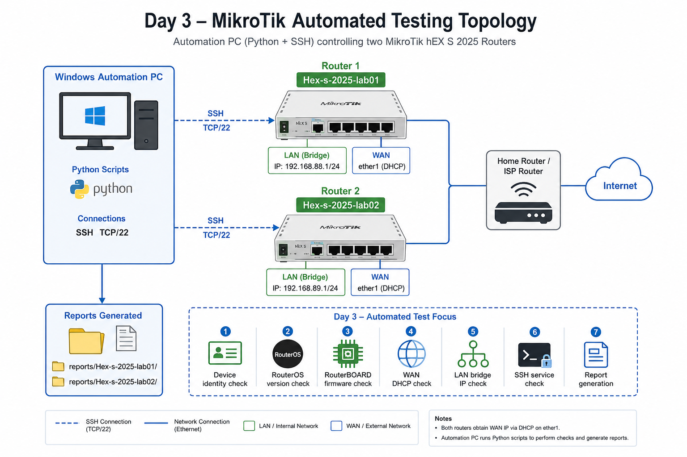
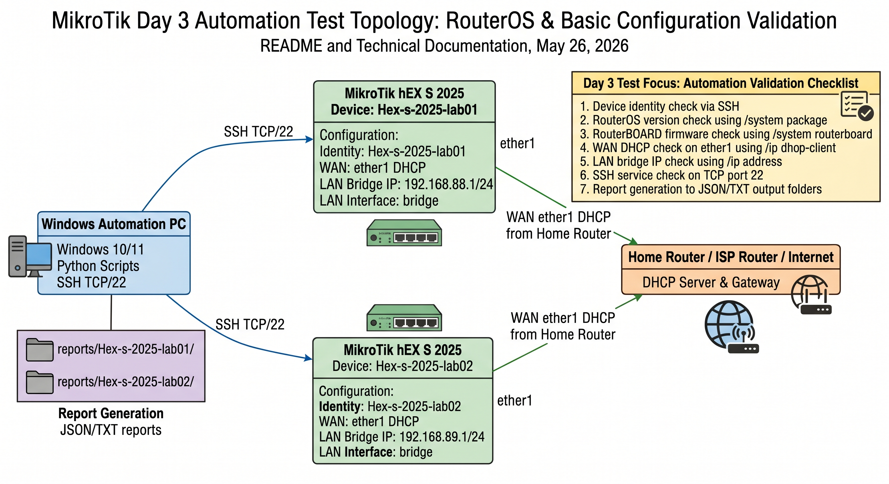
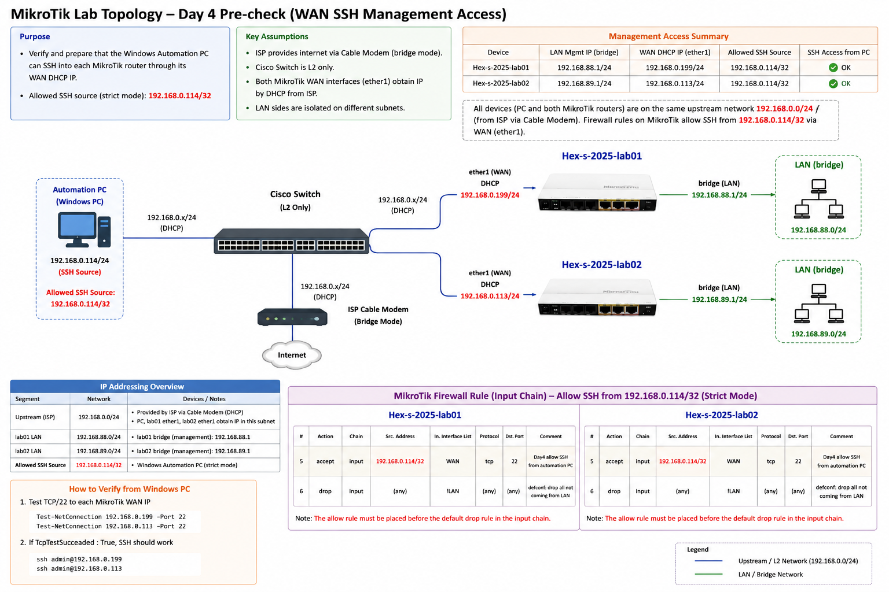

# MikroTik Reset Automation Platform

Python automation for MikroTik reset setup, acceptance checks, and post-setup validation.



## Current Supported Platforms

- MikroTik RouterOS
- Cisco IOS experimental

The project is being moved in small steps toward an adapter-based architecture. The existing MikroTik scripts remain the stable path, while `experimental_cross_platform_baseline.py` uses `core/device_factory.py` to select a device adapter from `device.vendor` and `device.platform` in `config.json`.

Cisco IOS support is currently read-only baseline only. It runs SSH login, show commands, NTP status checks, ping, and running-config collection for reporting; it does not enter configuration mode, change VLANs, IP addresses, ports, STP, or save configuration.

## Environment

- OS: Windows
- RouterOS device: MikroTik
- Router IP: `192.168.88.1`
- PC IP: `192.168.88.254`
- Login method: SSH
- Username: `admin`
- SSH port: `22`

The script asks for the SSH password at runtime. Press Enter at the password prompt to use the default value from `config.json`. Do not hard-code passwords in the Python source.

## Setup

```powershell
python -m venv .venv
.\.venv\Scripts\Activate.ps1
pip install -r requirements.txt
Copy-Item config.example.json config.json
```

Edit `config.json` if you want a default password for cases where you press Enter at the runtime password prompt.

## Tests

Run unit tests without connecting to MikroTik:

```powershell
pytest
```

## Recommended Workflow

For a reset MikroTik, keep using the original setup command. The acceptance check verifies the setup state after apply:

```powershell
# Setup dry-run
python mikrotik_day2_auto_setup.py --dry-run --device-name Hex-s-2025-lab01

# Apply setup
python mikrotik_day2_auto_setup.py --device-name Hex-s-2025-lab01

# Setup acceptance check
python mikrotik_acceptance_check.py --device-name Hex-s-2025-lab01

# Post-setup validation
python mikrotik_post_validation.py --device-name Hex-s-2025-lab01
```

The short alias also works, but the original command remains the primary documented entry point:

```powershell
python mikrotik_setup.py --dry-run
python mikrotik_setup.py
python mikrotik_auto_setup.py --dry-run
python mikrotik_auto_setup.py
```

Both setup commands also accept `--device-name`. If you omit it, the script prompts for a device name and uses the `config.json` default only when you press Enter.

Name mapping:

| Command | Alias | Purpose |
| --- | --- | --- |
| `mikrotik_day2_auto_setup.py` | `mikrotik_setup.py`, `mikrotik_auto_setup.py` | Apply setup, backup, report, and baseline marker |
| `mikrotik_acceptance_check.py` | - | Read-only setup acceptance check |
| `mikrotik_post_validation.py` | - | Read-only post-setup validation |

The legacy baseline check still exists as `mikrotik_baseline_check.py` for the older Day 1 acceptance criteria.

## Setup Acceptance Check Usage

Provide a device name from the command line:

```powershell
python mikrotik_acceptance_check.py --device-name hex-s-2025-lab01
```

Or run without `--device-name` and enter it when prompted:

```powershell
python mikrotik_acceptance_check.py
```

Prompt:

```text
Please input device name:
```

Router host/IP prompt:

```text
Please input router host/IP (press Enter to use config.json default: 192.168.88.1):
```

Password prompt:

```text
Please input SSH password:
```

The setup acceptance check verifies identity, WAN interface, WAN DHCP client, LAN bridge IP, SSH service, and that `ftp` / `telnet` are disabled.

## Read-Only Commands

Baseline checks allow only these read-only commands:

```text
/system clock print
/system ntp client print
/ping 8.8.8.8 count=3
/file print
```

Blocked operations include reset, reboot, backup load, import, identity changes, and IP, firewall, bridge, or DHCP modifications.

Exception: Version 2 allows `/system identity set name=<device_name>` only through the explicit `--set-identity` option. Other write operations remain blocked.

## Acceptance Criteria

The run passes only when all checks pass:

- SSH login succeeds.
- `/system clock print` contains `time-zone-name: Asia/Taipei`.
- `/system clock print` contains `gmt-offset: +08:00`.
- `/system ntp client print` contains `enabled: yes`.
- `/system ntp client print` contains `status: synchronized`.
- `/ping 8.8.8.8 count=3` has `received > 0` or `packet-loss` is not `100%`.
- `/file print` contains `baseline-wan-ntp-ok.backup`.
- `/file print` contains `baseline-wan-ntp-ok.rsc`.

## Reports

The script writes:

- Console PASS / FAIL result
- Timestamped JSON report, for example `reports/day1/report_20260525_133500_PASS.json`
- Timestamped text report, for example `reports/day1/report_20260525_133500_PASS.txt`
- Latest-report aliases: `reports/day1/report.json` and `reports/day1/report.txt`

The console output also lists each check item and its PASS / FAIL result.

`report.json` contains:

```json
{
  "device_name": "<input device name>",
  "router_ip": "192.168.88.1",
  "ssh_port": 22,
  "overall_result": "PASS or FAIL",
  "checks": []
}
```

## Post-Setup Validation

`mikrotik_post_validation.py` is the Day 3 workflow. Run it after setup and setup acceptance when you want a broader read-only validation of WAN, LAN, service hardening, version, firmware, and internet/DNS reachability.



Run:

```powershell
python mikrotik_post_validation.py --device-name Hex-s-2025-lab02
```

The script prompts for router host/IP and SSH password at runtime. Press Enter at the host/IP prompt to use `config.json`.

Validation commands:

```routeros
/system resource print
/system package print
/system routerboard print
/ip dhcp-client print detail
/ip address print
/ip route print
/ping 8.8.8.8 count=3
/ping google.com count=3
/ip service print
```

Result meanings:

| Status | Meaning |
| --- | --- |
| `PASS` | The check matches the expected condition. |
| `FAIL` | A clear problem was found, such as WAN DHCP not bound, no WAN IP, no default route, or ping failure. |
| `WARNING` | The router is usable but there is risk or drift, such as RouterOS version mismatch or unsafe services still enabled. |
| `SKIP` | The check is not applicable or lacks enough input to judge. |

Reports are stored per device:

```text
reports/
  Hex-S-2025-lab01/
    day3_test_report.json
    day3_test_report.txt
  Hex-S-2025-lab02/
    day3_test_report.json
    day3_test_report.txt
```

The JSON report includes `device_name`, `test_time`, RouterOS/package/firmware fields, WAN/LAN IPs, summary counts, test results, failed items, warning items, raw commands, and raw command outputs. SSH passwords are never written to reports.

To validate a second MikroTik, run the same command with a different device name and enter that router's IP at the prompt:

```powershell
python mikrotik_post_validation.py --device-name Hex-s-2025-lab02
```

## Day 4 Pre-check - WAN SSH Management Access



Before running the Day 4 multi-device baseline through each router's WAN DHCP IP, use the WAN SSH pre-check to prepare a narrow firewall exception for the Windows Automation PC.

Why this may be needed:

- The Windows Automation PC may be able to ping the MikroTik WAN IP.
- `Test-NetConnection <router_wan_ip> -Port 22` may still fail.
- SSH can be enabled on RouterOS, but the default firewall commonly drops WAN-side input traffic before it reaches the SSH service.

Run the pre-check from the project folder:

```powershell
python mikrotik_day4_precheck_wan_ssh.py
```

The script first connects through the router's LAN management IP, then asks for:

- LAN management IP
- device name
- username
- password
- allowed SSH source

Allowed SSH source modes:

| Mode | Example | Use Case |
| --- | --- | --- |
| Safe mode | `192.168.0.159/32` | Only the Automation PC can SSH from the WAN side |
| Lab convenience mode | `192.168.0.0/24` | Any host on the home lab LAN subnet can SSH |

`0.0.0.0/0` is rejected. Do not expose MikroTik SSH to the public Internet.

The script verifies or applies:

- SSH service exists and is enabled.
- Firewall input accept rule exists for TCP/22 from the allowed source on `in-interface-list=WAN`.
- The allow rule uses comment `Day4 allow SSH from automation source`.
- The allow rule is moved before the default WAN input drop rule `defconf: drop all not coming from LAN`.
- WAN DHCP IP on `ether1` is read and reported.

Verify from PowerShell after the pre-check:

```powershell
Test-NetConnection <router_wan_ip> -Port 22
```

Reports:

```text
reports/<device_name>/day4_precheck_wan_ssh.json
reports/<device_name>/day4_precheck_wan_ssh.txt
```

The reports include device name, LAN management IP, WAN DHCP IP, allowed SSH source, SSH service status, firewall rule status, and whether the rule was added, already existed, updated, or moved. Passwords are never written to reports.

## Day 4 Multi-Device Baseline Validation

Day 4 converts the post-setup device checks into formal baseline test cases for multiple MikroTik routers. Each check has structured `expected`, `actual`, `result`, and `message` fields, making the output closer to a QA Automation / SDET test report than a simple status dump.

Run:

```powershell
python mikrotik_day4_multi_device_baseline.py
```

Topology summary:

- Automation PC runs Python and connects to each MikroTik over SSH TCP/22.
- `Hex-s-2025-lab01` uses LAN bridge IP `192.168.88.1/24` and WAN `ether1` DHCP.
- `Hex-s-2025-lab02` uses LAN bridge IP `192.168.89.1/24` and WAN `ether1` DHCP.
- Reports are written per device and as one Day 4 summary.

Expected public-safe `config.example.json` device profile format:

```json
{
  "devices": {
    "Hex-s-2025-lab01": {
      "device_name": "Hex-s-2025-lab01",
      "host": "192.168.88.1",
      "day4_host": "192.168.0.199",
      "ssh_port": 22,
      "username": "admin",
      "password": "",
      "expected": {
        "wan_interface": "ether1",
        "wan_mode": "dhcp",
        "expected_lan_bridge_ip": "192.168.88.1/24"
      }
    },
    "Hex-s-2025-lab02": {
      "device_name": "Hex-s-2025-lab02",
      "host": "192.168.89.1",
      "day4_host": "192.168.0.113",
      "ssh_port": 22,
      "username": "admin",
      "password": "",
      "expected": {
        "wan_interface": "ether1",
        "wan_mode": "dhcp",
        "expected_lan_bridge_ip": "192.168.89.1/24"
      }
    }
  }
}
```

For Day 4, `day4_host` is the preferred SSH target. Use the MikroTik WAN DHCP IP that passed the PowerShell check:

```powershell
Test-NetConnection <router_wan_ip> -Port 22
```

If `day4_host` is omitted, Day 4 first checks the pre-check report at `reports/<device_name>/day4_precheck_wan_ssh.json` and uses its `wan_dhcp_ip` as the default SSH target. If no pre-check report exists, Day 4 falls back to `wan_host`, then `host`. This keeps `host` available for Day 2 / Day 3 LAN management workflows while Day 4 can validate WAN-side SSH access.

Checks performed per device:

- SSH connection
- Device identity
- RouterOS version
- RouterBOARD current firmware
- RouterBOARD upgrade firmware
- WAN DHCP client status on `ether1`
- LAN bridge IP
- SSH service status
- Report generation

Example output:

```text
Device: Hex-s-2025-lab01
Overall Result: PASS

Check: LAN bridge IP
Expected: 192.168.88.1/24
Actual: 192.168.88.1/24
Result: PASS

Check: WAN DHCP client status
Expected: ether1 bound
Actual: ether1 bound
Result: PASS
```

Day 4 report paths:

```text
reports/Hex-s-2025-lab01/day4_baseline_validation.json
reports/Hex-s-2025-lab01/day4_baseline_validation.txt
reports/Hex-s-2025-lab01/day4_baseline_validation.html
reports/Hex-s-2025-lab02/day4_baseline_validation.json
reports/Hex-s-2025-lab02/day4_baseline_validation.txt
reports/Hex-s-2025-lab02/day4_baseline_validation.html
reports/day4_summary_report.json
reports/day4_summary_report.txt
reports/day4_summary_report.html
```

Day 3 vs Day 4:

| Stage | Purpose | Output Style |
| --- | --- | --- |
| Day 3 | Read-only post-setup validation for one selected device | Operational validation report |
| Day 4 | Multi-device baseline validation across configured devices | Formal test-case style report with PASS / FAIL / SKIP |

## Error Handling

The script reports failures for:

- SSH timeout
- Authentication failure
- Command timeout
- Unexpected RouterOS output format

## Day 2 Reset Auto Setup

`mikrotik_day2_auto_setup.py` is the setup workflow for a MikroTik hEX S 2025 after reset. It connects by SSH, checks RouterOS and RouterBOARD versions, optionally applies a conservative baseline, validates the result, and writes JSON and text reports. `mikrotik_setup.py` is only a short alias for the same workflow.

Update `config.json` from `config.example.json`:

```json
{
  "device": {
    "vendor": "mikrotik",
    "platform": "routeros"
  },
  "host": "192.168.88.1",
  "port": 22,
  "username": "admin",
  "password": "",
  "device_name": "Hex-s-2025-lab01",
  "target_routeros_version": "7.22.3",
  "enable_apply_config": false,
  "enable_backup": true,
  "enable_report": true,
  "timezone": "Asia/Taipei",
  "disable_services": ["ftp", "telnet"],
  "expected": {
    "wan_interface": "ether1",
    "wan_dhcp_client_required": true,
    "lan_bridge": "bridge",
    "lan_ip_cidr": "192.168.88.1/24",
    "required_disabled_services": ["ftp", "telnet"]
  },
  "devices": {
    "Hex-s-2025-lab01": {
      "host": "192.168.88.1",
      "expected": {
        "lan_ip_cidr": "192.168.88.1/24"
      }
    },
    "Hex-s-2025-lab02": {
      "host": "192.168.89.1",
      "expected": {
        "lan_ip_cidr": "192.168.89.1/24"
      }
    }
  }
}
```

Leave `password` empty for normal use. The script prompts for the SSH password at runtime and does not echo the value on screen:

```text
Please input SSH password:
```

The script also prompts for the router host/IP at runtime. Press Enter to use the `host` value from `config.json`, or type a different IP for the current run.

The setup device name can be provided on the command line:

```powershell
python mikrotik_day2_auto_setup.py --dry-run --device-name Hex-s-2025-lab01
python mikrotik_setup.py --dry-run --device-name Hex-s-2025-lab01
python mikrotik_auto_setup.py --dry-run --device-name Hex-s-2025-lab01
```

When `--device-name` matches a key under `devices`, that device profile overrides the shared defaults. For example, `Hex-s-2025-lab02` uses `host=192.168.89.1` and `expected.lan_ip_cidr=192.168.89.1/24`, so Day 2 dry-run uses the lab02 bridge IP instead of the lab01 IP.

If `--device-name` is omitted, the script prompts for it:

```text
Please input device name (press Enter to use config.json default: Hex-s-2025-lab02):
```

Run:

```powershell
python mikrotik_day2_auto_setup.py
```

Force dry-run from the command line:

```powershell
python mikrotik_day2_auto_setup.py --dry-run
```

### Golden Day 2 Template

For MikroTik devices with the same model and same intended topology, you can create a reusable Day 2 golden template from a discovered reference device. The discovery step is read-only and does not apply settings.

Recommended flow:

```powershell
python mikrotik_day2_auto_setup.py --discover-config
python mikrotik_day2_auto_setup.py --export-template
Copy-Item golden_day2_config.example.json config.json
python mikrotik_day2_auto_setup.py --dry-run
python mikrotik_day2_auto_setup.py
```

`--discover-config` writes `reports/day2/discovered_day2_config.json` and `reports/day2/discovered_day2_config.txt`. It only reads the current RouterOS state and suggests config values.

`--export-template` reads `reports/day2/discovered_day2_config.json`, takes `suggested_config`, and writes `golden_day2_config.example.json`. The exported template is safe for GitHub: `password` is empty and `enable_apply_config` is forced to `false`.

Use the golden template only for devices with the same model and same intended use. For a different model or different topology, run `--discover-config` on that device first and review the report before applying anything.

`config.json` should never be committed to GitHub. It can contain per-device hostnames, device names, and operational apply settings. The repository `.gitignore` keeps `config.json`, `reports/`, `.venv/`, and `__pycache__/` out of version control.

Run the experimental adapter-based baseline:

```powershell
python experimental_cross_platform_baseline.py
```

For Cisco IOS structure testing, copy `config.cisco.example.json` to `config.json` on a Cisco test host and keep in mind this first version is read-only baseline only.

### Dry-Run vs Apply Mode

- `enable_apply_config: false` runs version checks, backup if enabled, validation commands, and report output. It lists the identity, timezone, NTP, and service commands that would be applied, but does not apply them.
- If dry-run finds a RouterOS package version mismatch, the console and text report include manual update guidance. The script still does not download, install, upgrade, or reboot automatically.
- `enable_apply_config: true` applies only the conservative Day 2 baseline:
  - `/system identity set name=<device_name>`
  - `/system clock set time-zone-name=<timezone>`
  - `/system ntp client set enabled=no`
  - `/system ntp client set enabled=yes mode=unicast servers=pool.ntp.org`
  - `/ip service disable [find name=<service>]` only for `ftp` and `telnet`

The script never disables SSH, HTTP (`www`), HTTPS (`www-ssl`), WinBox, or unknown numeric service names from old local configs. It does not change the admin password, delete users, reboot, import config, upgrade RouterOS packages, or run RouterBOARD firmware upgrade.

During validation, the script also checks bridge LAN IP drift. If a device profile expects `192.168.89.1/24` but the bridge still has `192.168.88.1/24`, the report marks `WARNING` and prints a suggested `/ip address remove ...` cleanup command for review instead of silently leaving the stale IP unnoticed.

After apply or dry-run validation, the script checks `/system ntp client print`. If NTP reports `status=waiting`, it retries every 10 seconds for up to 120 seconds. `status=synchronized` is treated as PASS. If NTP is still not synchronized after the timeout, the report shows `WARNING` instead of failing the entire run.

### Version and Firmware Checks

Day 2 checks but does not upgrade:

- `/system package print` is parsed for the `routeros` package version and compared with `target_routeros_version`.
- `/system routerboard print` is parsed for `current-firmware`, `upgrade-firmware`, and `factory-firmware`.
- If `current-firmware != upgrade-firmware`, the report shows `WARNING`; no `/system routerboard upgrade` or reboot is executed.

### Manual RouterOS and RouterBOARD Upgrade

RouterOS package upgrade and RouterBOARD firmware upgrade are intentionally not part of the normal Day 2 apply flow. They can reboot the router and interrupt SSH, so run them manually during a maintenance window.

Shortest manual command sequence:

```routeros
/system backup save name=before-upgrade
/export file=before-upgrade

/system package update check-for-updates
/system package update install
```

After the router reboots, check and upgrade RouterBOARD firmware if needed:

```routeros
/system routerboard print
/system routerboard upgrade
/system reboot
```

After the second reboot, verify versions:

```routeros
/system resource print
/system package print
/system routerboard print
```

Confirm:

- RouterOS `version` matches the intended target.
- RouterBOARD `current-firmware` equals `upgrade-firmware`.

Then run:

```powershell
python mikrotik_day2_auto_setup.py --dry-run
python mikrotik_day2_auto_setup.py
```

### Day 2 Reports

When `enable_report` is true, the script writes:

- `reports/<device_name>/day2_auto_setup_report.json`
- `reports/<device_name>/day2_auto_setup_report.txt`

Examples:

```text
reports/
  Hex-s-2025-lab01/
    day2_auto_setup_report.json
    day2_auto_setup_report.txt
    day3_test_report.json
    day3_test_report.txt
  Hex-s-2025-lab02/
    day2_auto_setup_report.json
    day2_auto_setup_report.txt
    day3_test_report.json
    day3_test_report.txt
```

The Day 2 report path uses the final resolved device name. `--device-name` takes priority over `config.json`, so reports from different MikroTik devices do not overwrite each other.

The report includes SSH result, RouterOS package version, RouterBOARD firmware fields, NTP client fields, backup/apply/validation results, executed commands, warnings, and errors. The SSH password is never written to console or report.

### Day 2 Acceptance Criteria

- `python mikrotik_day2_auto_setup.py` can run from this project folder.
- SSH failure stops configuration apply and is reported clearly.
- Dry-run mode does not apply identity, timezone, NTP, or service changes.
- Apply mode changes only identity, timezone, NTP, and services listed in `disable_services`.
- NTP validation records `enabled`, `mode`, `servers`, `status`, `synced-server`, `synced-stratum`, and `system-offset`.
- RouterOS `routeros` package version is parsed and written to report.
- RouterBOARD firmware fields are parsed and written to report.
- Firmware mismatch produces `WARNING` without upgrade or reboot.
- NTP not synchronized after retry produces `WARNING`, not overall `FAIL`.
- JSON and TXT reports are generated when `enable_report` is true.
- `pytest` passes without a live MikroTik connection.
