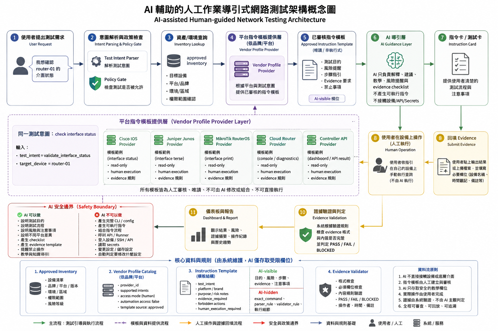

# AI-assisted Human-guided Network Testing Architecture

Status: CONCEPTUAL_ROADMAP_ONLY

## Decision Summary

This page records a conceptual / roadmap architecture diagram for an AI-assisted, human-guided network testing workflow.

The diagram is a planning and communication artifact only. It does not mean all modules shown in the diagram are currently implemented, wired together, executable, or authorized for implementation.

The current repository remains non-executing, report-only, dry-run / mock-only, human-guided, local, and deterministic where applicable.



## Current Boundary

The diagram should be read as a future-facing architecture concept, not as the current runtime architecture.

Current repository behavior remains limited to safe documentation, static evidence, report-only validation, dry-run planning, mock-only examples, and reviewer-visible local artifacts unless a later phase explicitly authorizes a narrower implementation boundary.

The diagram does not authorize:

- live device access
- SSH
- NETCONF
- RESTCONF
- provider/API/model integration
- secrets
- config backup
- config change
- actual command execution
- runner behavior
- adapter behavior
- scheduler behavior
- queue behavior
- broker behavior
- worker behavior
- agent loop behavior
- autonomous execution
- hidden execution side effects
- second safety matrix
- Day1-Day160 rewrite

## Planning-only Interpretation

Future-facing areas in the diagram are planning / roadmap concepts only.

The following diagram areas are not current implementation claims:

- Vendor Profile Provider Layer
- AI Guidance Layer
- Instruction Card
- Controller API wording
- Controller Evidence Provider wording

If the diagram wording appears to imply provider integration, API integration, model calls, controller execution, or controller evidence collection, that interpretation is explicitly out of scope for the current repository.

The current repository does not implement provider/API/model integration, controller execution, controller evidence collection, live device communication, or autonomous operation.

## Human-guided Review Model

The intended concept is human-guided review.

AI-assisted wording means future reviewer assistance, explanation, classification, or planning support only after separate authorization. It does not mean autonomous execution, automatic remediation, automatic command generation, hidden tool calls, device access, or model/provider integration.

Any future implementation must preserve explicit human review boundaries, no-execution proof, reviewer-visible evidence, and separate phase authorization.

## Relationship To Phase 2J

Phase 2J-00 established a non-device automation control planning boundary.

Phase 2J-01 authorized only the idea of a future non-executing local job contract skeleton as a static/local contract-shape candidate. It did not implement that skeleton.

This concept diagram documentation does not start Phase 2J-02, create a policy gate contract, create a local job contract skeleton, create an approval envelope contract, add a runner, add an adapter, add a scheduler, add a queue, add a broker, add a worker, add an agent loop, or add an execution path.

## Placement

The diagram asset is stored at:

```text
docs/assets/ai_assisted_human_guided_network_testing_architecture.png
```

This concept page is stored at:

```text
docs/concepts/ai_assisted_human_guided_network_testing_architecture.md
```

This placement keeps the binary image with existing documentation assets and keeps the explanation in a topic-focused documentation page rather than the repository root.

## Documentation Readability Review

```text
CONCEPTUAL_ROADMAP_LABEL_VISIBLE: PASS
READABLE_WITHOUT_PRIOR_CHAT_CONTEXT: PASS
CURRENT_STATE_AND_FUTURE_ROADMAP_SEPARATED: PASS
FORBIDDEN_SCOPE_EXPLICIT: PASS
NO_LIVE_AUTOMATION_IMPLIED: PASS
NO_DEVICE_EXECUTION_IMPLIED: PASS
NO_RUNNER_ADAPTER_PROVIDER_MODEL_AUTONOMY_IMPLIED: PASS
PLACEMENT_EXPLAINED: PASS
NEXT_ACTION_DOES_NOT_IMPLY_IMPLEMENTATION: PASS
FINAL_READABILITY_RESULT: PASS
```
