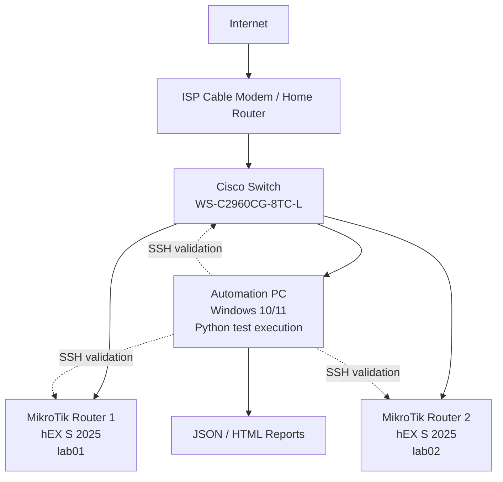

# Lab Topology

## Lab Topology Overview

The lab topology supports Day 1 through Day 6 validation for the Network Automation Testing Platform. It combines one Automation PC, one Cisco access switch, two MikroTik routers, and an upstream ISP cable modem or home router.

The Automation PC runs the Python workflows. The Cisco switch provides central Layer 2 connectivity. The MikroTik routers act as devices under test. The upstream modem or home router provides WAN and internet reachability for the lab.

## Device Roles

| Device | Role | Validation Scope |
| --- | --- | --- |
| Automation PC | Test execution host | Runs scripts, connects through SSH, generates reports |
| Cisco WS-C2960CG-8TC-L | Lab core switch | Read-only topology validation |
| MikroTik hEX S 2025 lab01 | Device under test 1 | Day 1, Day 2, Day 3, and Day 4 MikroTik validation |
| MikroTik hEX S 2025 lab02 | Device under test 2 | Day 4 multi-device MikroTik validation |
| ISP Cable Modem / Home Router | Internet edge | Provides upstream WAN connectivity |

## Automation PC Role

The Automation PC is the control point for the lab.

Responsibilities:

- Run Python validation scripts.
- Connect to MikroTik and Cisco devices through SSH.
- Store local runtime config files.
- Generate JSON and HTML reports.
- Aggregate device-level evidence into the Day 6 lab summary.

The Automation PC should have network reachability to all target devices before live validation starts.

## Cisco Switch Role

The Cisco WS-C2960CG-8TC-L acts as the lab core switch.

Responsibilities:

- Provide Layer 2 connectivity between the Automation PC and lab devices.
- Expose switch topology evidence through read-only show commands.
- Support Day 5 Cisco topology validation.

The automation workflow does not change Cisco configuration.

## MikroTik lab01 / lab02 Role

The MikroTik hEX S 2025 routers are the main devices under test.

`lab01` is used for:

- Day 1 baseline acceptance checks
- Day 2 reset auto setup
- Day 3 post-setup validation
- Day 4 multi-device baseline validation

`lab02` is used for:

- Day 2 setup when prepared as a second router
- Day 3 post-setup validation when needed
- Day 4 multi-device baseline validation

The Day 4 workflow validates both MikroTik devices as formal baseline test targets.

## ISP Cable Modem / Home Router Role

The ISP cable modem or home router is the internet edge for the lab.

Responsibilities:

- Provide WAN connectivity to the lab.
- Act as the upstream gateway.
- Allow MikroTik WAN DHCP and internet reachability checks to be validated.

This project does not automate the ISP cable modem or home router.

## Mermaid Topology Diagram

## Validation Scope

MikroTik validation includes:

- SSH login
- Device identity
- RouterOS version fields
- RouterBOARD firmware fields
- WAN DHCP status
- LAN bridge IP
- Service hardening checks
- Internet and DNS reachability checks
- Per-device JSON / HTML report generation

Cisco validation includes:

- SSH login
- Switch model detection
- IOS version parsing
- Vlan1 management IP state
- Expected connected ports
- VLAN 1 state
- Dynamic MAC learning
- Spanning-tree blocking status
- JSON / HTML report generation

Day 6 lab summary includes:

- Existing report discovery
- Per-device result normalization
- Required and optional device coverage
- Lab-level PASS / FAIL / WARNING result
- Portfolio-friendly HTML summary output
